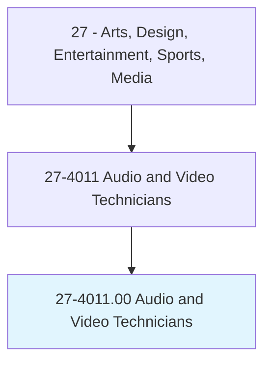
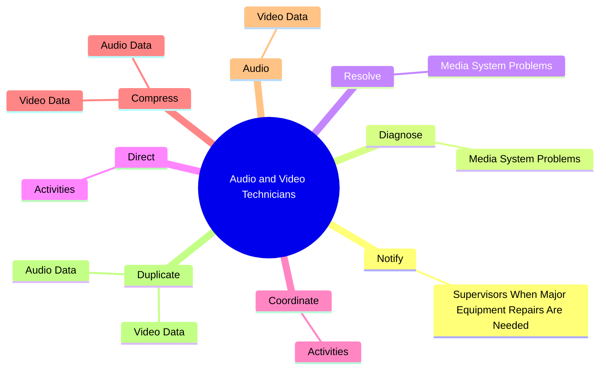
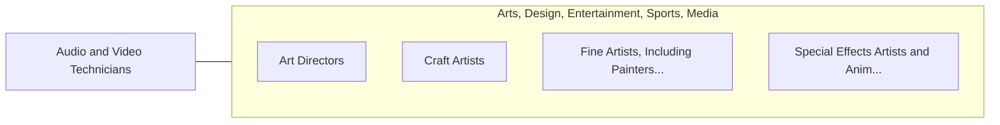

# Audio and Video Technicians

> Set up, maintain, and dismantle audio and video equipment, such as microphones, sound speakers, connecting wires and cables, sound and mixing boards, video cameras, video monitors and servers, and related electronic equipment for live or recorded events, such as concerts, meetings, conventions, presentations, podcasts, news conferences, and sporting events.

## Overview

Audio and Video Technicians is classified under Arts, Design, Entertainment, Sports, Media (SOC 27). Set up, maintain, and dismantle audio and video equipment, such as microphones, sound speakers, connecting wires and cables, sound and mixing boards, video cameras, video monitors and servers, and related electronic equipment for live or recorded events, such as concerts, meetings, conventions, presentations, podcasts, news conferences, and sporting events.

## Classification Hierarchy

## Key Statistics

| Metric | Value |
|--------|-------|
| SOC Code | 27-4011.00 |
| Category | [Arts, Design, Entertainment, Sports, Media](/occupations/ArtsMedia/index) |
| Task Count | 172 |
| Source | O*NET |

## Core Tasks

### notify.SupervisorsWhenMajorEquipmentRepairsAreNeeded

Audio and Video Technicians notify supervisors when major equipment repairs are needed as part of their core responsibilities.

**Actions:**
- `notify.SupervisorsWhenMajorEquipmentRepairsAreNeeded`

### diagnose.MediaSystemProblems

Audio and Video Technicians diagnose media system problems as part of their core responsibilities.

**Actions:**
- `diagnose.MediaSystemProblems`

### resolve.MediaSystemProblems

Audio and Video Technicians resolve media system problems as part of their core responsibilities.

**Actions:**
- `resolve.MediaSystemProblems`

## Skills & Competencies

### Technical Skills
- **Creative Design** - Advanced
- **Digital Media** - Advanced
- **Content Creation** - Advanced

### Soft Skills
- **Communication** - Essential
- **Problem Solving** - Essential
- **Critical Thinking** - Important
- **Teamwork** - Important
- **Adaptability** - Important

## Related Occupations

## Industries

This occupation is found across multiple industries. See [Industries](/industries) for sector-specific employment data.

## Career Progression

---

*Source: O*NET 27-4011.00 - ONETOccupation*
