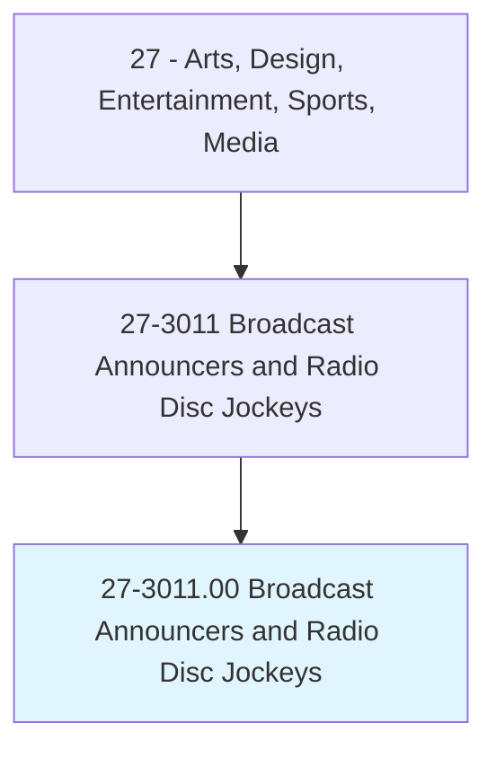
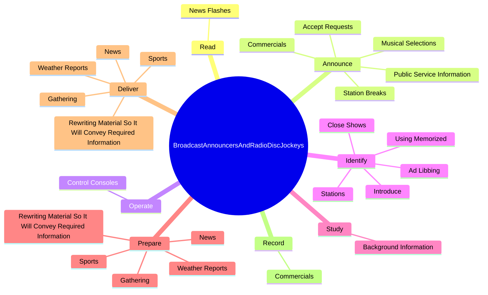

# Broadcast Announcers and Radio Disc Jockeys

> Speak or read from scripted materials, such as news reports or commercial messages, on radio, television, or other communications media. May play and queue music, announce artist or title of performance, identify station, or interview guests.

## Overview

Broadcast Announcers and Radio Disc Jockeys is an occupation within the Arts, Design, Entertainment, Sports, Media category. Speak or read from scripted materials, such as news reports or commercial messages, on radio, television, or other communications media. 

## Classification Hierarchy

## Key Statistics

| Metric | Value |
|--------|-------|
| SOC Code | 27-3011.00 |
| Category | [Arts, Design, Entertainment, Sports, Media](/occupations/ArtsMedia/index) |
| Task Count | 80 |
| Source | O*NET |

## Core Tasks

### read.NewsFlashes

Broadcast Announcers and Radio Disc Jockeys read news flashes as part of their core responsibilities.

**Actions:**
- `read.NewsFlashes.to.inform.AudiencesOfImportantEvents`

### announce.MusicalSelections

Broadcast Announcers and Radio Disc Jockeys announce musical selections as part of their core responsibilities.

**Actions:**
- `announce.MusicalSelections.from.ListeningAudience`
- `announce.StationBreaks.from.ListeningAudience`
- `announce.Commercials.from.ListeningAudience`
- `announce.PublicServiceInformation.from.ListeningAudience`

### operate.ControlConsoles

Broadcast Announcers and Radio Disc Jockeys operate control consoles as part of their core responsibilities.

**Actions:**
- `operate.ControlConsoles`

## Skills & Competencies

### Technical Skills
- **Creative Design** - Advanced
- **Digital Media** - Advanced
- **Content Creation** - Advanced

### Soft Skills
- **Communication** - Essential
- **Problem Solving** - Essential
- **Critical Thinking** - Important
- **Teamwork** - Important
- **Adaptability** - Important

## Related Occupations

## Industries

This occupation is found across multiple industries. See [Industries](/industries) for sector-specific employment data.

## Career Progression

---

*Source: O*NET 27-3011.00 - ONETOccupation*
