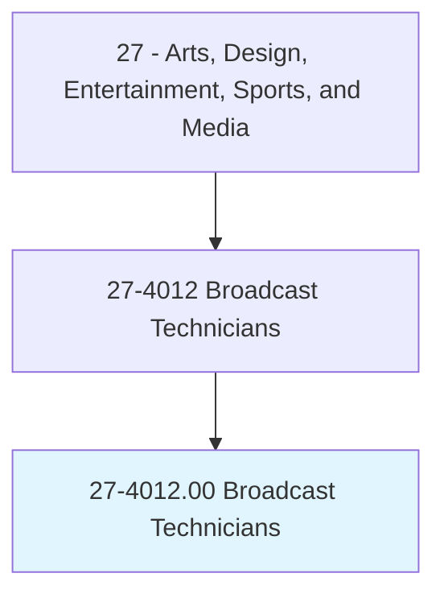
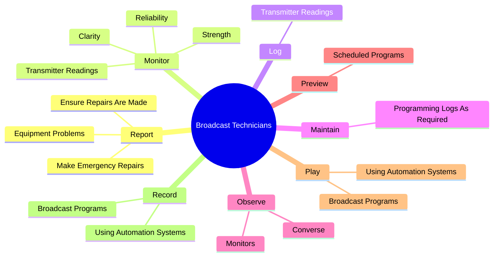
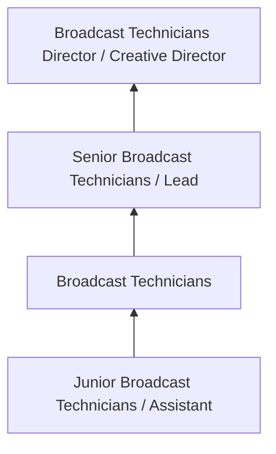
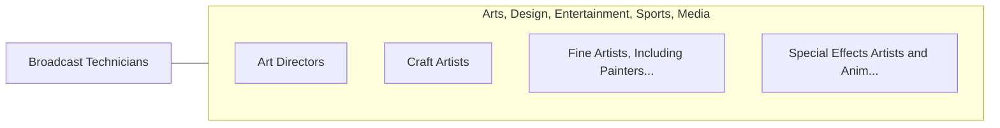

# Broadcast Technicians

> Set up, operate, and maintain the electronic equipment used to acquire, edit, and transmit audio and video for radio or television programs. Control and adjust incoming and outgoing broadcast signals to regulate sound volume, signal strength, and signal clarity. Operate satellite, microwave, or other transmitter equipment to broadcast radio or television programs.

## Overview

Broadcast Technicians professionals set up, operate, and maintain the electronic equipment used to acquire, edit, and transmit audio and video for radio or television programs. This occupation falls within the Arts, Design, Entertainment, Sports, and Media category and requires a combination of specialized knowledge, technical skills, and practical experience.

These professionals work across diverse settings and organizational contexts, applying their expertise to meet the demands of their field. They must stay current with industry standards, emerging practices, and regulatory requirements that affect their work. The role demands both independent judgment and collaborative skills, as practitioners regularly interact with colleagues, stakeholders, and the public.

As the field continues to evolve, Broadcast Technicians professionals increasingly leverage technology and data-driven approaches to enhance their effectiveness. Career opportunities span the public and private sectors, with demand influenced by economic conditions, demographic shifts, and technological advancement.

## Classification Hierarchy



## Key Statistics

| Metric | Value |
|--------|-------|
| SOC Code | 27-4012.00 |
| Job Zone | N/A |
| Category | [Arts, Design, Entertainment, Sports, and Media](/occupations/ArtsMedia/index) |
| Core Tasks | 90+ |
| Salary Range | $35,000 - $100,000 |
| Median Salary | $55,000 |
| Growth Outlook | 3% (Slower than average) |
| Source | O*NET |

## Core Tasks



### monitor.TransmitterReadings

Broadcast Technicians monitor transmitter readings as part of their core responsibilities.

**Actions:**
- `monitor.TransmitterReadings` - Monitor and log transmitter readings.
- `monitor.Strength.of.IncomingSignals` - Monitor strength, clarity, and reliability of incoming and outgoing signals, ...
- `monitor.Strength.of.OutgoingSignals` - Monitor strength, clarity, and reliability of incoming and outgoing signals, ...
- `monitor.Strength.of.AdjustEquipmentAsNecessary.to.maintain.QualityBroadcasts` - Monitor strength, clarity, and reliability of incoming and outgoing signals, ...
- `monitor.Clarity.of.IncomingSignals` - Monitor strength, clarity, and reliability of incoming and outgoing signals, ...

### record.BroadcastPrograms

Broadcast Technicians record broadcast programs as part of their core responsibilities.

**Actions:**
- `record.BroadcastPrograms` - Play and record broadcast programs, using automation systems.
- `record.UsingAutomationSystems` - Play and record broadcast programs, using automation systems.
- `record.Sound.onto.Tape.for.Radio` - Record sound onto tape or film for radio or television, checking its quality ...
- `record.Sound.onto.Tape.for.Television` - Record sound onto tape or film for radio or television, checking its quality ...
- `record.Sound.onto.Tape.for.CheckingQuality` - Record sound onto tape or film for radio or television, checking its quality ...

### determine.Number

Broadcast Technicians determine number as part of their core responsibilities.

**Actions:**
- `determine.Number.of.MicrophonesNeeded.for.BestSoundRecordingQuality` - Determine the number, type, and approximate location of microphones needed fo...
- `determine.Number.of.TransmissionQuality` - Determine the number, type, and approximate location of microphones needed fo...
- `determine.Number.of.PositionThemAppropriately` - Determine the number, type, and approximate location of microphones needed fo...
- `determine.Type.of.MicrophonesNeeded.for.BestSoundRecordingQuality` - Determine the number, type, and approximate location of microphones needed fo...
- `determine.Type.of.TransmissionQuality` - Determine the number, type, and approximate location of microphones needed fo...

### report.EquipmentProblems

Broadcast Technicians report equipment problems as part of their core responsibilities.

**Actions:**
- `report.EquipmentProblems.to.EquipmentWhenNecessary` - Report equipment problems, ensure that repairs are made, and make emergency r...
- `report.EquipmentProblems.to.Possible` - Report equipment problems, ensure that repairs are made, and make emergency r...
- `report.EnsureRepairsAreMade.to.EquipmentWhenNecessary` - Report equipment problems, ensure that repairs are made, and make emergency r...
- `report.EnsureRepairsAreMade.to.Possible` - Report equipment problems, ensure that repairs are made, and make emergency r...
- `report.MakeEmergencyRepairs.to.EquipmentWhenNecessary` - Report equipment problems, ensure that repairs are made, and make emergency r...


## Skills & Competencies

### Technical Skills
- **Creative Design** - Expert
- **Digital Media Tools** - Advanced
- **Content Creation** - Advanced
- **Visual Communication** - Advanced
- **Production Techniques** - Proficient
- **Project Coordination** - Proficient

### Soft Skills
- **Creativity** - Critical
- **Communication** - Critical
- **Collaboration** - Essential
- **Adaptability** - Essential
- **Time Management** - Essential

## Education & Certifications

| Requirement | Details |
|-------------|---------|
| Typical Education | Bachelor's degree in arts, design, communications, or related field |
| Work Experience | 1-3 years portfolio-based experience |
| On-the-Job Training | Moderate - ongoing skill development in creative tools |
| Certifications | Industry-specific certifications (Adobe, etc.) |

## Career Progression



## Industry Variations

### Entertainment and Media
Creative production for film, television, music, or digital media. Broadcast Technicians professionals focus on audience engagement and storytelling.

### Advertising and Marketing
Brand communication and commercial creative work. Emphasis on client relationships and measurable campaign outcomes.

### Corporate Communications
Internal and external communications for organizations. Focus on brand consistency and strategic messaging.

### Freelance and Independent
Self-directed creative work with diverse clients. Requires strong business skills alongside creative talent.

## Technology & Tools

- **Adobe Creative Suite (Photoshop, Illustrator, Premiere)**
- **Digital audio workstations**
- **Content management systems**
- **3D modeling software**
- **Social media and analytics platforms**

## Related Occupations



## Industries

- [Media and Entertainment](/industries/Media) - High Employment
- [Advertising and Marketing](/industries/Advertising) - High Employment
- [Publishing](/industries/Publishing) - Moderate Employment
- [Technology](/industries/Technology) - Growing Employment

## Departments

This occupation typically works in:
- [Creative Services](/departments/Creative)
- [Marketing](/departments/Marketing/index)
- [Communications](/departments/Communications)

## GraphDL Semantic Structure

```
Broadcast Technicians perform:
- report.EquipmentProblems.to.EquipmentWhenNecessary
- report.EquipmentProblems.to.Possible
- report.EnsureRepairsAreMade.to.EquipmentWhenNecessary
- report.EnsureRepairsAreMade.to.Possible
- report.MakeEmergencyRepairs.to.EquipmentWhenNecessary
- report.MakeEmergencyRepairs.to.Possible
```

---

*Source: O*NET 27-4012.00 - ONETOccupation*
