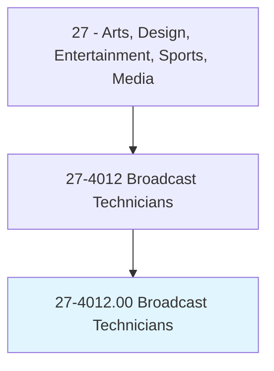
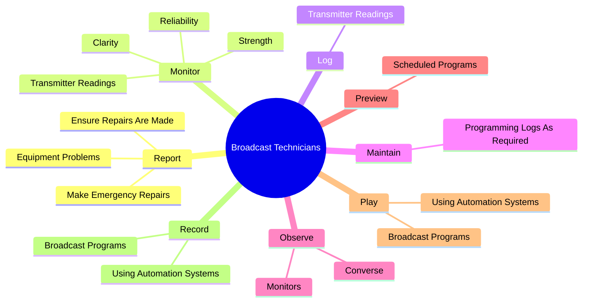
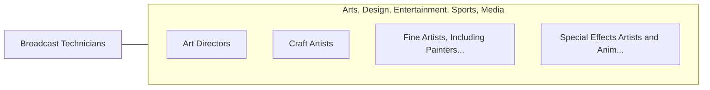

# Broadcast Technicians

> Set up, operate, and maintain the electronic equipment used to acquire, edit, and transmit audio and video for radio or television programs. Control and adjust incoming and outgoing broadcast signals to regulate sound volume, signal strength, and signal clarity. Operate satellite, microwave, or other transmitter equipment to broadcast radio or television programs.

## Overview

Broadcast Technicians is an occupation within the Arts, Design, Entertainment, Sports, Media category. Set up, operate, and maintain the electronic equipment used to acquire, edit, and transmit audio and video for radio or television programs. Control and adjust incoming and outgoing broadcast signals to regulate sound volume, signal strength, and signal clarity.

## Classification Hierarchy

## Key Statistics

| Metric | Value |
|--------|-------|
| SOC Code | 27-4012.00 |
| Category | [Arts, Design, Entertainment, Sports, Media](/occupations/ArtsMedia) |
| Task Count | 90 |
| Source | O*NET |

## Core Tasks

### report.EquipmentProblems

Broadcast Technicians report equipment problems as part of their core responsibilities.

**Actions:**
- `report.EquipmentProblems.to.EquipmentWhenNecessary`
- `report.EquipmentProblems.to.Possible`
- `report.EnsureRepairsAreMade.to.EquipmentWhenNecessary`
- `report.EnsureRepairsAreMade.to.Possible`

### monitor.TransmitterReadings

Broadcast Technicians monitor transmitter readings as part of their core responsibilities.

**Actions:**
- `monitor.TransmitterReadings`
- `monitor.Strength.of.IncomingSignals`
- `monitor.Strength.of.OutgoingSignals`
- `monitor.Strength.of.AdjustEquipmentAsNecessary.to.maintain.QualityBroadcasts`

### log.TransmitterReadings

Broadcast Technicians log transmitter readings as part of their core responsibilities.

**Actions:**
- `log.TransmitterReadings`

## Skills & Competencies

### Technical Skills
- **Creative Design** - Advanced
- **Digital Media** - Advanced
- **Content Creation** - Advanced

### Soft Skills
- **Communication** - Essential
- **Problem Solving** - Essential
- **Critical Thinking** - Important
- **Teamwork** - Important
- **Adaptability** - Important

## Related Occupations

## Industries

This occupation is found across multiple industries. See [Industries](/industries) for sector-specific employment data.

## Career Progression

---

*Source: O*NET 27-4012.00 - ONETOccupation*
