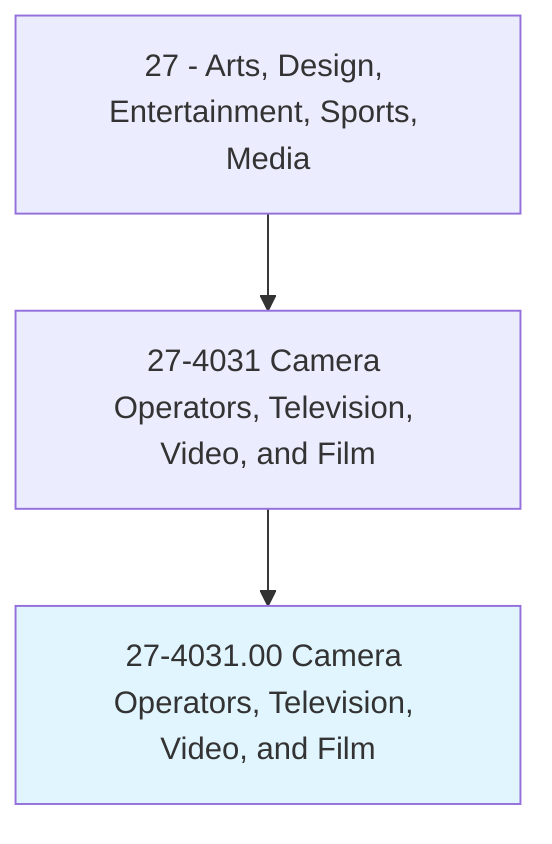
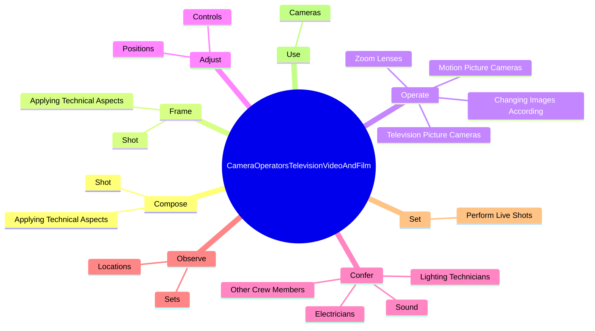

# Camera Operators, Television, Video, and Film

> Operate television, video, or film camera to record images or scenes for television, video, or film productions.

## Overview

Camera Operators, Television, Video, and Film is classified under Arts, Design, Entertainment, Sports, Media (SOC 27). Operate television, video, or film camera to record images or scenes for television, video, or film productions.

## Classification Hierarchy

## Key Statistics

| Metric | Value |
|--------|-------|
| SOC Code | 27-4031.00 |
| Category | [Arts, Design, Entertainment, Sports, Media](/occupations/ArtsMedia) |
| Task Count | 130 |
| Source | O*NET |

## Core Tasks

### compose.Shot

Camera Operators, Television, Video, and Film compose shot as part of their core responsibilities.

**Actions:**
- `compose.Shot.of.Light`
- `compose.Shot.of.Lenses`
- `compose.Shot.of.Film`
- `compose.Shot.of.Filters`

### frame.Shot

Camera Operators, Television, Video, and Film frame shot as part of their core responsibilities.

**Actions:**
- `frame.Shot.of.Light`
- `frame.Shot.of.Lenses`
- `frame.Shot.of.Film`
- `frame.Shot.of.Filters`

### operate.TelevisionPictureCameras

Camera Operators, Television, Video, and Film operate television picture cameras as part of their core responsibilities.

**Actions:**
- `operate.TelevisionPictureCameras.to.record.ScenesForTelevisionBroadcasts`
- `operate.TelevisionPictureCameras.to.Advertising`
- `operate.TelevisionPictureCameras.to.MotionPictures`
- `operate.MotionPictureCameras.to.record.ScenesForTelevisionBroadcasts`

## Skills & Competencies

### Technical Skills
- **Creative Design** - Advanced
- **Digital Media** - Advanced
- **Content Creation** - Advanced

### Soft Skills
- **Communication** - Essential
- **Problem Solving** - Essential
- **Critical Thinking** - Important
- **Teamwork** - Important
- **Adaptability** - Important

## Related Occupations

## Industries

This occupation is found across multiple industries. See [Industries](/industries) for sector-specific employment data.

## Career Progression

---

*Source: O*NET 27-4031.00 - ONETOccupation*
