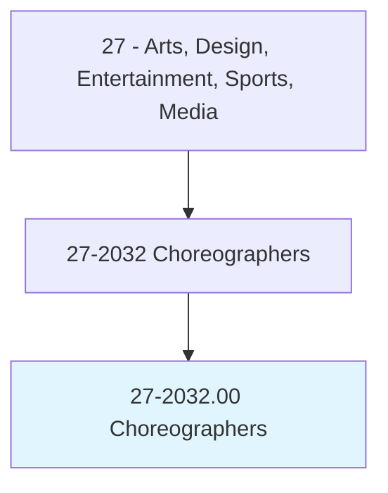
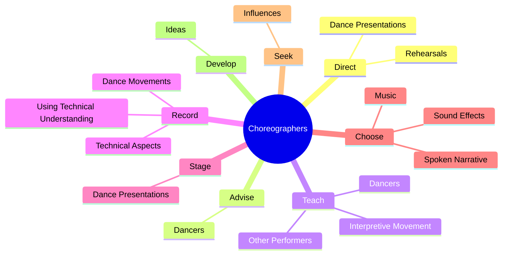
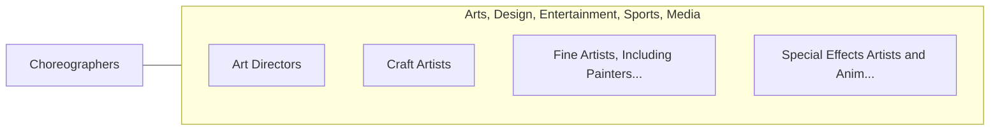

# Choreographers

> Create new dance routines. Rehearse performance of routines. May direct and stage presentations.

## Overview

Choreographers is an occupation within the Arts, Design, Entertainment, Sports, Media category. Create new dance routines. Rehearse performance of routines.

## Classification Hierarchy

## Key Statistics

| Metric | Value |
|--------|-------|
| SOC Code | 27-2032.00 |
| Category | [Arts, Design, Entertainment, Sports, Media](/occupations/ArtsMedia) |
| Task Count | 62 |
| Source | O*NET |

## Core Tasks

### direct.Rehearsals

Choreographers direct rehearsals as part of their core responsibilities.

**Actions:**
- `direct.Rehearsals.to.instruct.DancersInDanceStepsTechniquesToAchieveDesiredEffects`
- `direct.Rehearsals.to.InTechniquesToAchieveDesiredEffects`
- `direct.DancePresentations.for.VariousForms.of.Entertainment`

### advise.Dancers

Choreographers advise dancers as part of their core responsibilities.

**Actions:**
- `advise.Dancers.on.StandingProperlyTeachingCorrectDanceTechniques.to.help.PreventInjuries`
- `advise.Dancers.on.MovingProperlyTeachingCorrectDanceTechniques.to.help.PreventInjuries`

### teach.Dancers

Choreographers teach dancers as part of their core responsibilities.

**Actions:**
- `teach.Dancers`
- `teach.OtherPerformers.about.RhythmMovement`
- `teach.InterpretiveMovement`

## Skills & Competencies

### Technical Skills
- **Creative Design** - Advanced
- **Digital Media** - Advanced
- **Content Creation** - Advanced

### Soft Skills
- **Communication** - Essential
- **Problem Solving** - Essential
- **Critical Thinking** - Important
- **Teamwork** - Important
- **Adaptability** - Important

## Related Occupations

## Industries

This occupation is found across multiple industries. See [Industries](/industries) for sector-specific employment data.

## Career Progression

---

*Source: O*NET 27-2032.00 - ONETOccupation*
