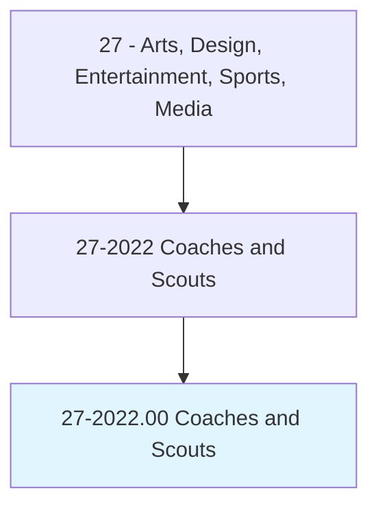
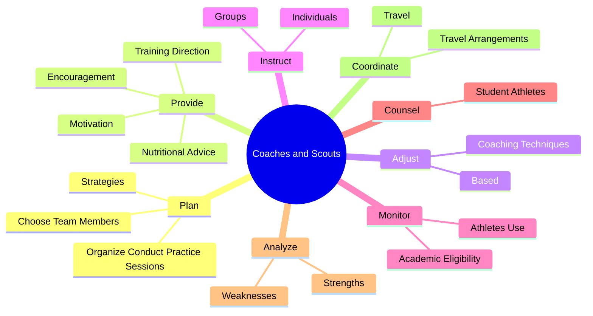
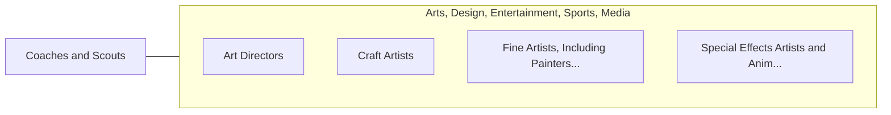

# Coaches and Scouts

> Instruct or coach groups or individuals in the fundamentals of sports for the primary purpose of competition. Demonstrate techniques and methods of participation. May evaluate athletes' strengths and weaknesses as possible recruits or to improve the athletes' technique to prepare them for competition. Those required to hold teaching certifications should be reported in the appropriate teaching category.

## Overview

Coaches and Scouts is an occupation within the Arts, Design, Entertainment, Sports, Media category. Instruct or coach groups or individuals in the fundamentals of sports for the primary purpose of competition. Demonstrate techniques and methods of participation.

## Classification Hierarchy

## Key Statistics

| Metric | Value |
|--------|-------|
| SOC Code | 27-2022.00 |
| Category | [Arts, Design, Entertainment, Sports, Media](/occupations/ArtsMedia/index) |
| Task Count | 158 |
| Source | O*NET |

## Core Tasks

### plan.OrganizeConductPracticeSessions

Coaches and Scouts plan organize conduct practice sessions as part of their core responsibilities.

**Actions:**
- `plan.OrganizeConductPracticeSessions`
- `plan.Strategies.for.IndividualGamesSeasons`
- `plan.Strategies.for.SportsSeasons`
- `plan.ChooseTeamMembers.for.IndividualGamesSeasons`

### provide.TrainingDirection

Coaches and Scouts provide training direction as part of their core responsibilities.

**Actions:**
- `provide.TrainingDirection.to.prepare.AthletesForGames`
- `provide.TrainingDirection.to.CompetitiveEvents`
- `provide.TrainingDirection.to.tours`
- `provide.Encouragement.to.prepare.AthletesForGames`

### adjust.CoachingTechniques

Coaches and Scouts adjust coaching techniques as part of their core responsibilities.

**Actions:**
- `adjust.CoachingTechniques.on.Strengths.of.Athletes`
- `adjust.CoachingTechniques.on.Weaknesses.of.Athletes`
- `adjust.Based.on.Strengths.of.Athletes`
- `adjust.Based.on.Weaknesses.of.Athletes`

## Skills & Competencies

### Technical Skills
- **Creative Design** - Advanced
- **Digital Media** - Advanced
- **Content Creation** - Advanced

### Soft Skills
- **Communication** - Essential
- **Problem Solving** - Essential
- **Critical Thinking** - Important
- **Teamwork** - Important
- **Adaptability** - Important

## Related Occupations

## Industries

This occupation is found across multiple industries. See [Industries](/industries) for sector-specific employment data.

## Career Progression

---

*Source: O*NET 27-2022.00 - ONETOccupation*
