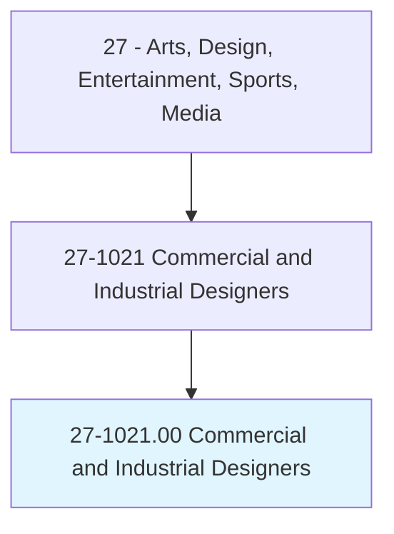
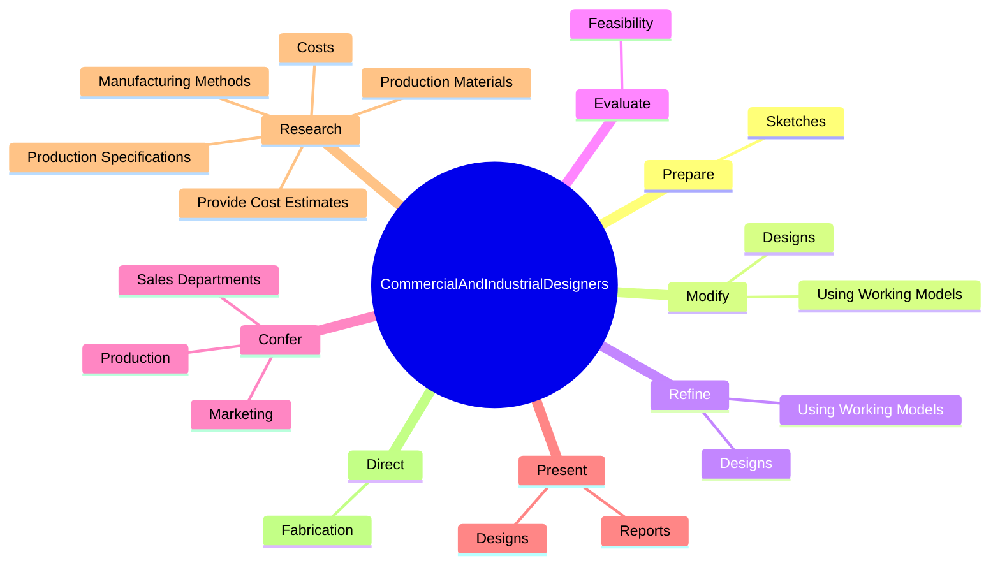

# Commercial and Industrial Designers

> Design and develop manufactured products, such as cars, home appliances, and children's toys. Combine artistic talent with research on product use, marketing, and materials to create the most functional and appealing product design.

## Overview

Commercial and Industrial Designers is an occupation within the Arts, Design, Entertainment, Sports, Media category. Design and develop manufactured products, such as cars, home appliances, and children's toys. 

## Classification Hierarchy

## Key Statistics

| Metric | Value |
|--------|-------|
| SOC Code | 27-1021.00 |
| Category | [Arts, Design, Entertainment, Sports, Media](/occupations/ArtsMedia/index) |
| Task Count | 120 |
| Source | O*NET |

## Core Tasks

### prepare.Sketches

Commercial and Industrial Designers prepare sketches as part of their core responsibilities.

**Actions:**
- `prepare.Sketches.of.Ideas`
- `prepare.Sketches.of.DetailedDrawings`
- `prepare.Sketches.of.Illustrations`
- `prepare.Sketches.of.Artwork`

### modify.Designs

Commercial and Industrial Designers modify designs as part of their core responsibilities.

**Actions:**
- `modify.Designs.to.conform.WithCustomerSpecifications`
- `modify.Designs.to.production.Limitations`
- `modify.Designs.to.changes.InDesignTrends`
- `modify.UsingWorkingModels.to.conform.WithCustomerSpecifications`

### refine.Designs

Commercial and Industrial Designers refine designs as part of their core responsibilities.

**Actions:**
- `refine.Designs.to.conform.WithCustomerSpecifications`
- `refine.Designs.to.production.Limitations`
- `refine.Designs.to.changes.InDesignTrends`
- `refine.UsingWorkingModels.to.conform.WithCustomerSpecifications`

## Skills & Competencies

### Technical Skills
- **Creative Design** - Advanced
- **Digital Media** - Advanced
- **Content Creation** - Advanced

### Soft Skills
- **Communication** - Essential
- **Problem Solving** - Essential
- **Critical Thinking** - Important
- **Teamwork** - Important
- **Adaptability** - Important

## Related Occupations

## Industries

This occupation is found across multiple industries. See [Industries](/industries) for sector-specific employment data.

## Career Progression

---

*Source: O*NET 27-1021.00 - ONETOccupation*
