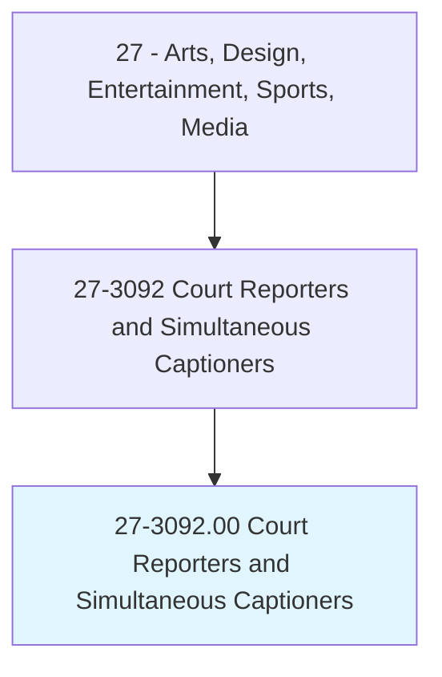
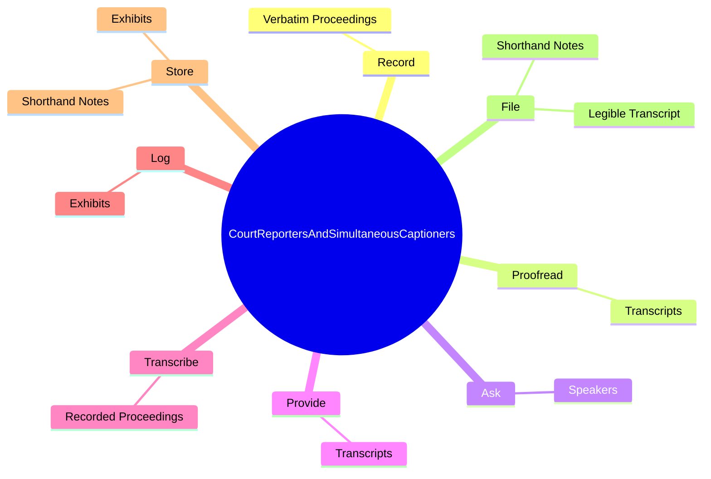
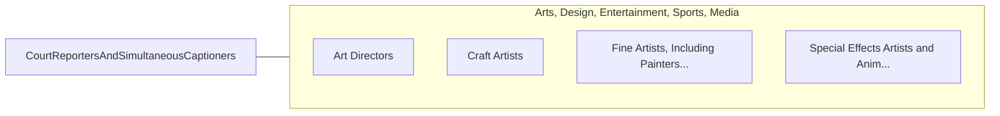

# Court Reporters and Simultaneous Captioners

> Use verbatim methods and equipment to capture, store, retrieve, and transcribe pretrial and trial proceedings or other information. Includes stenocaptioners who operate computerized stenographic captioning equipment to provide captions of live or prerecorded broadcasts for hearing-impaired viewers.

## Overview

Court Reporters and Simultaneous Captioners is an occupation within the Arts, Design, Entertainment, Sports, Media category. Use verbatim methods and equipment to capture, store, retrieve, and transcribe pretrial and trial proceedings or other information. 

## Classification Hierarchy

## Key Statistics

| Metric | Value |
|--------|-------|
| SOC Code | 27-3092.00 |
| Category | [Arts, Design, Entertainment, Sports, Media](/occupations/ArtsMedia/index) |
| Task Count | 29 |
| Source | O*NET |

## Core Tasks

### record.VerbatimProceedings

Court Reporters and Simultaneous Captioners record verbatim proceedings as part of their core responsibilities.

**Actions:**
- `record.VerbatimProceedings.of.Courts`
- `record.VerbatimProceedings.of.LegislativeAssemblies`
- `record.VerbatimProceedings.of.CommitteeMeetings`
- `record.VerbatimProceedings.of.OtherProceedings`

### proofread.Transcripts

Court Reporters and Simultaneous Captioners proofread transcripts as part of their core responsibilities.

**Actions:**
- `proofread.Transcripts.for.CorrectSpelling.of.Words`

### ask.Speakers

Court Reporters and Simultaneous Captioners ask speakers as part of their core responsibilities.

**Actions:**
- `ask.Speakers.to.clarify.InaudibleStatements`

## Skills & Competencies

### Technical Skills
- **Creative Design** - Advanced
- **Digital Media** - Advanced
- **Content Creation** - Advanced

### Soft Skills
- **Communication** - Essential
- **Problem Solving** - Essential
- **Critical Thinking** - Important
- **Teamwork** - Important
- **Adaptability** - Important

## Related Occupations

## Industries

This occupation is found across multiple industries. See [Industries](/industries) for sector-specific employment data.

## Career Progression

---

*Source: O*NET 27-3092.00 - ONETOccupation*
