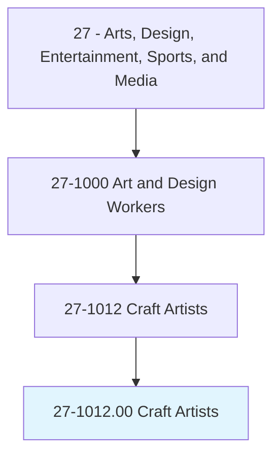
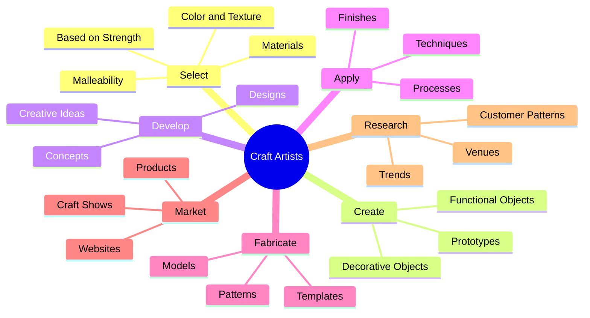
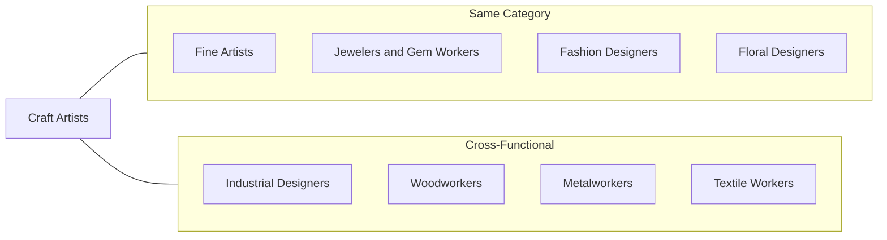
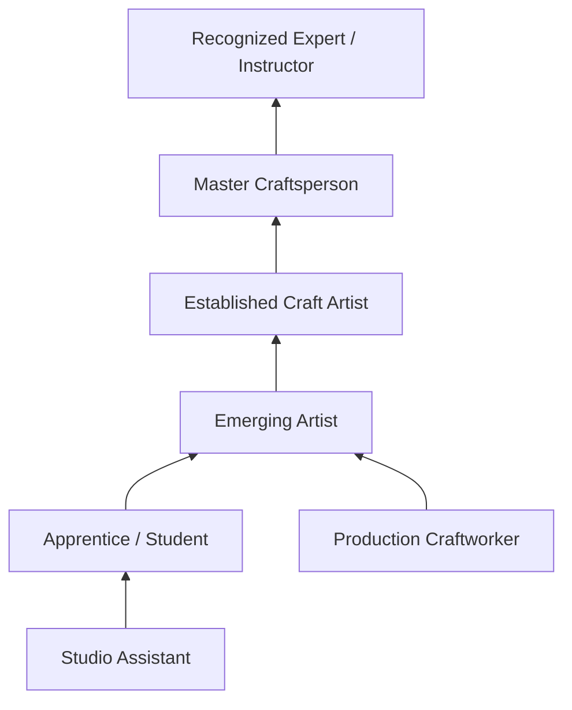

# Craft Artists

> Create or reproduce handmade objects for sale and exhibition using a variety of techniques, such as welding, weaving, pottery, and needlecraft.

## Overview

Craft Artists create handmade objects that combine artistic expression with functional or decorative purpose. They work with diverse materials including ceramics, glass, textiles, wood, metal, and paper, applying traditional techniques alongside modern innovations. Unlike mass-produced goods, craft work emphasizes the artist's personal vision, skill, and attention to detail. Many Craft Artists are self-employed entrepreneurs who design, produce, market, and sell their own work through galleries, craft fairs, online platforms, and commissioned pieces.

## Classification Hierarchy

## Key Statistics

| Metric | Value |
|--------|-------|
| SOC Code | 27-1012.00 |
| Job Zone | 3 (Medium Preparation) |
| Category | [Arts, Design, Entertainment, Sports, and Media](/occupations/ArtsMedia) |
| Core Tasks | 15+ |
| Source | O*NET |

## Core Tasks

### select.Materials

Craft Artists carefully choose materials based on their properties and suitability for the intended work.

**Actions:**
- `select.Materials.for.UseBased.on.Strength` - Choose materials with appropriate durability
- `select.Materials.for.Color` - Select materials for desired color properties
- `select.Materials.for.Texture` - Pick materials with specific tactile qualities
- `select.Materials.for.Balance` - Consider weight distribution in material selection
- `select.Materials.for.Malleability` - Assess workability of materials for techniques used

### create.Objects

Craft Artists produce both functional and decorative handmade objects using various methods and materials.

**Actions:**
- `create.FunctionalObjects.by.Hand` - Handcraft items with practical use
- `create.DecorativeObjects.by.Hand` - Create objects primarily for aesthetic value
- `create.FunctionalObjects.by.UsingVariety.of.Methods` - Apply multiple techniques to functional pieces
- `create.Prototypes.of.ObjectsToBeCrafted` - Develop test versions before final production
- `create.Models.of.ObjectsToBeCrafted` - Build reference models for complex pieces

### develop.Concepts

Craft Artists generate and refine creative ideas for their work.

**Actions:**
- `develop.ConceptsIdeas.for.CraftObjects` - Generate initial design concepts
- `develop.CreativeIdeas.for.CraftObjects` - Expand and refine artistic vision
- `develop.DesignsUsingSpecializedComputerSoftware` - Use digital tools for design development
- `develop.ProductPackaging` - Create presentation for finished work
- `develop.Display` - Design exhibition and display strategies

### fabricate.Patterns

Craft Artists create guides and templates to ensure consistency and precision in production.

**Actions:**
- `fabricate.Patterns.to.guide.CraftProduction` - Create reusable production guides
- `fabricate.Templates.to.guide.CraftProduction` - Develop precise cutting and forming templates
- `set.Specifications.for.Materials` - Define material requirements for pieces
- `set.Specifications.for.Dimensions` - Establish size and proportion standards
- `set.Specifications.for.Finishes` - Specify surface treatment requirements

### market.Products

Craft Artists promote and sell their work through various channels.

**Actions:**
- `advertise.ProductsUsingMedia` - Promote work through various media channels
- `advertise.InternetAdvertising` - Use online platforms for visibility
- `advertise.Brochures` - Create print marketing materials
- `plan.CraftShows.to.market.Products` - Organize participation in craft events
- `attend.CraftShows.to.market.Products` - Sell directly at craft fairs and exhibitions

### research.Trends

Craft Artists stay informed about market trends and customer preferences.

**Actions:**
- `research.CraftTrends.to.InspireDesigns` - Study current craft movements for inspiration
- `research.Venues.to.MarketingStrategies` - Identify optimal sales channels
- `research.CustomerBuyingPatterns.to.InspireDesigns` - Understand market demand
- `research.CustomerBuyingPatterns.to.MarketingStrategies` - Align products with customer preferences

## Skills & Competencies

### Technical Skills
- **Hand Crafting Techniques** - Expert
- **Material Knowledge** - Expert
- **Tool Proficiency** - Advanced
- **Finishing Techniques** - Advanced
- **Pattern Making** - Advanced
- **Quality Control** - Intermediate
- **Photography (Product)** - Intermediate

### Soft Skills
- **Creativity** - Critical
- **Attention to Detail** - Critical
- **Self-Motivation** - Essential
- **Business Acumen** - Essential
- **Customer Service** - Important
- **Time Management** - Important

## Craft Specializations

### Ceramics / Pottery
Works with clay to create functional and decorative objects through hand-building, wheel throwing, and glazing techniques.

### Fiber Arts / Textiles
Creates woven, knitted, felted, or sewn items including tapestries, garments, quilts, and sculptural pieces.

### Jewelry Making
Designs and fabricates jewelry using precious and semi-precious metals, stones, glass, and mixed media.

### Woodworking
Crafts furniture, decorative objects, and functional items from wood using traditional and power tools.

### Glasswork
Creates art glass through blowing, fusing, casting, or lampworking techniques.

### Metalwork
Shapes metal into artistic and functional objects through forging, welding, casting, or fabrication.

## Related Occupations

## Industries

- [Self-Employed / Independent Artists](/industries/SelfEmployed) - Highest Employment
- [Retail Trade - Art Galleries](/industries/RetailArt) - Moderate Employment
- [Specialty Trade Contractors](/industries/SpecialtyTrade) - Some Employment
- [Museums and Historical Sites](/industries/Museums) - Some Employment
- [Manufacturing - Handmade Goods](/industries/Manufacturing) - Some Employment

## Career Progression

## Education & Training

| Requirement | Details |
|-------------|---------|
| Typical Education | High school diploma; formal training varies from self-taught to BFA |
| Work Experience | Extensive practice and skill development in chosen medium |
| On-the-Job Training | Apprenticeships, workshops, and self-directed learning common |
| Common Certifications | Medium-specific certifications (pottery, jewelry, etc.) |

## Business Model

### Sales Channels
- Craft fairs and art festivals
- Online marketplaces (Etsy, personal websites)
- Galleries and boutiques
- Commission work
- Wholesale to retailers

### Pricing Considerations
- Material costs
- Time invested
- Skill level and reputation
- Market positioning
- Overhead expenses

## Tools & Equipment

### Common Tools (Varies by Specialty)
- Hand tools specific to medium
- Power tools and equipment
- Kilns, forges, or specialized equipment
- Finishing and polishing tools
- Safety equipment

### Business Tools
- E-commerce platforms
- Photography equipment
- Accounting software
- Social media platforms
- Inventory management systems

## Departments

This occupation typically works in:
- [Self-Employed / Studio](/departments/Studio)
- [Production Workshop](/departments/Production)
- [Gallery / Retail](/departments/Gallery)

---

*Source: O*NET 27-1012.00 - ONETOccupation*
