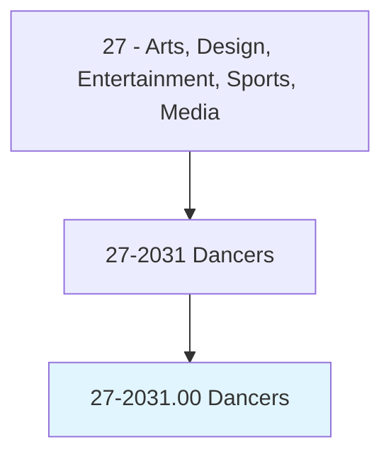
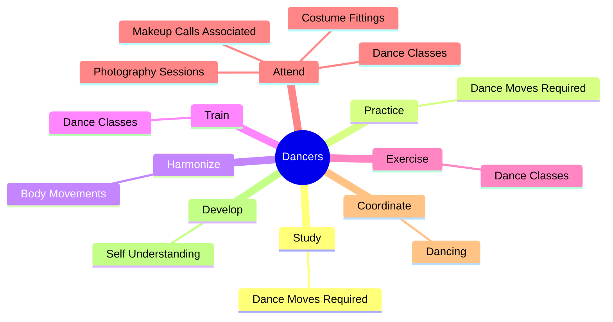
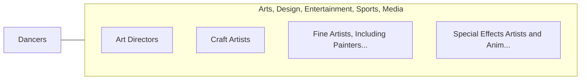

# Dancers

> Perform dances. May perform on stage, for broadcasting, or for video recording.

## Overview

Dancers is an occupation within the Arts, Design, Entertainment, Sports, Media category. Perform dances. 

## Classification Hierarchy

## Key Statistics

| Metric | Value |
|--------|-------|
| SOC Code | 27-2031.00 |
| Category | [Arts, Design, Entertainment, Sports, Media](/occupations/ArtsMedia/index) |
| Task Count | 46 |
| Source | O*NET |

## Core Tasks

### study.DanceMovesRequired

Dancers study dance moves required as part of their core responsibilities.

**Actions:**
- `study.DanceMovesRequired.in.Roles`

### practice.DanceMovesRequired

Dancers practice dance moves required as part of their core responsibilities.

**Actions:**
- `practice.DanceMovesRequired.in.Roles`

### harmonize.BodyMovements

Dancers harmonize body movements as part of their core responsibilities.

**Actions:**
- `harmonize.BodyMovements.to.RhythmOfMusicalAccompaniment`

## Skills & Competencies

### Technical Skills
- **Creative Design** - Advanced
- **Digital Media** - Advanced
- **Content Creation** - Advanced

### Soft Skills
- **Communication** - Essential
- **Problem Solving** - Essential
- **Critical Thinking** - Important
- **Teamwork** - Important
- **Adaptability** - Important

## Related Occupations

## Industries

This occupation is found across multiple industries. See [Industries](/industries) for sector-specific employment data.

## Career Progression

---

*Source: O*NET 27-2031.00 - ONETOccupation*
