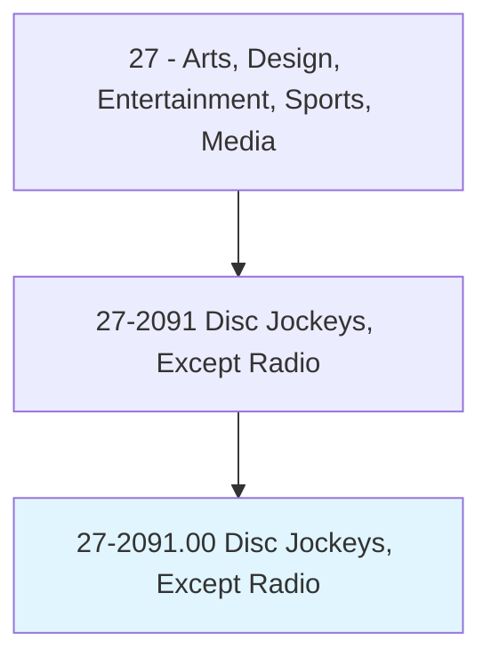
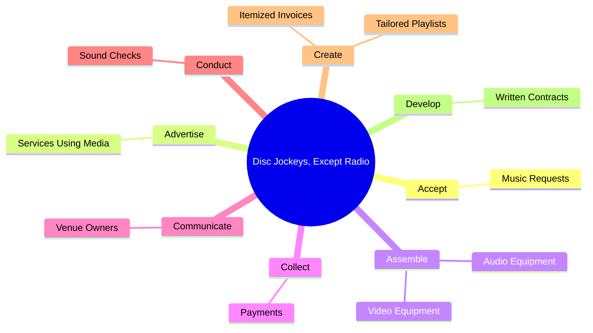
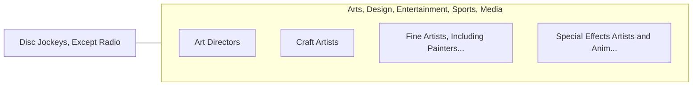

# Disc Jockeys, Except Radio

> Play prerecorded music for live audiences at venues or events such as clubs, parties, or wedding receptions. May use techniques such as mixing, cutting, or sampling to manipulate recordings. May also perform as emcee (master of ceremonies).

## Overview

Disc Jockeys, Except Radio is an occupation within the Arts, Design, Entertainment, Sports, Media category. Play prerecorded music for live audiences at venues or events such as clubs, parties, or wedding receptions. May use techniques such as mixing, cutting, or sampling to manipulate recordings.

## Classification Hierarchy

## Key Statistics

| Metric | Value |
|--------|-------|
| SOC Code | 27-2091.00 |
| Category | [Arts, Design, Entertainment, Sports, Media](/occupations/ArtsMedia) |
| Task Count | 34 |
| Source | O*NET |

## Core Tasks

### accept.MusicRequests

Disc Jockeys, Except Radio accept music requests as part of their core responsibilities.

**Actions:**
- `accept.MusicRequests.from.EventGuests`

### advertise.ServicesUsingMedia

Disc Jockeys, Except Radio advertise services using media as part of their core responsibilities.

**Actions:**
- `advertise.ServicesUsingMedia`

### assemble.AudioEquipment

Disc Jockeys, Except Radio assemble audio equipment as part of their core responsibilities.

**Actions:**
- `assemble.AudioEquipment`
- `assemble.VideoEquipment`

## Skills & Competencies

### Technical Skills
- **Creative Design** - Advanced
- **Digital Media** - Advanced
- **Content Creation** - Advanced

### Soft Skills
- **Communication** - Essential
- **Problem Solving** - Essential
- **Critical Thinking** - Important
- **Teamwork** - Important
- **Adaptability** - Important

## Related Occupations

## Industries

This occupation is found across multiple industries. See [Industries](/industries) for sector-specific employment data.

## Career Progression

---

*Source: O*NET 27-2091.00 - ONETOccupation*
