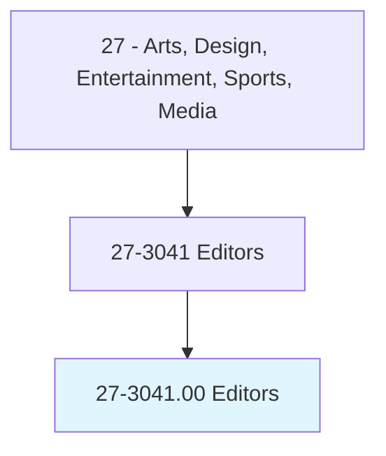
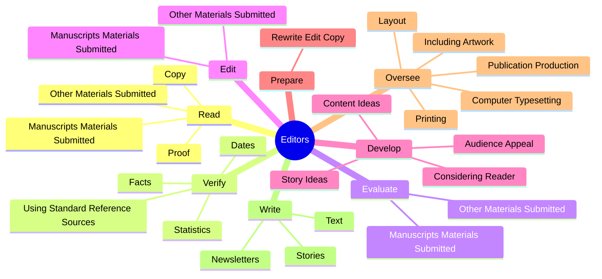
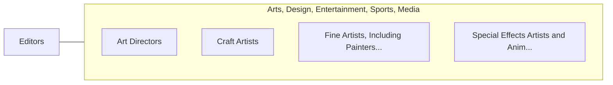

# Editors

> Plan, coordinate, revise, or edit written material. May review proposals and drafts for possible publication.

## Overview

Editors is an occupation within the Arts, Design, Entertainment, Sports, Media category. Plan, coordinate, revise, or edit written material. 

## Classification Hierarchy

## Key Statistics

| Metric | Value |
|--------|-------|
| SOC Code | 27-3041.00 |
| Category | [Arts, Design, Entertainment, Sports, Media](/occupations/ArtsMedia) |
| Task Count | 132 |
| Source | O*NET |

## Core Tasks

### read.Copy

Editors read copy as part of their core responsibilities.

**Actions:**
- `read.Copy.to.detect`
- `read.Copy.to.correct.ErrorsInSpelling`
- `read.Copy.to.Punctuation`
- `read.Copy.to.Syntax`

### verify.Facts

Editors verify facts as part of their core responsibilities.

**Actions:**
- `verify.Facts`
- `verify.Dates`
- `verify.Statistics`
- `verify.UsingStandardReferenceSources`

### evaluate.ManuscriptsMaterialsSubmitted

Editors evaluate manuscripts materials submitted as part of their core responsibilities.

**Actions:**
- `evaluate.ManuscriptsMaterialsSubmitted.for.Publication`
- `evaluate.ManuscriptsMaterialsSubmitted.for.Confer.with.AuthorsRegardingChangesInContent`
- `evaluate.ManuscriptsMaterialsSubmitted.for.Style`
- `evaluate.ManuscriptsMaterialsSubmitted.for.Organization`

## Skills & Competencies

### Technical Skills
- **Creative Design** - Advanced
- **Digital Media** - Advanced
- **Content Creation** - Advanced

### Soft Skills
- **Communication** - Essential
- **Problem Solving** - Essential
- **Critical Thinking** - Important
- **Teamwork** - Important
- **Adaptability** - Important

## Related Occupations

## Industries

This occupation is found across multiple industries. See [Industries](/industries) for sector-specific employment data.

## Career Progression

---

*Source: O*NET 27-3041.00 - ONETOccupation*
