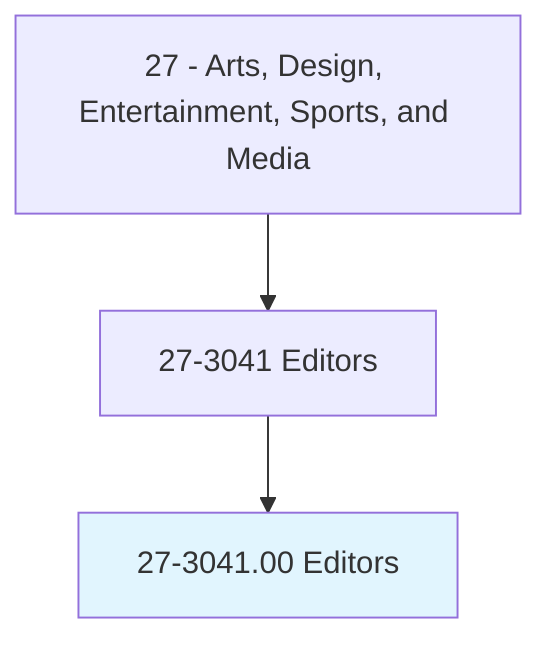
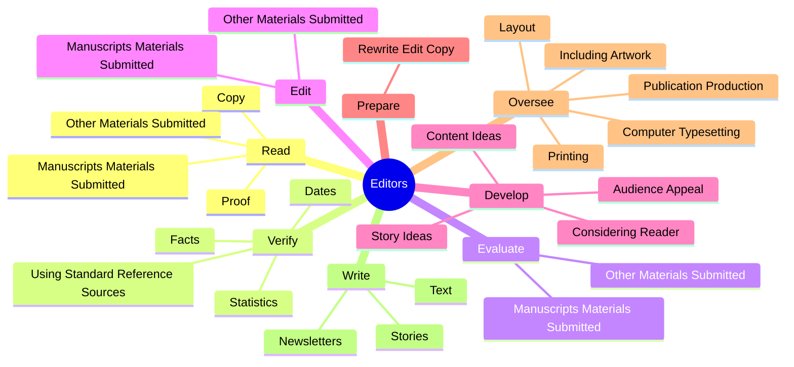
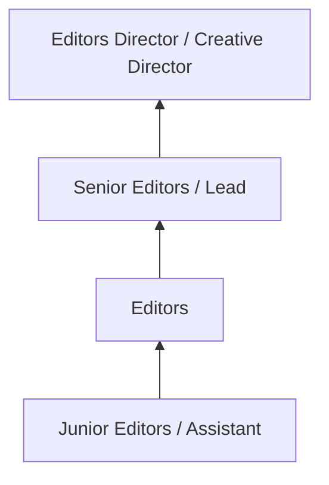
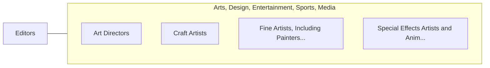

# Editors

> Plan, coordinate, revise, or edit written material. May review proposals and drafts for possible publication.

## Overview

Editors professionals plan, coordinate, revise, or edit written material. This occupation falls within the Arts, Design, Entertainment, Sports, and Media category and requires a combination of specialized knowledge, technical skills, and practical experience.

These professionals work across diverse settings and organizational contexts, applying their expertise to meet the demands of their field. They must stay current with industry standards, emerging practices, and regulatory requirements that affect their work. The role demands both independent judgment and collaborative skills, as practitioners regularly interact with colleagues, stakeholders, and the public.

As the field continues to evolve, Editors professionals increasingly leverage technology and data-driven approaches to enhance their effectiveness. Career opportunities span the public and private sectors, with demand influenced by economic conditions, demographic shifts, and technological advancement.

## Classification Hierarchy



## Key Statistics

| Metric | Value |
|--------|-------|
| SOC Code | 27-3041.00 |
| Job Zone | N/A |
| Category | [Arts, Design, Entertainment, Sports, and Media](/occupations/ArtsMedia/index) |
| Core Tasks | 132+ |
| Salary Range | $35,000 - $100,000 |
| Median Salary | $55,000 |
| Growth Outlook | 3% (Slower than average) |
| Source | O*NET |

## Core Tasks



### read.Copy

Editors read copy as part of their core responsibilities.

**Actions:**
- `read.Copy.to.detect` - Read copy or proof to detect and correct errors in spelling, punctuation, and...
- `read.Copy.to.correct.ErrorsInSpelling` - Read copy or proof to detect and correct errors in spelling, punctuation, and...
- `read.Copy.to.Punctuation` - Read copy or proof to detect and correct errors in spelling, punctuation, and...
- `read.Copy.to.Syntax` - Read copy or proof to detect and correct errors in spelling, punctuation, and...
- `read.Proof.to.detect` - Read copy or proof to detect and correct errors in spelling, punctuation, and...

### oversee.PublicationProduction

Editors oversee publication production as part of their core responsibilities.

**Actions:**
- `oversee.PublicationProduction.to.Deadlines` - Oversee publication production, including artwork, layout, computer typesetti...
- `oversee.PublicationProduction.to.budget.Requirements` - Oversee publication production, including artwork, layout, computer typesetti...
- `oversee.IncludingArtwork.to.Deadlines` - Oversee publication production, including artwork, layout, computer typesetti...
- `oversee.IncludingArtwork.to.budget.Requirements` - Oversee publication production, including artwork, layout, computer typesetti...
- `oversee.Layout.to.Deadlines` - Oversee publication production, including artwork, layout, computer typesetti...

### select.Local

Editors select local as part of their core responsibilities.

**Actions:**
- `select.Local.from.WireServices` - Select local, state, national, and international news items received from wir...
- `select.Local.from.Based.on.AssessmentOfItemsSignificance` - Select local, state, national, and international news items received from wir...
- `select.Local.from.InterestValue` - Select local, state, national, and international news items received from wir...
- `select.State.from.WireServices` - Select local, state, national, and international news items received from wir...
- `select.State.from.Based.on.AssessmentOfItemsSignificance` - Select local, state, national, and international news items received from wir...

### evaluate.ManuscriptsMaterialsSubmitted

Editors evaluate manuscripts materials submitted as part of their core responsibilities.

**Actions:**
- `evaluate.ManuscriptsMaterialsSubmitted.for.Publication` - Read, evaluate and edit manuscripts or other materials submitted for publicat...
- `evaluate.ManuscriptsMaterialsSubmitted.for.Confer.with.AuthorsRegardingChangesInContent` - Read, evaluate and edit manuscripts or other materials submitted for publicat...
- `evaluate.ManuscriptsMaterialsSubmitted.for.Style` - Read, evaluate and edit manuscripts or other materials submitted for publicat...
- `evaluate.ManuscriptsMaterialsSubmitted.for.Organization` - Read, evaluate and edit manuscripts or other materials submitted for publicat...
- `evaluate.OtherMaterialsSubmitted.for.Publication` - Read, evaluate and edit manuscripts or other materials submitted for publicat...


## Skills & Competencies

### Technical Skills
- **Creative Design** - Expert
- **Digital Media Tools** - Advanced
- **Content Creation** - Advanced
- **Visual Communication** - Advanced
- **Production Techniques** - Proficient
- **Project Coordination** - Proficient

### Soft Skills
- **Creativity** - Critical
- **Communication** - Critical
- **Collaboration** - Essential
- **Adaptability** - Essential
- **Time Management** - Essential

## Education & Certifications

| Requirement | Details |
|-------------|---------|
| Typical Education | Bachelor's degree in arts, design, communications, or related field |
| Work Experience | 1-3 years portfolio-based experience |
| On-the-Job Training | Moderate - ongoing skill development in creative tools |
| Certifications | Industry-specific certifications (Adobe, etc.) |

## Career Progression



## Industry Variations

### Entertainment and Media
Creative production for film, television, music, or digital media. Editors professionals focus on audience engagement and storytelling.

### Advertising and Marketing
Brand communication and commercial creative work. Emphasis on client relationships and measurable campaign outcomes.

### Corporate Communications
Internal and external communications for organizations. Focus on brand consistency and strategic messaging.

### Freelance and Independent
Self-directed creative work with diverse clients. Requires strong business skills alongside creative talent.

## Technology & Tools

- **Adobe Creative Suite (Photoshop, Illustrator, Premiere)**
- **Digital audio workstations**
- **Content management systems**
- **3D modeling software**
- **Social media and analytics platforms**

## Related Occupations



## Industries

- [Media and Entertainment](/industries/Media) - High Employment
- [Advertising and Marketing](/industries/Advertising) - High Employment
- [Publishing](/industries/Publishing) - Moderate Employment
- [Technology](/industries/Technology) - Growing Employment

## Departments

This occupation typically works in:
- [Creative Services](/departments/Creative)
- [Marketing](/departments/Marketing/index)
- [Communications](/departments/Communications)

## GraphDL Semantic Structure

```
Editors perform:
- read.Copy.to.detect
- read.Copy.to.correct.ErrorsInSpelling
- read.Copy.to.Punctuation
- read.Copy.to.Syntax
- read.Proof.to.detect
- read.Proof.to.correct.ErrorsInSpelling
```

---

*Source: O*NET 27-3041.00 - ONETOccupation*
