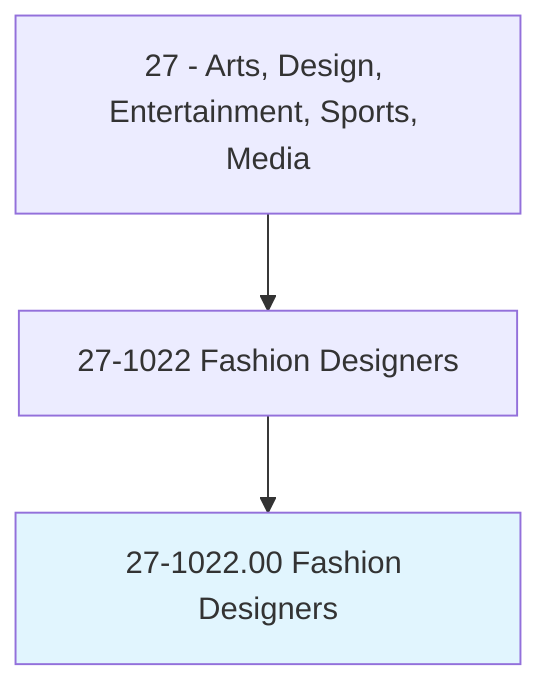
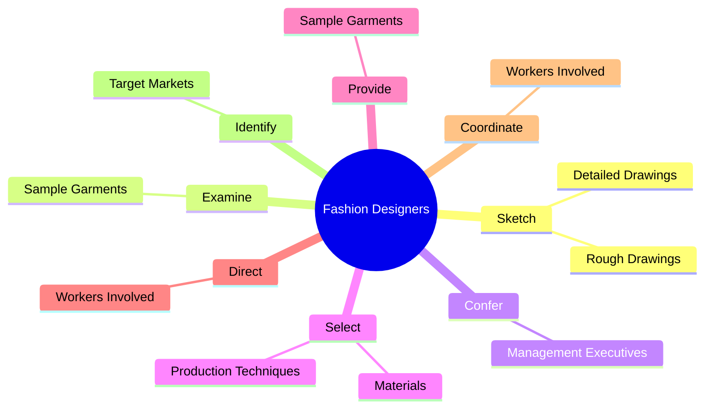
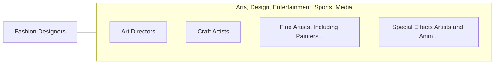

# Fashion Designers

> Design clothing and accessories. Create original designs or adapt fashion trends.

## Overview

Fashion Designers is an occupation within the Arts, Design, Entertainment, Sports, Media category. Design clothing and accessories. 

## Classification Hierarchy

## Key Statistics

| Metric | Value |
|--------|-------|
| SOC Code | 27-1022.00 |
| Category | [Arts, Design, Entertainment, Sports, Media](/occupations/ArtsMedia) |
| Task Count | 77 |
| Source | O*NET |

## Core Tasks

### sketch.RoughDrawings

Fashion Designers sketch rough drawings as part of their core responsibilities.

**Actions:**
- `sketch.RoughDrawings.of.Apparel`
- `sketch.RoughDrawings.of.Accessories`
- `sketch.RoughDrawings.of.WriteSpecifications`
- `sketch.RoughDrawings.of.ColorSchemes`

### examine.SampleGarments

Fashion Designers examine sample garments as part of their core responsibilities.

**Actions:**
- `examine.SampleGarments.on.OffModelsModifyingDesigns.to.achieve.DesiredEffects`

### confer.ManagementExecutives

Fashion Designers confer management executives as part of their core responsibilities.

**Actions:**
- `confer.ManagementExecutives.with.Clients.to.discuss.DesignIdeas`

## Skills & Competencies

### Technical Skills
- **Creative Design** - Advanced
- **Digital Media** - Advanced
- **Content Creation** - Advanced

### Soft Skills
- **Communication** - Essential
- **Problem Solving** - Essential
- **Critical Thinking** - Important
- **Teamwork** - Important
- **Adaptability** - Important

## Related Occupations

## Industries

This occupation is found across multiple industries. See [Industries](/industries) for sector-specific employment data.

## Career Progression

---

*Source: O*NET 27-1022.00 - ONETOccupation*
