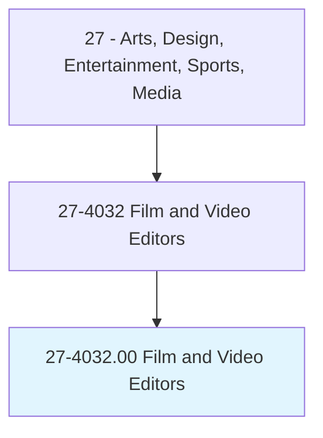
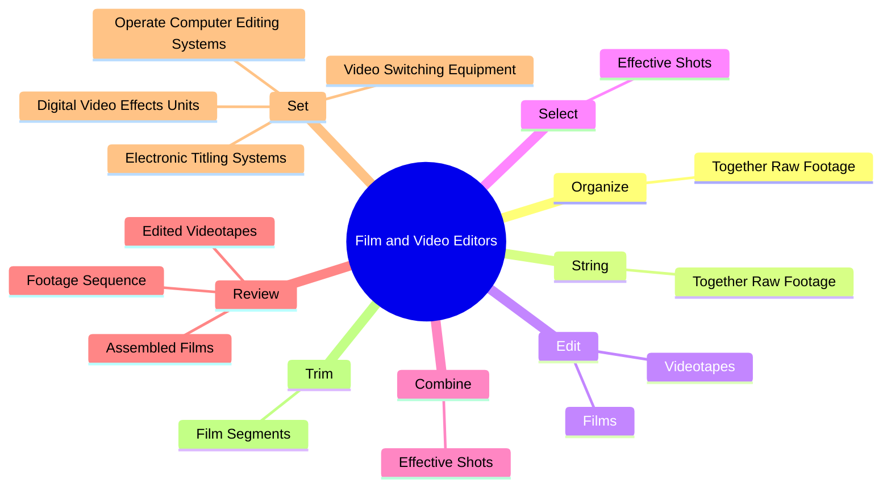
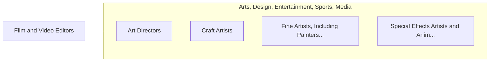

# Film and Video Editors

> Edit moving images on film, video, or other media. May work with a producer or director to organize images for final production. May edit or synchronize soundtracks with images.

## Overview

Film and Video Editors is an occupation within the Arts, Design, Entertainment, Sports, Media category. Edit moving images on film, video, or other media. May work with a producer or director to organize images for final production.

## Classification Hierarchy

## Key Statistics

| Metric | Value |
|--------|-------|
| SOC Code | 27-4032.00 |
| Category | [Arts, Design, Entertainment, Sports, Media](/occupations/ArtsMedia) |
| Task Count | 86 |
| Source | O*NET |

## Core Tasks

### organize.TogetherRawFootage

Film and Video Editors organize together raw footage as part of their core responsibilities.

**Actions:**
- `organize.TogetherRawFootage.into.ContinuousWholeAccording.to.Scripts`
- `organize.TogetherRawFootage.into.ContinuousWholeAccordingToInstructionsOfDirectors`
- `organize.TogetherRawFootage.into.ContinuousWholeAccording.to.Producers`

### string.TogetherRawFootage

Film and Video Editors string together raw footage as part of their core responsibilities.

**Actions:**
- `string.TogetherRawFootage.into.ContinuousWholeAccording.to.Scripts`
- `string.TogetherRawFootage.into.ContinuousWholeAccordingToInstructionsOfDirectors`
- `string.TogetherRawFootage.into.ContinuousWholeAccording.to.Producers`

### edit.Films

Film and Video Editors edit films as part of their core responsibilities.

**Actions:**
- `edit.Films.to.insert.Music`
- `edit.Films.to.Dialogue`
- `edit.Films.to.SoundEffects`
- `edit.Films.to.ToArrangeFilmsIntoSequences`

## Skills & Competencies

### Technical Skills
- **Creative Design** - Advanced
- **Digital Media** - Advanced
- **Content Creation** - Advanced

### Soft Skills
- **Communication** - Essential
- **Problem Solving** - Essential
- **Critical Thinking** - Important
- **Teamwork** - Important
- **Adaptability** - Important

## Related Occupations

## Industries

This occupation is found across multiple industries. See [Industries](/industries) for sector-specific employment data.

## Career Progression

---

*Source: O*NET 27-4032.00 - ONETOccupation*
