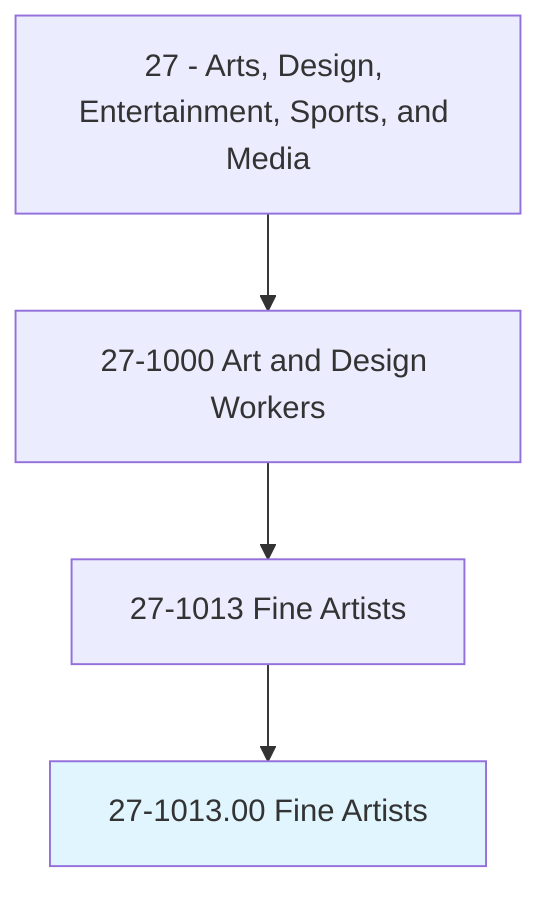
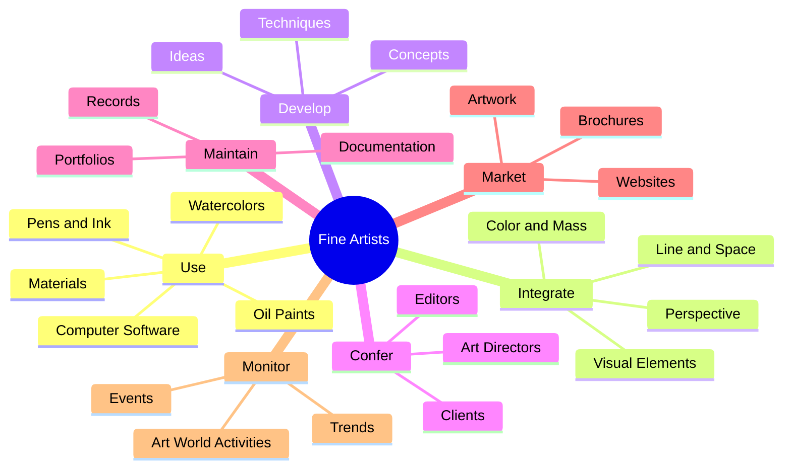
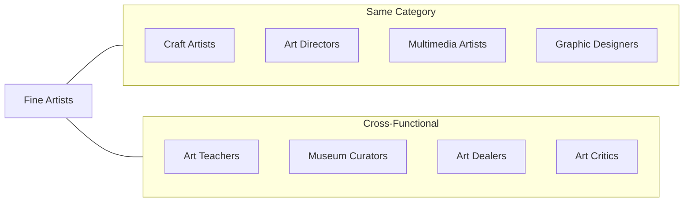
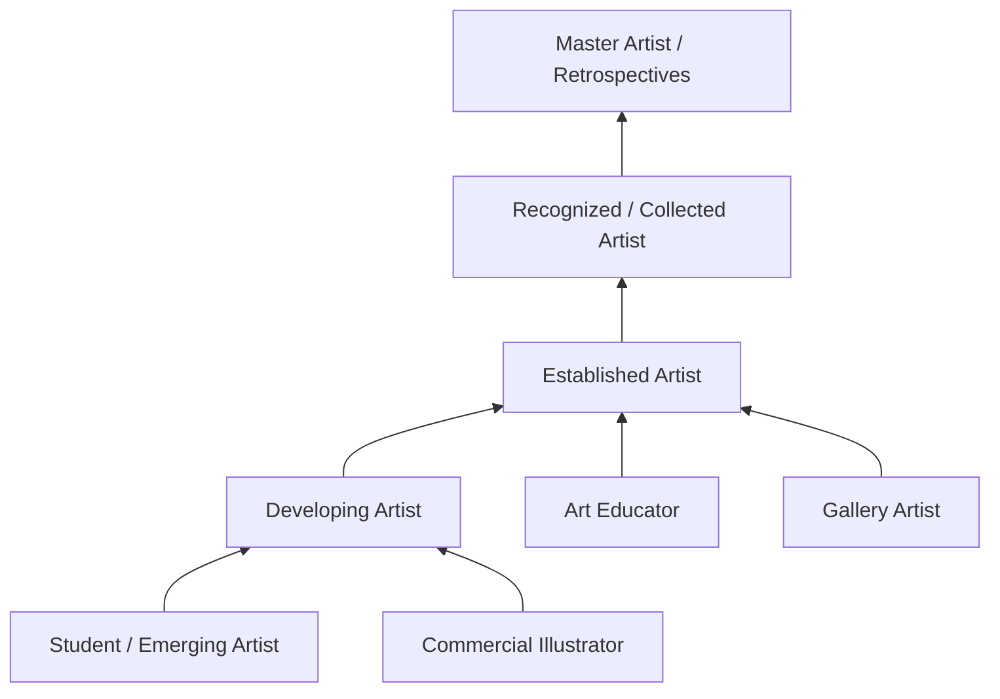

# Fine Artists, Including Painters, Sculptors, and Illustrators

> Create original artwork using any of a wide variety of media and techniques.

## Overview

Fine Artists create original works of art for aesthetic, intellectual, or emotional expression rather than primarily commercial purposes. This includes painters, sculptors, illustrators, and artists working in mixed media. They develop personal artistic styles, explore creative concepts, and produce work for galleries, museums, private collectors, and public spaces. Fine Artists combine technical mastery of their chosen medium with conceptual depth and artistic vision to create meaningful works that communicate ideas, evoke emotions, or challenge perceptions.

## Classification Hierarchy

## Key Statistics

| Metric | Value |
|--------|-------|
| SOC Code | 27-1013.00 |
| Job Zone | 4 (Considerable Preparation) |
| Category | [Arts, Design, Entertainment, Sports, and Media](/occupations/ArtsMedia) |
| Core Tasks | 12+ |
| Source | O*NET |

## Core Tasks

### use.Materials

Fine Artists work with diverse materials and techniques to create original artwork.

**Actions:**
- `use.Materials.to.create.Artwork` - Apply chosen materials to produce art
- `use.Pens.to.create.Artwork` - Create ink-based works and drawings
- `use.Watercolors.to.create.Artwork` - Produce watercolor paintings
- `use.Charcoal.to.create.Artwork` - Create charcoal drawings and studies
- `use.Oil.to.create.Artwork` - Paint with oil-based media
- `use.ComputerSoftware.to.create.Artwork` - Create digital art and illustrations

### integrate.VisualElements

Fine Artists develop and combine visual elements to produce desired artistic effects.

**Actions:**
- `integrate.VisualElements.to.produce.DesiredEffects` - Combine elements for intended impact
- `integrate.Line.to.produce.DesiredEffects` - Use line quality to create expression
- `integrate.Space.to.IllustrationOfIdeas` - Employ spatial relationships for meaning
- `integrate.Color.to.Emotions` - Apply color theory for emotional response
- `integrate.Mass.to.Moods` - Use form and weight for mood creation
- `integrate.Perspective.to.IllustrationOfIdeas` - Employ perspective for visual storytelling

### develop.VisualElements

Fine Artists evolve their artistic vocabulary and technical approach.

**Actions:**
- `develop.VisualElements.to.produce.DesiredEffects` - Expand visual language
- `develop.Line.to.IllustrationOfIdeas` - Refine line work for expression
- `develop.Color.to.Emotions` - Deepen color usage for emotional impact
- `develop.Perspective.to.Moods` - Enhance perspective techniques

### confer.Stakeholders

Fine Artists communicate with clients and collaborators about artwork requirements.

**Actions:**
- `confer.Editors.of.ArtworkToBeProduced` - Discuss illustration requirements with editors
- `confer.Writers.of.ArtworkToBeProduced` - Collaborate with writers on visual content
- `confer.ArtDirectors.of.ArtworkToBeProduced` - Align with art directors on creative vision
- `confer.OtherInterestedParties.regarding.NatureOfArtworkToBeProduced` - Communicate with stakeholders
- `confer.Content.of.ArtworkToBeProduced` - Discuss subject matter and themes

### maintain.Portfolios

Fine Artists document and present their body of work to demonstrate capabilities.

**Actions:**
- `maintain.Portfolios.of.ArtisticWork.to.demonstrate.Styles` - Curate portfolio to show range
- `maintain.Portfolios.of.Interests` - Document areas of artistic focus
- `maintain.Portfolios.of.Abilities` - Showcase technical capabilities

### market.Artwork

Fine Artists promote and sell their work through various channels.

**Actions:**
- `market.Artwork.through.Brochures` - Create promotional print materials
- `market.Mailings` - Send promotional materials to prospects
- `market.WebSites` - Maintain online presence for visibility and sales

### monitor.ArtWorld

Fine Artists stay current on developments in the art world to inform their practice.

**Actions:**
- `monitor.Events.to.develop.Ideas` - Attend events for inspiration
- `monitor.Trends.to.keep.CurrentOnArtWorldActivities` - Track art market trends
- `monitor.AttendArtExhibitions.to.develop.Ideas` - Visit exhibitions for exposure
- `monitor.ReadArtPublications.to.keep.CurrentOnArtWorldActivities` - Follow art literature

### study.Techniques

Fine Artists continuously develop their skills and artistic knowledge.

**Actions:**
- `study.DifferentTechniques.to.learn.HowToApplyThemToArtisticEndeavors` - Expand technical repertoire
- `photograph.Objects.for.ReferenceMaterial` - Document reference images for artwork

## Skills & Competencies

### Technical Skills
- **Drawing** - Expert
- **Color Theory** - Expert
- **Composition** - Expert
- **Medium-Specific Techniques** - Expert
- **Art History Knowledge** - Advanced
- **Digital Art Tools** - Intermediate to Advanced
- **Photography** - Intermediate

### Soft Skills
- **Creativity** - Critical
- **Artistic Vision** - Critical
- **Self-Discipline** - Essential
- **Communication** - Essential
- **Business Skills** - Important
- **Networking** - Important

## Artist Specializations

### Painter
Creates two-dimensional works using pigment-based media including oil, acrylic, watercolor, and mixed media on canvas, paper, or other surfaces.

### Sculptor
Produces three-dimensional artwork through carving, modeling, casting, or assembling materials such as stone, metal, clay, wood, or found objects.

### Illustrator
Creates visual images to accompany text or communicate concepts in publications, advertising, product packaging, or digital media.

### Printmaker
Produces artwork through printing processes including etching, lithography, screen printing, and relief printing.

### Mixed Media Artist
Combines multiple materials and techniques to create works that transcend traditional medium boundaries.

### Digital Artist
Creates artwork primarily using digital tools and software, producing work for screens, prints, or interactive media.

## Related Occupations

## Industries

- [Self-Employed / Independent Artists](/industries/SelfEmployed) - Highest Employment
- [Museums and Art Galleries](/industries/Museums) - Moderate Employment
- [Publishing Industries](/industries/Publishing) - Illustration work
- [Advertising and Public Relations](/industries/Advertising) - Commercial illustration
- [Educational Services](/industries/Education) - Teaching positions

## Art Market Channels

### Primary Market
- Gallery representation
- Direct studio sales
- Art fairs and exhibitions
- Commission work

### Secondary Market
- Auction houses
- Resale through dealers
- Private sales

### Alternative Markets
- Public art commissions
- Artist residencies
- Grants and fellowships
- Online platforms and NFTs

## Career Progression

## Education & Training

| Requirement | Details |
|-------------|---------|
| Typical Education | Bachelor's or Master's degree in Fine Arts (BFA/MFA) |
| Work Experience | Continuous artistic practice and portfolio development |
| On-the-Job Training | Apprenticeships, residencies, workshops, and self-directed study |
| Common Certifications | None required; degrees and exhibition history establish credibility |

## Portfolio Development

### Essential Elements
- Strong body of cohesive work
- Documentation of artistic process
- Artist statement and biography
- Exhibition history
- Press and reviews

### Presentation Formats
- Physical portfolio
- Digital portfolio website
- Social media presence
- Print materials (postcards, catalogs)

## Tools & Materials

### Traditional Media
- Paints (oil, acrylic, watercolor)
- Drawing materials (graphite, charcoal, pastels)
- Canvases, papers, panels
- Brushes, palette knives, tools
- Easels and studio equipment

### Digital Tools
- Graphics tablets
- Digital illustration software
- 3D modeling software
- Photo editing software

### Business Tools
- Website platforms
- Social media
- Accounting and invoicing software
- Inventory management

## Departments

This occupation typically works in:
- [Self-Employed / Studio](/departments/Studio)
- [Gallery Representation](/departments/Gallery)
- [Art Department](/departments/Creative) (for commercial work)
- [Educational Institution](/departments/Education) (teaching roles)

---

*Source: O*NET 27-1013.00 - ONETOccupation*
