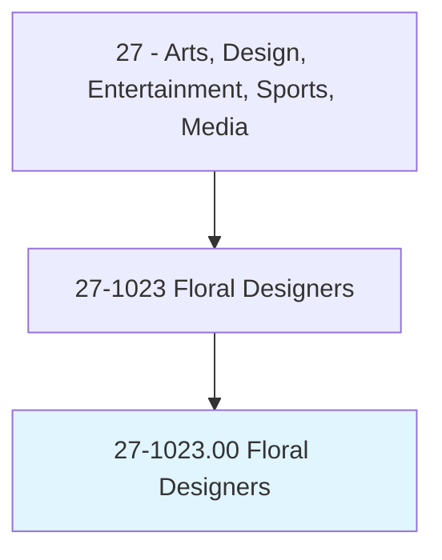
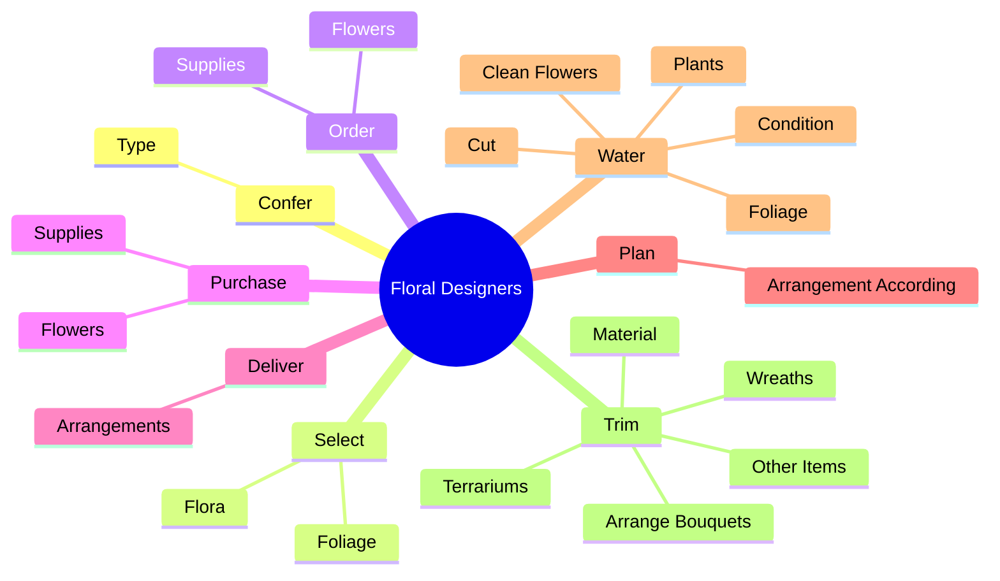

# Floral Designers

> Design, cut, and arrange live, dried, or artificial flowers and foliage.

## Overview

Floral Designers is classified under Arts, Design, Entertainment, Sports, Media (SOC 27). Design, cut, and arrange live, dried, or artificial flowers and foliage.

## Classification Hierarchy

## Key Statistics

| Metric | Value |
|--------|-------|
| SOC Code | 27-1023.00 |
| Category | [Arts, Design, Entertainment, Sports, Media](/occupations/ArtsMedia) |
| Task Count | 79 |
| Source | O*NET |

## Core Tasks

### confer.Type

Floral Designers confer type as part of their core responsibilities.

**Actions:**
- `confer.Type.of.ArrangementDesired`
- `confer.Type.of.Date`
- `confer.Type.of.Time`
- `confer.Type.of.Place.of.Delivery`

### select.Flora

Floral Designers select flora as part of their core responsibilities.

**Actions:**
- `select.Flora.for.Arrangements`
- `select.Flora.for.Working.with.NumerousCombinationsToSynthesize`
- `select.Flora.for.DevelopNewCreations`
- `select.Foliage.for.Arrangements`

### order.Flowers

Floral Designers order flowers as part of their core responsibilities.

**Actions:**
- `order.Flowers.from.Wholesalers`
- `order.Flowers.from.Growers`
- `order.Supplies.from.Wholesalers`
- `order.Supplies.from.Growers`

## Skills & Competencies

### Technical Skills
- **Creative Design** - Advanced
- **Digital Media** - Advanced
- **Content Creation** - Advanced

### Soft Skills
- **Communication** - Essential
- **Problem Solving** - Essential
- **Critical Thinking** - Important
- **Teamwork** - Important
- **Adaptability** - Important

## Related Occupations

## Industries

This occupation is found across multiple industries. See [Industries](/industries) for sector-specific employment data.

## Career Progression

---

*Source: O*NET 27-1023.00 - ONETOccupation*
