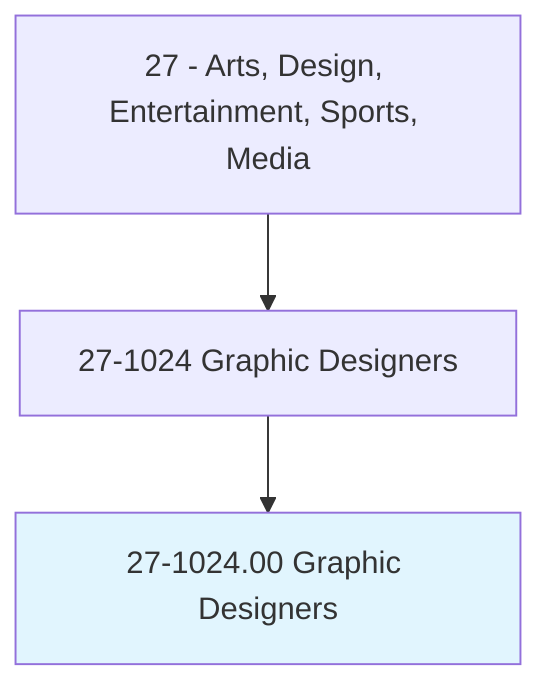
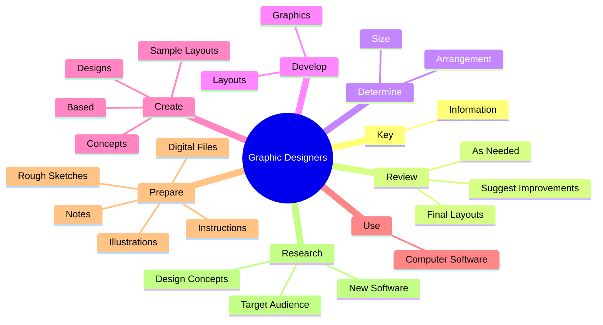
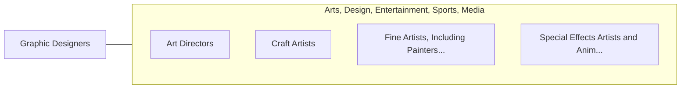

# Graphic Designers

> Design or create graphics to meet specific commercial or promotional needs, such as packaging, displays, or logos. May use a variety of mediums to achieve artistic or decorative effects.

## Overview

Graphic Designers is an occupation within the Arts, Design, Entertainment, Sports, Media category. Design or create graphics to meet specific commercial or promotional needs, such as packaging, displays, or logos. 

## Classification Hierarchy

## Key Statistics

| Metric | Value |
|--------|-------|
| SOC Code | 27-1024.00 |
| Category | [Arts, Design, Entertainment, Sports, Media](/occupations/ArtsMedia/index) |
| Task Count | 77 |
| Source | O*NET |

## Core Tasks

### key.Information

Graphic Designers key information as part of their core responsibilities.

**Actions:**
- `key.Information.into.ComputerEquipment.to.create.LayoutsForClient`
- `key.Information.into.ComputerEquipment.to.Supervisor`

### review.FinalLayouts

Graphic Designers review final layouts as part of their core responsibilities.

**Actions:**
- `review.FinalLayouts`
- `review.SuggestImprovements`
- `review.AsNeeded`

### determine.Size

Graphic Designers determine size as part of their core responsibilities.

**Actions:**
- `determine.Size.of.IllustrativeMaterial`
- `determine.Size.of.Copy`
- `determine.Size.of.SelectStyle`
- `determine.Size.of.Size.of.Type`

## Skills & Competencies

### Technical Skills
- **Creative Design** - Advanced
- **Digital Media** - Advanced
- **Content Creation** - Advanced

### Soft Skills
- **Communication** - Essential
- **Problem Solving** - Essential
- **Critical Thinking** - Important
- **Teamwork** - Important
- **Adaptability** - Important

## Related Occupations

## Industries

This occupation is found across multiple industries. See [Industries](/industries) for sector-specific employment data.

## Career Progression

---

*Source: O*NET 27-1024.00 - ONETOccupation*
