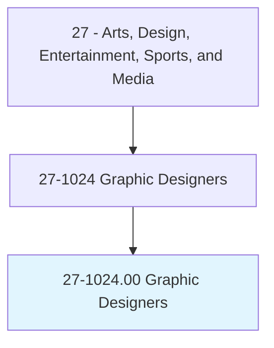
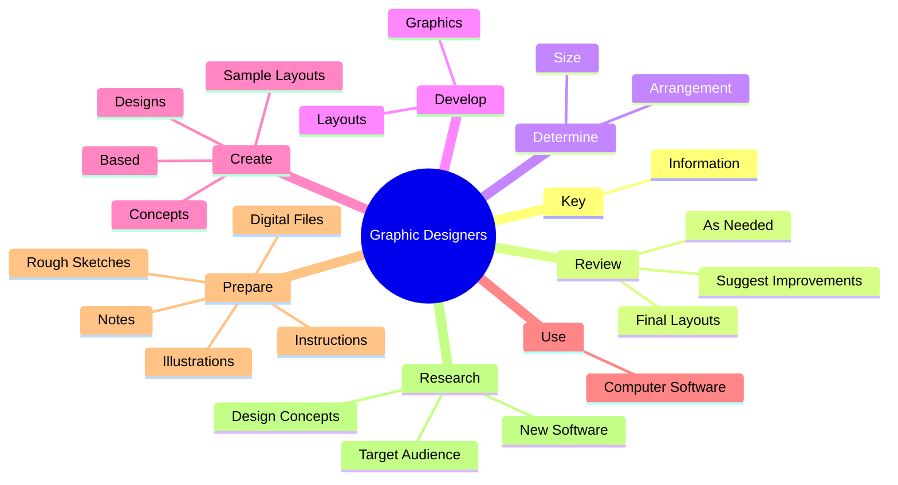
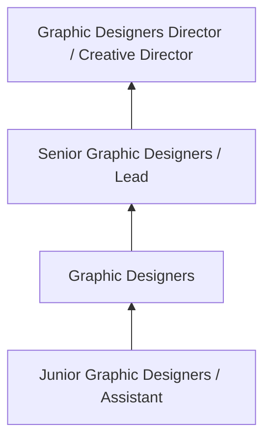
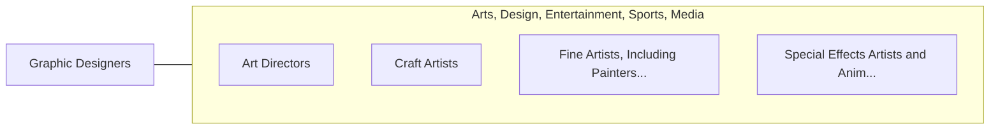

# Graphic Designers

> Design or create graphics to meet specific commercial or promotional needs, such as packaging, displays, or logos. May use a variety of mediums to achieve artistic or decorative effects.

## Overview

Graphic Designers professionals design or create graphics to meet specific commercial or promotional needs, such as packaging, displays, or logos. This occupation falls within the Arts, Design, Entertainment, Sports, and Media category and requires a combination of specialized knowledge, technical skills, and practical experience.

These professionals work across diverse settings and organizational contexts, applying their expertise to meet the demands of their field. They must stay current with industry standards, emerging practices, and regulatory requirements that affect their work. The role demands both independent judgment and collaborative skills, as practitioners regularly interact with colleagues, stakeholders, and the public.

As the field continues to evolve, Graphic Designers professionals increasingly leverage technology and data-driven approaches to enhance their effectiveness. Career opportunities span the public and private sectors, with demand influenced by economic conditions, demographic shifts, and technological advancement.

## Classification Hierarchy



## Key Statistics

| Metric | Value |
|--------|-------|
| SOC Code | 27-1024.00 |
| Job Zone | N/A |
| Category | [Arts, Design, Entertainment, Sports, and Media](/occupations/ArtsMedia/index) |
| Core Tasks | 77+ |
| Salary Range | $35,000 - $100,000 |
| Median Salary | $55,000 |
| Growth Outlook | 3% (Slower than average) |
| Source | O*NET |

## Core Tasks



### prepare.DigitalFiles

Graphic Designers prepare digital files as part of their core responsibilities.

**Actions:**
- `prepare.DigitalFiles.for.Printing` - Prepare digital files for printing.
- `prepare.Notes.for.WorkersWhoAssemble` - Prepare notes and instructions for workers who assemble and prepare final lay...
- `prepare.Notes.for.PrepareFinalLayouts.for.Printing` - Prepare notes and instructions for workers who assemble and prepare final lay...
- `prepare.Instructions.for.WorkersWhoAssemble` - Prepare notes and instructions for workers who assemble and prepare final lay...
- `prepare.Instructions.for.PrepareFinalLayouts.for.Printing` - Prepare notes and instructions for workers who assemble and prepare final lay...

### determine.Size

Graphic Designers determine size as part of their core responsibilities.

**Actions:**
- `determine.Size.of.IllustrativeMaterial` - Determine size and arrangement of illustrative material and copy, and select ...
- `determine.Size.of.Copy` - Determine size and arrangement of illustrative material and copy, and select ...
- `determine.Size.of.SelectStyle` - Determine size and arrangement of illustrative material and copy, and select ...
- `determine.Size.of.Size.of.Type` - Determine size and arrangement of illustrative material and copy, and select ...
- `determine.Arrangement.of.IllustrativeMaterial` - Determine size and arrangement of illustrative material and copy, and select ...

### create.Designs

Graphic Designers create designs as part of their core responsibilities.

**Actions:**
- `create.Designs.on.Knowledge.of.LayoutPrinciplesDesignConcepts` - Create designs, concepts, and sample layouts, based on knowledge of layout pr...
- `create.Designs.on.EstheticDesignConcepts` - Create designs, concepts, and sample layouts, based on knowledge of layout pr...
- `create.Concepts.on.Knowledge.of.LayoutPrinciplesDesignConcepts` - Create designs, concepts, and sample layouts, based on knowledge of layout pr...
- `create.Concepts.on.EstheticDesignConcepts` - Create designs, concepts, and sample layouts, based on knowledge of layout pr...
- `create.SampleLayouts.on.Knowledge.of.LayoutPrinciplesDesignConcepts` - Create designs, concepts, and sample layouts, based on knowledge of layout pr...

### develop.Graphics

Graphic Designers develop graphics as part of their core responsibilities.

**Actions:**
- `develop.Graphics.for.ProductIllustrations` - Develop graphics and layouts for product illustrations, company logos, and We...
- `develop.Graphics.for.CompanyLogos` - Develop graphics and layouts for product illustrations, company logos, and We...
- `develop.Graphics.for.WebSites` - Develop graphics and layouts for product illustrations, company logos, and We...
- `develop.Layouts.for.ProductIllustrations` - Develop graphics and layouts for product illustrations, company logos, and We...
- `develop.Layouts.for.CompanyLogos` - Develop graphics and layouts for product illustrations, company logos, and We...


## Skills & Competencies

### Technical Skills
- **Creative Design** - Expert
- **Digital Media Tools** - Advanced
- **Content Creation** - Advanced
- **Visual Communication** - Advanced
- **Production Techniques** - Proficient
- **Project Coordination** - Proficient

### Soft Skills
- **Creativity** - Critical
- **Communication** - Critical
- **Collaboration** - Essential
- **Adaptability** - Essential
- **Time Management** - Essential

## Education & Certifications

| Requirement | Details |
|-------------|---------|
| Typical Education | Bachelor's degree in arts, design, communications, or related field |
| Work Experience | 1-3 years portfolio-based experience |
| On-the-Job Training | Moderate - ongoing skill development in creative tools |
| Certifications | Industry-specific certifications (Adobe, etc.) |

## Career Progression



## Industry Variations

### Entertainment and Media
Creative production for film, television, music, or digital media. Graphic Designers professionals focus on audience engagement and storytelling.

### Advertising and Marketing
Brand communication and commercial creative work. Emphasis on client relationships and measurable campaign outcomes.

### Corporate Communications
Internal and external communications for organizations. Focus on brand consistency and strategic messaging.

### Freelance and Independent
Self-directed creative work with diverse clients. Requires strong business skills alongside creative talent.

## Technology & Tools

- **Adobe Creative Suite (Photoshop, Illustrator, Premiere)**
- **Digital audio workstations**
- **Content management systems**
- **3D modeling software**
- **Social media and analytics platforms**

## Related Occupations



## Industries

- [Media and Entertainment](/industries/Media) - High Employment
- [Advertising and Marketing](/industries/Advertising) - High Employment
- [Publishing](/industries/Publishing) - Moderate Employment
- [Technology](/industries/Technology) - Growing Employment

## Departments

This occupation typically works in:
- [Creative Services](/departments/Creative)
- [Marketing](/departments/Marketing/index)
- [Communications](/departments/Communications)

## GraphDL Semantic Structure

```
Graphic Designers perform:
- key.Information.into.ComputerEquipment.to.create.LayoutsForClient
- key.Information.into.ComputerEquipment.to.Supervisor
- review.FinalLayouts
- review.SuggestImprovements
- review.AsNeeded
- determine.Size.of.IllustrativeMaterial
```

---

*Source: O*NET 27-1024.00 - ONETOccupation*
