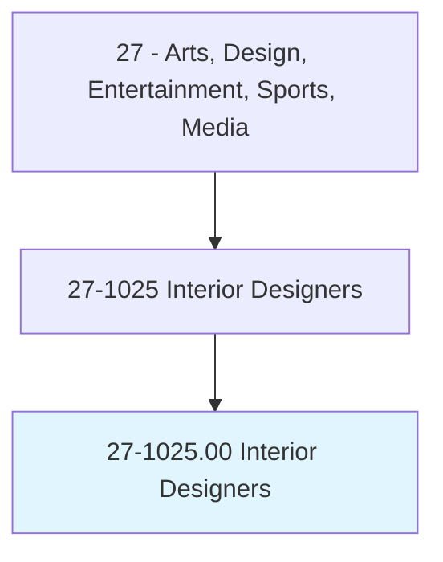
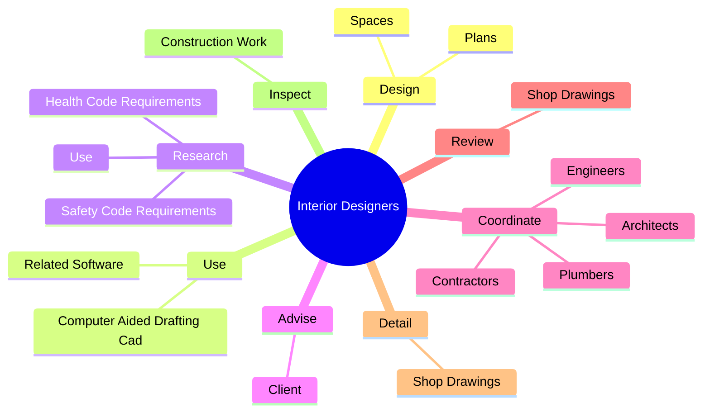

# Interior Designers

> Plan, design, and furnish the internal space of rooms or buildings. Design interior environments or create physical layouts that are practical, aesthetic, and conducive to the intended purposes. May specialize in a particular field, style, or phase of interior design.

## Overview

Interior Designers is an occupation within the Arts, Design, Entertainment, Sports, Media category. Plan, design, and furnish the internal space of rooms or buildings. Design interior environments or create physical layouts that are practical, aesthetic, and conducive to the intended purposes.

## Classification Hierarchy

## Key Statistics

| Metric | Value |
|--------|-------|
| SOC Code | 27-1025.00 |
| Category | [Arts, Design, Entertainment, Sports, Media](/occupations/ArtsMedia) |
| Task Count | 79 |
| Source | O*NET |

## Core Tasks

### design.Plans

Interior Designers design plans as part of their core responsibilities.

**Actions:**
- `design.Plans.to.BeSafeBeCompliantWithAmericanDisabilitiesActAda`
- `design.Plans.to.ToBeCompliantWithAmericanDisabilitiesActAda`
- `design.Spaces.to.BeEnvironmentallyFriendly`
- `design.Spaces.to.UsingSustainable`

### use.ComputerAidedDraftingCad

Interior Designers use computer aided drafting cad as part of their core responsibilities.

**Actions:**
- `use.ComputerAidedDraftingCad`
- `use.RelatedSoftware.to.produce.ConstructionDocuments`

### research.HealthCodeRequirements

Interior Designers research health code requirements as part of their core responsibilities.

**Actions:**
- `research.HealthCodeRequirements.to.inform.Design`
- `research.SafetyCodeRequirements.to.inform.Design`
- `research.Use.of.NewMaterials`
- `research.Use.of.Technologies`

## Skills & Competencies

### Technical Skills
- **Creative Design** - Advanced
- **Digital Media** - Advanced
- **Content Creation** - Advanced

### Soft Skills
- **Communication** - Essential
- **Problem Solving** - Essential
- **Critical Thinking** - Important
- **Teamwork** - Important
- **Adaptability** - Important

## Related Occupations

## Industries

This occupation is found across multiple industries. See [Industries](/industries) for sector-specific employment data.

## Career Progression

---

*Source: O*NET 27-1025.00 - ONETOccupation*
