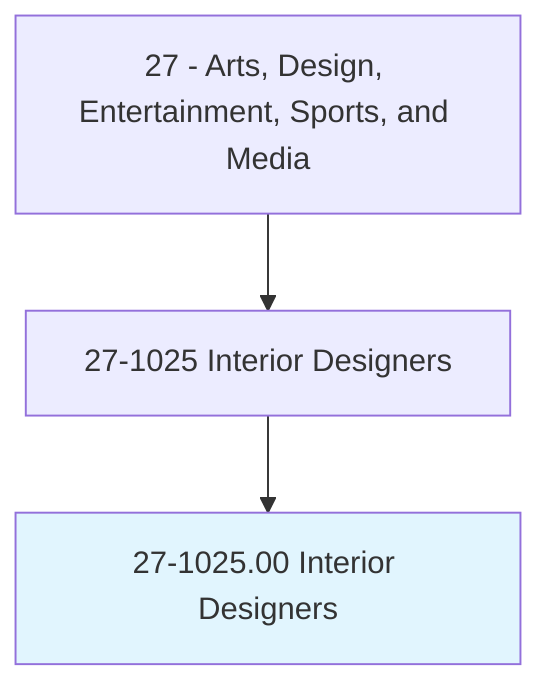
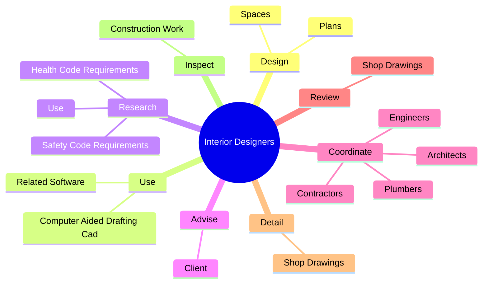
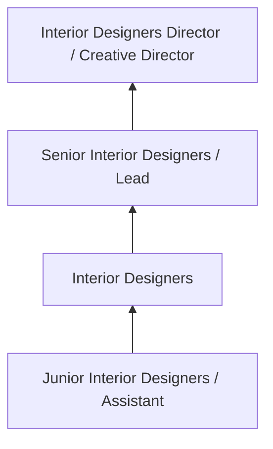

# Interior Designers

> Plan, design, and furnish the internal space of rooms or buildings. Design interior environments or create physical layouts that are practical, aesthetic, and conducive to the intended purposes. May specialize in a particular field, style, or phase of interior design.

## Overview

Interior Designers professionals plan, design, and furnish the internal space of rooms or buildings. This occupation falls within the Arts, Design, Entertainment, Sports, and Media category and requires a combination of specialized knowledge, technical skills, and practical experience.

These professionals work across diverse settings and organizational contexts, applying their expertise to meet the demands of their field. They must stay current with industry standards, emerging practices, and regulatory requirements that affect their work. The role demands both independent judgment and collaborative skills, as practitioners regularly interact with colleagues, stakeholders, and the public.

As the field continues to evolve, Interior Designers professionals increasingly leverage technology and data-driven approaches to enhance their effectiveness. Career opportunities span the public and private sectors, with demand influenced by economic conditions, demographic shifts, and technological advancement.

## Classification Hierarchy



## Key Statistics

| Metric | Value |
|--------|-------|
| SOC Code | 27-1025.00 |
| Job Zone | N/A |
| Category | [Arts, Design, Entertainment, Sports, and Media](/occupations/ArtsMedia/index) |
| Core Tasks | 79+ |
| Salary Range | $35,000 - $100,000 |
| Median Salary | $55,000 |
| Growth Outlook | 3% (Slower than average) |
| Source | O*NET |

## Core Tasks



### subcontract.Fabrication

Interior Designers subcontract fabrication as part of their core responsibilities.

**Actions:**
- `subcontract.Fabrication.of.Carpeting` - Subcontract fabrication, installation, and arrangement of carpeting, fixtures...
- `subcontract.Fabrication.of.Fixtures` - Subcontract fabrication, installation, and arrangement of carpeting, fixtures...
- `subcontract.Fabrication.of.Accessories` - Subcontract fabrication, installation, and arrangement of carpeting, fixtures...
- `subcontract.Fabrication.of.Draperies` - Subcontract fabrication, installation, and arrangement of carpeting, fixtures...
- `subcontract.Fabrication.of.Paint` - Subcontract fabrication, installation, and arrangement of carpeting, fixtures...

### design.Plans

Interior Designers design plans as part of their core responsibilities.

**Actions:**
- `design.Plans.to.BeSafeBeCompliantWithAmericanDisabilitiesActAda` - Design plans to be safe and to be compliant with the American Disabilities Ac...
- `design.Plans.to.ToBeCompliantWithAmericanDisabilitiesActAda` - Design plans to be safe and to be compliant with the American Disabilities Ac...
- `design.Spaces.to.BeEnvironmentallyFriendly` - Design spaces to be environmentally friendly, using sustainable, recycled mat...
- `design.Spaces.to.UsingSustainable` - Design spaces to be environmentally friendly, using sustainable, recycled mat...
- `design.Spaces.to.recycled.MaterialsWhenFeasible` - Design spaces to be environmentally friendly, using sustainable, recycled mat...

### advise.Client

Interior Designers advise client as part of their core responsibilities.

**Actions:**
- `advise.Client.on.InteriorDesignFactors` - Advise client on interior design factors, such as space planning, layout and ...
- `advise.Client.on.SpacePlanning` - Advise client on interior design factors, such as space planning, layout and ...
- `advise.Client.on.Layout` - Advise client on interior design factors, such as space planning, layout and ...
- `advise.Client.on.Use.of.Furnishings` - Advise client on interior design factors, such as space planning, layout and ...
- `advise.Client.on.Equipment` - Advise client on interior design factors, such as space planning, layout and ...

### research.HealthCodeRequirements

Interior Designers research health code requirements as part of their core responsibilities.

**Actions:**
- `research.HealthCodeRequirements.to.inform.Design` - Research health and safety code requirements to inform design.
- `research.SafetyCodeRequirements.to.inform.Design` - Research health and safety code requirements to inform design.
- `research.Use.of.NewMaterials` - Research and explore the use of new materials, technologies, and products to ...
- `research.Use.of.Technologies` - Research and explore the use of new materials, technologies, and products to ...
- `research.Use.of.Products.to.incorporate.IntoDesigns` - Research and explore the use of new materials, technologies, and products to ...


## Skills & Competencies

### Technical Skills
- **Creative Design** - Expert
- **Digital Media Tools** - Advanced
- **Content Creation** - Advanced
- **Visual Communication** - Advanced
- **Production Techniques** - Proficient
- **Project Coordination** - Proficient

### Soft Skills
- **Creativity** - Critical
- **Communication** - Critical
- **Collaboration** - Essential
- **Adaptability** - Essential
- **Time Management** - Essential

## Education & Certifications

| Requirement | Details |
|-------------|---------|
| Typical Education | Bachelor's degree in arts, design, communications, or related field |
| Work Experience | 1-3 years portfolio-based experience |
| On-the-Job Training | Moderate - ongoing skill development in creative tools |
| Certifications | Industry-specific certifications (Adobe, etc.) |

## Career Progression



## Industry Variations

### Entertainment and Media
Creative production for film, television, music, or digital media. Interior Designers professionals focus on audience engagement and storytelling.

### Advertising and Marketing
Brand communication and commercial creative work. Emphasis on client relationships and measurable campaign outcomes.

### Corporate Communications
Internal and external communications for organizations. Focus on brand consistency and strategic messaging.

### Freelance and Independent
Self-directed creative work with diverse clients. Requires strong business skills alongside creative talent.

## Technology & Tools

- **Adobe Creative Suite (Photoshop, Illustrator, Premiere)**
- **Digital audio workstations**
- **Content management systems**
- **3D modeling software**
- **Social media and analytics platforms**

## Related Occupations


## Industries

- Media and Entertainment - High Employment
- [Advertising and Marketing](/industries/Advertising) - High Employment
- [Publishing](/industries/Publishing) - Moderate Employment
- [Technology](/industries/Technology) - Growing Employment

## Departments

This occupation typically works in:
- Creative Services
- [Marketing](/departments/Marketing/index)
- Communications

## GraphDL Semantic Structure

```graphdl
Interior Designers perform:
- design.Plans.to.BeSafeBeCompliantWithAmericanDisabilitiesActAda
- design.Plans.to.ToBeCompliantWithAmericanDisabilitiesActAda
- use.ComputerAidedDraftingCad
- use.RelatedSoftware.to.produce.ConstructionDocuments
- research.HealthCodeRequirements.to.inform.Design
- research.SafetyCodeRequirements.to.inform.Design
```

---

*Source: O*NET 27-1025.00 - ONETOccupation*
