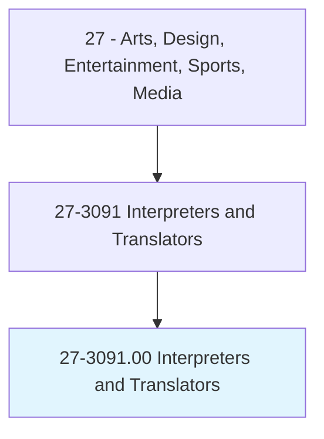
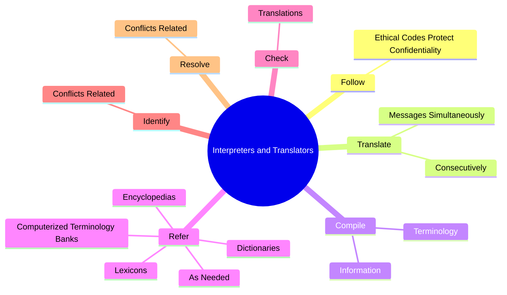
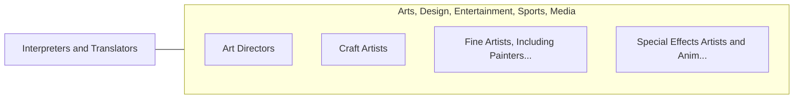

# Interpreters and Translators

> Interpret oral or sign language, or translate written text from one language into another.

## Overview

Interpreters and Translators is classified under Arts, Design, Entertainment, Sports, Media (SOC 27). Interpret oral or sign language, or translate written text from one language into another.

## Classification Hierarchy

## Key Statistics

| Metric | Value |
|--------|-------|
| SOC Code | 27-3091.00 |
| Category | [Arts, Design, Entertainment, Sports, Media](/occupations/ArtsMedia/index) |
| Task Count | 65 |
| Source | O*NET |

## Core Tasks

### follow.EthicalCodesProtectConfidentiality

Interpreters and Translators follow ethical codes protect confidentiality as part of their core responsibilities.

**Actions:**
- `follow.EthicalCodesProtectConfidentiality.of.Information`

### translate.MessagesSimultaneously

Interpreters and Translators translate messages simultaneously as part of their core responsibilities.

**Actions:**
- `translate.MessagesSimultaneously.into.SpecifiedLanguagesOrally.by.UsingHandSigns`
- `translate.MessagesSimultaneously.into.SpecifiedLanguagesOrally.by.MaintainingMessageContent`
- `translate.MessagesSimultaneously.into.SpecifiedLanguagesOrally.by.Context`
- `translate.MessagesSimultaneously.into.SpecifiedLanguagesOrally.by.StyleAsAsPossible`

### compile.Terminology

Interpreters and Translators compile terminology as part of their core responsibilities.

**Actions:**
- `compile.Terminology.to.BeUsedInTranslations`
- `compile.Terminology.to.IncludingTechnicalTerms`
- `compile.Terminology.to.ForLegal`
- `compile.Terminology.to.MedicalMaterial`

## Skills & Competencies

### Technical Skills
- **Creative Design** - Advanced
- **Digital Media** - Advanced
- **Content Creation** - Advanced

### Soft Skills
- **Communication** - Essential
- **Problem Solving** - Essential
- **Critical Thinking** - Important
- **Teamwork** - Important
- **Adaptability** - Important

## Related Occupations

## Industries

This occupation is found across multiple industries. See [Industries](/industries) for sector-specific employment data.

## Career Progression

---

*Source: O*NET 27-3091.00 - ONETOccupation*
