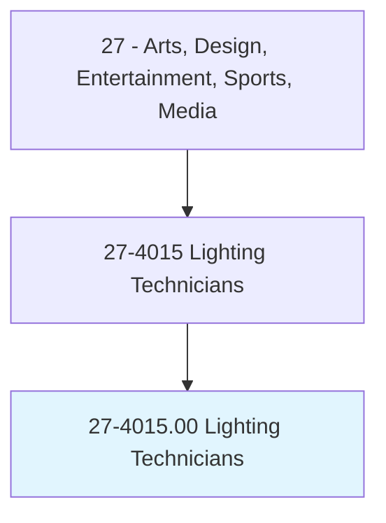
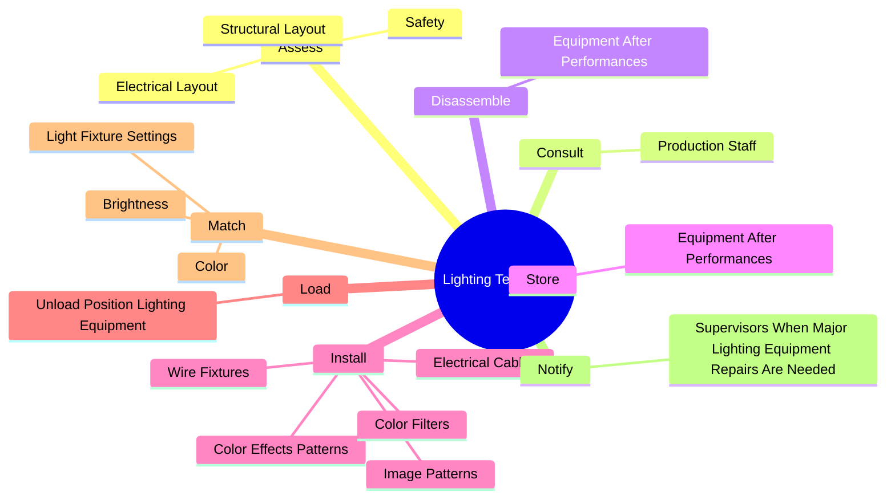

# Lighting Technicians

> Set up, maintain, and dismantle light fixtures, lighting control devices, and the associated lighting electrical and rigging equipment used for photography, television, film, video, and live productions. May focus or operate light fixtures, or attach color filters or other lighting accessories.

## Overview

Lighting Technicians is an occupation within the Arts, Design, Entertainment, Sports, Media category. Set up, maintain, and dismantle light fixtures, lighting control devices, and the associated lighting electrical and rigging equipment used for photography, television, film, video, and live productions. 

## Classification Hierarchy

## Key Statistics

| Metric | Value |
|--------|-------|
| SOC Code | 27-4015.00 |
| Category | [Arts, Design, Entertainment, Sports, Media](/occupations/ArtsMedia/index) |
| Task Count | 40 |
| Source | O*NET |

## Core Tasks

### assess.Safety

Lighting Technicians assess safety as part of their core responsibilities.

**Actions:**
- `assess.Safety.of.WiringSetUp.to.determine.RiskOfFireElectricalShock`
- `assess.Safety.of.EquipmentSetUp.to.determine.RiskOfFireElectricalShock`
- `assess.StructuralLayout.of.LocationsBeforeSettingUpLightingEquipment`
- `assess.ElectricalLayout.of.LocationsBeforeSettingUpLightingEquipment`

### consult.ProductionStaff

Lighting Technicians consult production staff as part of their core responsibilities.

**Actions:**
- `consult.ProductionStaff.to.determine.LightingRequirements`

### disassemble.EquipmentAfterPerformances

Lighting Technicians disassemble equipment after performances as part of their core responsibilities.

**Actions:**
- `disassemble.EquipmentAfterPerformances`

## Skills & Competencies

### Technical Skills
- **Creative Design** - Advanced
- **Digital Media** - Advanced
- **Content Creation** - Advanced

### Soft Skills
- **Communication** - Essential
- **Problem Solving** - Essential
- **Critical Thinking** - Important
- **Teamwork** - Important
- **Adaptability** - Important

## Related Occupations

## Industries

This occupation is found across multiple industries. See [Industries](/industries) for sector-specific employment data.

## Career Progression

---

*Source: O*NET 27-4015.00 - ONETOccupation*
