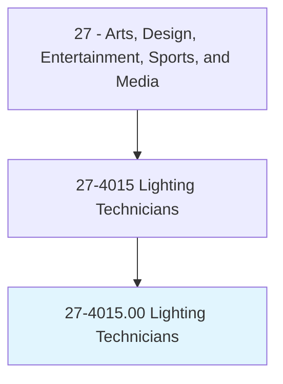
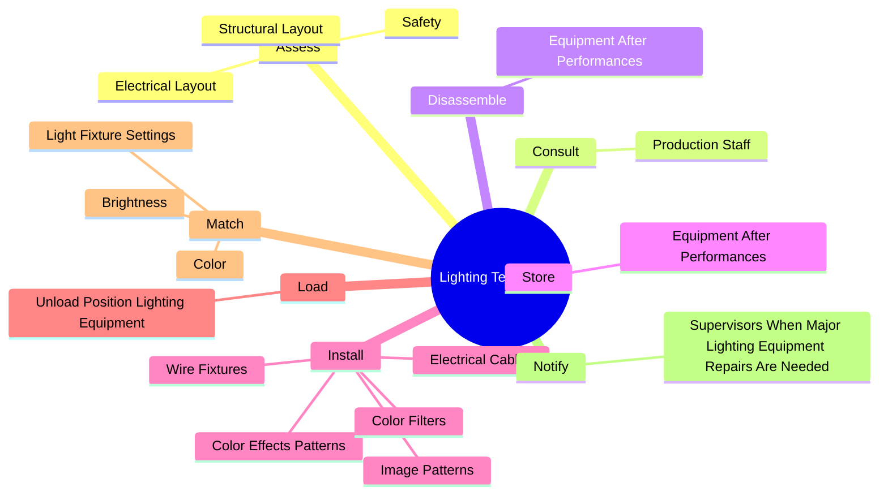
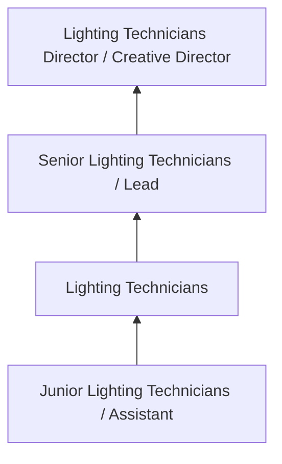

# Lighting Technicians

> Set up, maintain, and dismantle light fixtures, lighting control devices, and the associated lighting electrical and rigging equipment used for photography, television, film, video, and live productions. May focus or operate light fixtures, or attach color filters or other lighting accessories.

## Overview

Lighting Technicians professionals set up, maintain, and dismantle light fixtures, lighting control devices, and the associated lighting electrical and rigging equipment used for photography, television, film, video, and live productions. This occupation falls within the Arts, Design, Entertainment, Sports, and Media category and requires a combination of specialized knowledge, technical skills, and practical experience.

These professionals work across diverse settings and organizational contexts, applying their expertise to meet the demands of their field. They must stay current with industry standards, emerging practices, and regulatory requirements that affect their work. The role demands both independent judgment and collaborative skills, as practitioners regularly interact with colleagues, stakeholders, and the public.

As the field continues to evolve, Lighting Technicians professionals increasingly leverage technology and data-driven approaches to enhance their effectiveness. Career opportunities span the public and private sectors, with demand influenced by economic conditions, demographic shifts, and technological advancement.

## Classification Hierarchy



## Key Statistics

| Metric | Value |
|--------|-------|
| SOC Code | 27-4015.00 |
| Job Zone | N/A |
| Category | [Arts, Design, Entertainment, Sports, and Media](/occupations/ArtsMedia/index) |
| Core Tasks | 40+ |
| Salary Range | $35,000 - $100,000 |
| Median Salary | $55,000 |
| Growth Outlook | 3% (Slower than average) |
| Source | O*NET |

## Core Tasks



### perform.MinorRepairsMaintenance

Lighting Technicians perform minor repairs maintenance as part of their core responsibilities.

**Actions:**
- `perform.MinorRepairsMaintenance.on.LightingEquipment` - Perform minor repairs or routine maintenance on lighting equipment, such as r...
- `perform.MinorRepairsMaintenance.on.ReplacingLamps` - Perform minor repairs or routine maintenance on lighting equipment, such as r...
- `perform.MinorRepairsMaintenance.on.DamagedColorFilters` - Perform minor repairs or routine maintenance on lighting equipment, such as r...
- `perform.RoutineMaintenance.on.LightingEquipment` - Perform minor repairs or routine maintenance on lighting equipment, such as r...
- `perform.RoutineMaintenance.on.ReplacingLamps` - Perform minor repairs or routine maintenance on lighting equipment, such as r...

### install.ColorEffectsPatterns

Lighting Technicians install color effects patterns as part of their core responsibilities.

**Actions:**
- `install.ColorEffectsPatterns` - Install color effects or image patterns, such as color filters, onto lighting...
- `install.ImagePatterns` - Install color effects or image patterns, such as color filters, onto lighting...
- `install.ColorFilters` - Install color effects or image patterns, such as color filters, onto lighting...
- `install.ElectricalCables` - Install electrical cables or wire fixtures.
- `install.WireFixtures` - Install electrical cables or wire fixtures.

### set.FocusLightFixtures

Lighting Technicians set focus light fixtures as part of their core responsibilities.

**Actions:**
- `set.FocusLightFixtures.to.meet.RequirementsOfTelevision` - Set up and focus light fixtures to meet requirements of television, theater, ...
- `set.FocusLightFixtures.to.Theater` - Set up and focus light fixtures to meet requirements of television, theater, ...
- `set.FocusLightFixtures.to.Concerts` - Set up and focus light fixtures to meet requirements of television, theater, ...
- `set.FocusLightFixtures.to.OtherProductions` - Set up and focus light fixtures to meet requirements of television, theater, ...
- `set.Cranes.to.assist.WithSettingUpOfLightingEquipment` - Set up scaffolding or cranes to assist with setting up of lighting equipment.

### assess.Safety

Lighting Technicians assess safety as part of their core responsibilities.

**Actions:**
- `assess.Safety.of.WiringSetUp.to.determine.RiskOfFireElectricalShock` - Assess safety of wiring or equipment set-up to determine the risk of fire or ...
- `assess.Safety.of.EquipmentSetUp.to.determine.RiskOfFireElectricalShock` - Assess safety of wiring or equipment set-up to determine the risk of fire or ...
- `assess.StructuralLayout.of.LocationsBeforeSettingUpLightingEquipment` - Visit and assess structural and electrical layout of locations before setting...
- `assess.ElectricalLayout.of.LocationsBeforeSettingUpLightingEquipment` - Visit and assess structural and electrical layout of locations before setting...


## Skills & Competencies

### Technical Skills
- **Creative Design** - Expert
- **Digital Media Tools** - Advanced
- **Content Creation** - Advanced
- **Visual Communication** - Advanced
- **Production Techniques** - Proficient
- **Project Coordination** - Proficient

### Soft Skills
- **Creativity** - Critical
- **Communication** - Critical
- **Collaboration** - Essential
- **Adaptability** - Essential
- **Time Management** - Essential

## Education & Certifications

| Requirement | Details |
|-------------|---------|
| Typical Education | Bachelor's degree in arts, design, communications, or related field |
| Work Experience | 1-3 years portfolio-based experience |
| On-the-Job Training | Moderate - ongoing skill development in creative tools |
| Certifications | Industry-specific certifications (Adobe, etc.) |

## Career Progression



## Industry Variations

### Entertainment and Media
Creative production for film, television, music, or digital media. Lighting Technicians professionals focus on audience engagement and storytelling.

### Advertising and Marketing
Brand communication and commercial creative work. Emphasis on client relationships and measurable campaign outcomes.

### Corporate Communications
Internal and external communications for organizations. Focus on brand consistency and strategic messaging.

### Freelance and Independent
Self-directed creative work with diverse clients. Requires strong business skills alongside creative talent.

## Technology & Tools

- **Adobe Creative Suite (Photoshop, Illustrator, Premiere)**
- **Digital audio workstations**
- **Content management systems**
- **3D modeling software**
- **Social media and analytics platforms**

## Related Occupations


## Industries

- Media and Entertainment - High Employment
- [Advertising and Marketing](/industries/Advertising) - High Employment
- [Publishing](/industries/Publishing) - Moderate Employment
- [Technology](/industries/Technology) - Growing Employment

## Departments

This occupation typically works in:
- Creative Services
- [Marketing](/departments/Marketing/index)
- Communications

## GraphDL Semantic Structure

```graphdl
Lighting Technicians perform:
- assess.Safety.of.WiringSetUp.to.determine.RiskOfFireElectricalShock
- assess.Safety.of.EquipmentSetUp.to.determine.RiskOfFireElectricalShock
- consult.ProductionStaff.to.determine.LightingRequirements
- disassemble.EquipmentAfterPerformances
- store.EquipmentAfterPerformances
- install.ColorEffectsPatterns
```

---

*Source: O*NET 27-4015.00 - ONETOccupation*
