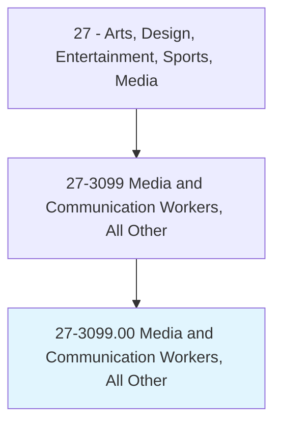

# Media and Communication Workers, All Other

> All media and communication workers not listed separately.

## Overview

Media and Communication Workers, All Other is classified under Arts, Design, Entertainment, Sports, Media (SOC 27). All media and communication workers not listed separately.

## Classification Hierarchy

## Key Statistics

| Metric | Value |
|--------|-------|
| SOC Code | 27-3099.00 |
| Category | [Arts, Design, Entertainment, Sports, Media](/occupations/ArtsMedia) |
| Task Count | 0 |
| Source | O*NET |

## Core Tasks

Task data is being compiled for this occupation. See [O*NET 27-3099.00](https://www.onetonline.org/link/summary/27-3099.00) for detailed task information.

## Skills & Competencies

### Technical Skills
- **Creative Design** - Advanced
- **Digital Media** - Advanced
- **Content Creation** - Advanced

### Soft Skills
- **Communication** - Essential
- **Problem Solving** - Essential
- **Critical Thinking** - Important
- **Teamwork** - Important
- **Adaptability** - Important

## Related Occupations

## Industries

This occupation is found across multiple industries. See [Industries](/industries) for sector-specific employment data.

## Career Progression

---

*Source: O*NET 27-3099.00 - ONETOccupation*
