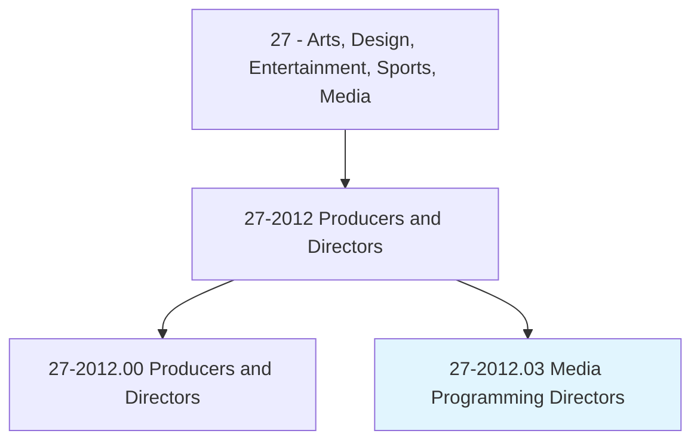
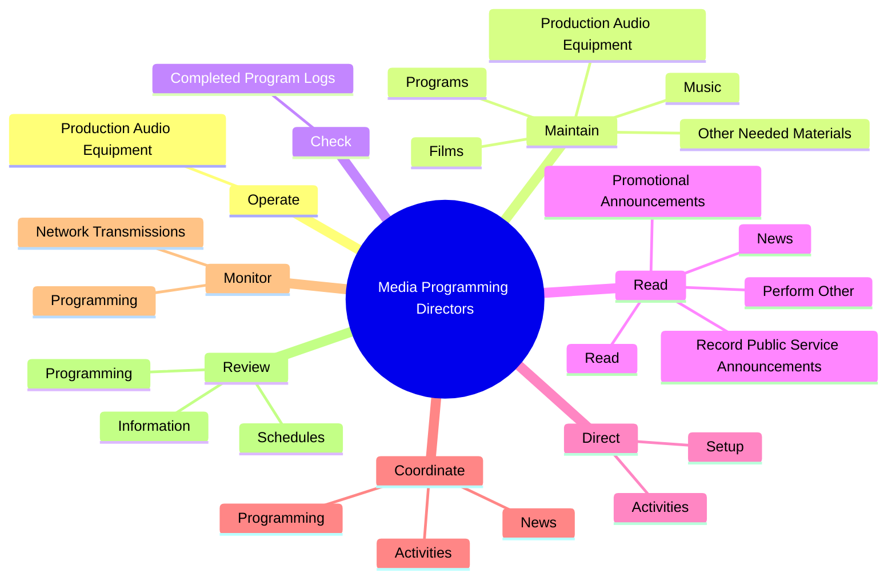

# Media Programming Directors

> Direct and coordinate activities of personnel engaged in preparation of radio or television station program schedules and programs, such as sports or news.

## Overview

Media Programming Directors is classified under Arts, Design, Entertainment, Sports, Media (SOC 27). Direct and coordinate activities of personnel engaged in preparation of radio or television station program schedules and programs, such as sports or news.

## Classification Hierarchy

## Key Statistics

| Metric | Value |
|--------|-------|
| SOC Code | 27-2012.03 |
| Category | [Arts, Design, Entertainment, Sports, Media](/occupations/ArtsMedia/index) |
| Task Count | 124 |
| Source | O*NET |

## Core Tasks

### operate.ProductionAudioEquipment

Media Programming Directors operate production audio equipment as part of their core responsibilities.

**Actions:**
- `operate.ProductionAudioEquipment`

### maintain.ProductionAudioEquipment

Media Programming Directors maintain production audio equipment as part of their core responsibilities.

**Actions:**
- `maintain.ProductionAudioEquipment`
- `maintain.Programs.for.UseAsNecessary`
- `maintain.Music.for.UseAsNecessary`
- `maintain.Films.for.UseAsNecessary`

### check.CompletedProgramLogs

Media Programming Directors check completed program logs as part of their core responsibilities.

**Actions:**
- `check.CompletedProgramLogs.for.Accuracy.with.FederalCommunicationsCommissionFcc`
- `check.CompletedProgramLogs.for.Conformance.with.FederalCommunicationsCommissionFcc`

## Skills & Competencies

### Technical Skills
- **Creative Design** - Advanced
- **Digital Media** - Advanced
- **Content Creation** - Advanced

### Soft Skills
- **Communication** - Essential
- **Problem Solving** - Essential
- **Critical Thinking** - Important
- **Teamwork** - Important
- **Adaptability** - Important

## Related Occupations

## Industries

This occupation is found across multiple industries. See [Industries](/industries) for sector-specific employment data.

## Career Progression

---

*Source: O*NET 27-2012.03 - ONETOccupation*
