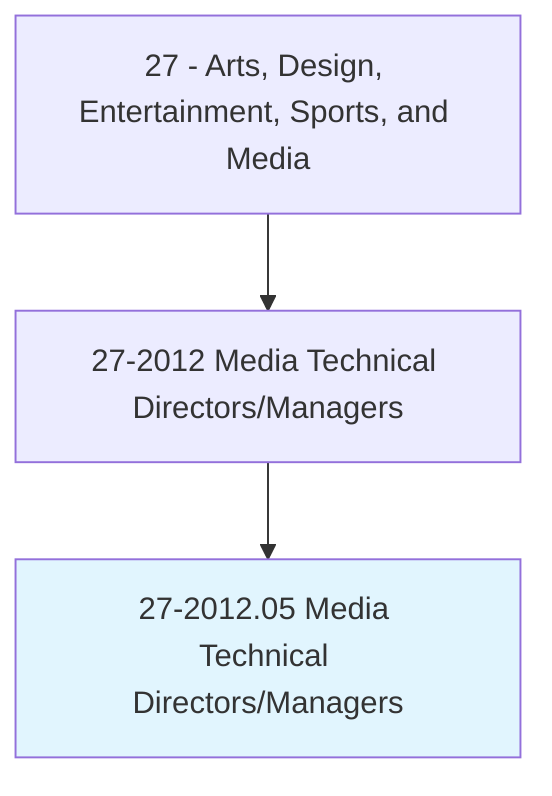
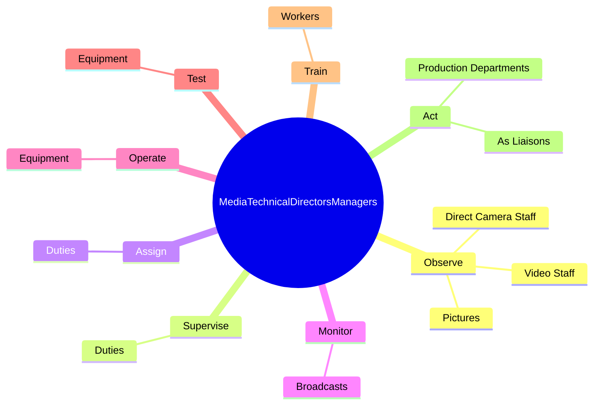
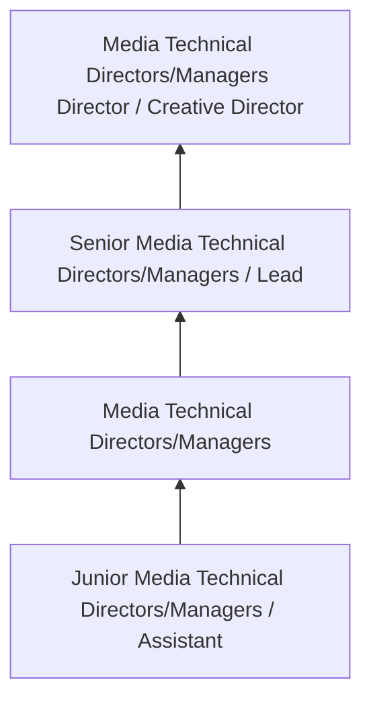

# Media Technical Directors/Managers

> Coordinate activities of technical departments, such as taping, editing, engineering, and maintenance, to produce radio or television programs.

## Overview

Media Technical Directors/Managers professionals coordinate activities of technical departments, such as taping, editing, engineering, and maintenance, to produce radio or television programs.. This occupation falls within the Arts, Design, Entertainment, Sports, and Media category and requires a combination of specialized knowledge, technical skills, and practical experience.

These professionals work across diverse settings and organizational contexts, applying their expertise to meet the demands of their field. They must stay current with industry standards, emerging practices, and regulatory requirements that affect their work. The role demands both independent judgment and collaborative skills, as practitioners regularly interact with colleagues, stakeholders, and the public.

As the field continues to evolve, Media Technical Directors/Managers professionals increasingly leverage technology and data-driven approaches to enhance their effectiveness. Career opportunities span the public and private sectors, with demand influenced by economic conditions, demographic shifts, and technological advancement.

## Classification Hierarchy



## Key Statistics

| Metric | Value |
|--------|-------|
| SOC Code | 27-2012.05 |
| Job Zone | N/A |
| Category | [Arts, Design, Entertainment, Sports, and Media](/occupations/ArtsMedia/index) |
| Core Tasks | 54+ |
| Salary Range | $35,000 - $100,000 |
| Median Salary | $55,000 |
| Growth Outlook | 3% (Slower than average) |
| Source | O*NET |

## Core Tasks



### set.ExecuteVideoTransitionsEffects

Media Technical Directors/Managers set execute video transitions effects as part of their core responsibilities.

**Actions:**
- `set.ExecuteVideoTransitionsEffects.to.manipulate.PicturesAsNecessary` - Set up and execute video transitions and special effects, such as fades, diss...
- `set.SpecialEffects.to.manipulate.PicturesAsNecessary` - Set up and execute video transitions and special effects, such as fades, diss...
- `set.Fades.to.manipulate.PicturesAsNecessary` - Set up and execute video transitions and special effects, such as fades, diss...
- `set.Dissolves.to.manipulate.PicturesAsNecessary` - Set up and execute video transitions and special effects, such as fades, diss...
- `set.Cuts.to.manipulate.PicturesAsNecessary` - Set up and execute video transitions and special effects, such as fades, diss...

### direct.TechnicalAspects

Media Technical Directors/Managers direct technical aspects as part of their core responsibilities.

**Actions:**
- `direct.TechnicalAspects.of.NewscastsProductions` - Direct technical aspects of newscasts and other productions, checking and swi...
- `direct.TechnicalAspects.of.OtherProductions` - Direct technical aspects of newscasts and other productions, checking and swi...
- `direct.TechnicalAspects.of.Checking` - Direct technical aspects of newscasts and other productions, checking and swi...
- `direct.TechnicalAspects.of.SwitchingBetweenVideoSources` - Direct technical aspects of newscasts and other productions, checking and swi...
- `direct.TechnicalAspects.of.TakingResponsibility.for.OnAirProduct` - Direct technical aspects of newscasts and other productions, checking and swi...

### train.Workers

Media Technical Directors/Managers train workers as part of their core responsibilities.

**Actions:**
- `train.Workers.in.Use.of.Equipment` - Train workers in use of equipment, such as switchers, cameras, monitors, micr...
- `train.Workers.in.Switchers` - Train workers in use of equipment, such as switchers, cameras, monitors, micr...
- `train.Workers.in.Cameras` - Train workers in use of equipment, such as switchers, cameras, monitors, micr...
- `train.Workers.in.Monitors` - Train workers in use of equipment, such as switchers, cameras, monitors, micr...
- `train.Workers.in.Microphones` - Train workers in use of equipment, such as switchers, cameras, monitors, micr...

### follow.Instructions

Media Technical Directors/Managers follow instructions as part of their core responsibilities.

**Actions:**
- `follow.Instructions.from.ProductionManagersDuringProductions` - Follow instructions from production managers and directors during productions...
- `follow.Instructions.from.DirectorsDuringProductions` - Follow instructions from production managers and directors during productions...
- `follow.Instructions.from.Commands.for.CameraCuts` - Follow instructions from production managers and directors during productions...
- `follow.Instructions.from.Effects` - Follow instructions from production managers and directors during productions...
- `follow.Instructions.from.Graphics` - Follow instructions from production managers and directors during productions...


## Skills & Competencies

### Technical Skills
- **Creative Design** - Expert
- **Digital Media Tools** - Advanced
- **Content Creation** - Advanced
- **Visual Communication** - Advanced
- **Production Techniques** - Proficient
- **Project Coordination** - Proficient

### Soft Skills
- **Creativity** - Critical
- **Communication** - Critical
- **Collaboration** - Essential
- **Adaptability** - Essential
- **Time Management** - Essential

## Education & Certifications

| Requirement | Details |
|-------------|---------|
| Typical Education | Bachelor's degree in arts, design, communications, or related field |
| Work Experience | 1-3 years portfolio-based experience |
| On-the-Job Training | Moderate - ongoing skill development in creative tools |
| Certifications | Industry-specific certifications (Adobe, etc.) |

## Career Progression



## Industry Variations

### Entertainment and Media
Creative production for film, television, music, or digital media. Media Technical Directors/Managers professionals focus on audience engagement and storytelling.

### Advertising and Marketing
Brand communication and commercial creative work. Emphasis on client relationships and measurable campaign outcomes.

### Corporate Communications
Internal and external communications for organizations. Focus on brand consistency and strategic messaging.

### Freelance and Independent
Self-directed creative work with diverse clients. Requires strong business skills alongside creative talent.

## Technology & Tools

- **Adobe Creative Suite (Photoshop, Illustrator, Premiere)**
- **Digital audio workstations**
- **Content management systems**
- **3D modeling software**
- **Social media and analytics platforms**

## Related Occupations


## Industries

- Media and Entertainment - High Employment
- [Advertising and Marketing](/industries/Advertising) - High Employment
- [Publishing](/industries/Publishing) - Moderate Employment
- [Technology](/industries/Technology) - Growing Employment

## Departments

This occupation typically works in:
- Creative Services
- [Marketing](/departments/Marketing/index)
- Communications

## GraphDL Semantic Structure

```graphdl
Media Technical Directors/Managers perform:
- observe.Pictures.through.Monitors
- observe.DirectCameraStaff.concerning.ShadingComposition
- observe.VideoStaff.concerning.ShadingComposition
- supervise.Duties.to.WorkersEngagedInTechnicalControl
- supervise.Duties.to.production.OfRadioPrograms
- supervise.Duties.to.TelevisionPrograms
```

---

*Source: O*NET 27-2012.05 - ONETOccupation*
