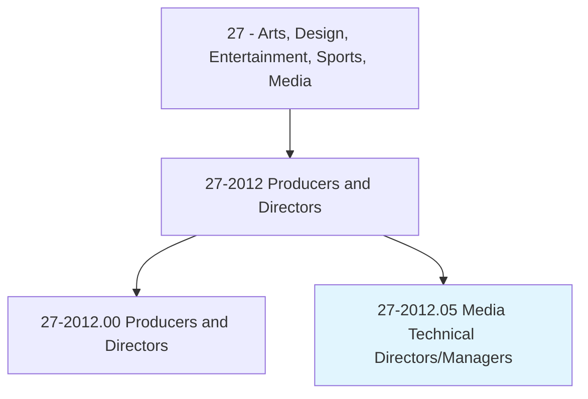
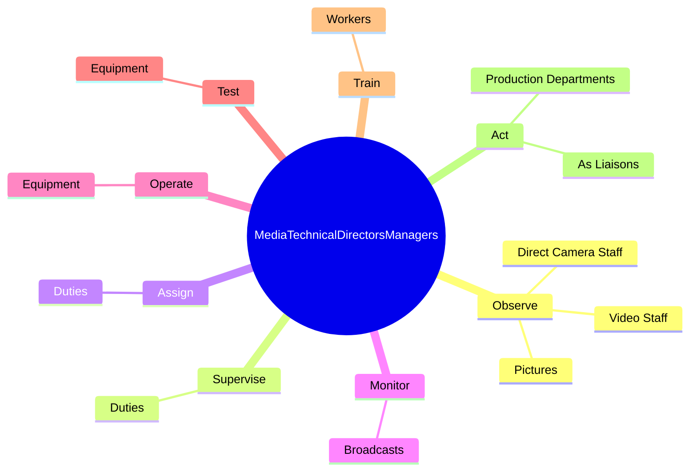

# Media Technical Directors/Managers

> Coordinate activities of technical departments, such as taping, editing, engineering, and maintenance, to produce radio or television programs.

## Overview

Media Technical Directors/Managers is classified under Arts, Design, Entertainment, Sports, Media (SOC 27). Coordinate activities of technical departments, such as taping, editing, engineering, and maintenance, to produce radio or television programs.

## Classification Hierarchy

## Key Statistics

| Metric | Value |
|--------|-------|
| SOC Code | 27-2012.05 |
| Category | [Arts, Design, Entertainment, Sports, Media](/occupations/ArtsMedia) |
| Task Count | 54 |
| Source | O*NET |

## Core Tasks

### observe.Pictures

Media Technical Directors/Managers observe pictures as part of their core responsibilities.

**Actions:**
- `observe.Pictures.through.Monitors`
- `observe.DirectCameraStaff.concerning.ShadingComposition`
- `observe.VideoStaff.concerning.ShadingComposition`

### supervise.Duties

Media Technical Directors/Managers supervise duties as part of their core responsibilities.

**Actions:**
- `supervise.Duties.to.WorkersEngagedInTechnicalControl`
- `supervise.Duties.to.production.OfRadioPrograms`
- `supervise.Duties.to.TelevisionPrograms`

### assign.Duties

Media Technical Directors/Managers assign duties as part of their core responsibilities.

**Actions:**
- `assign.Duties.to.WorkersEngagedInTechnicalControl`
- `assign.Duties.to.production.OfRadioPrograms`
- `assign.Duties.to.TelevisionPrograms`

## Skills & Competencies

### Technical Skills
- **Creative Design** - Advanced
- **Digital Media** - Advanced
- **Content Creation** - Advanced

### Soft Skills
- **Communication** - Essential
- **Problem Solving** - Essential
- **Critical Thinking** - Important
- **Teamwork** - Important
- **Adaptability** - Important

## Related Occupations

## Industries

This occupation is found across multiple industries. See [Industries](/industries) for sector-specific employment data.

## Career Progression

---

*Source: O*NET 27-2012.05 - ONETOccupation*
