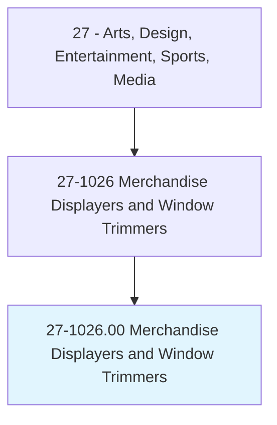
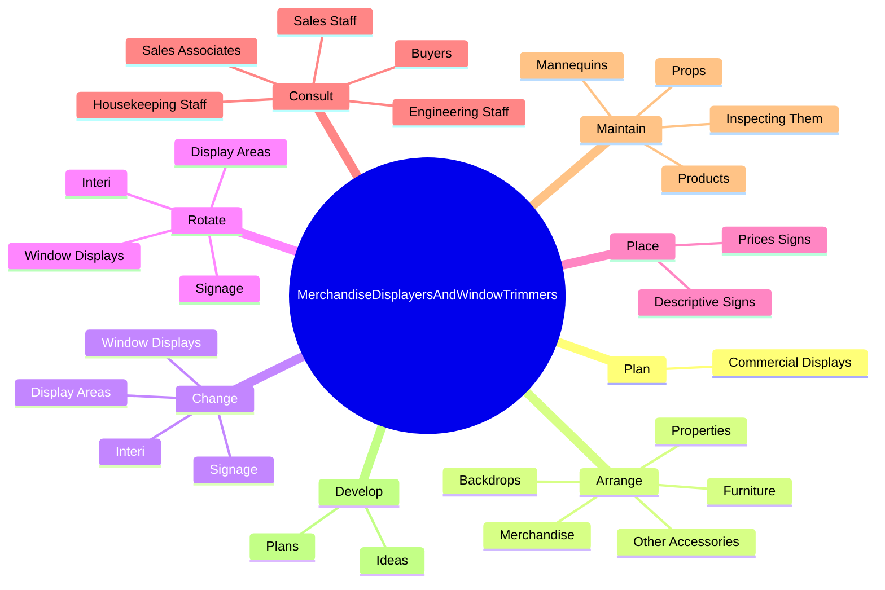
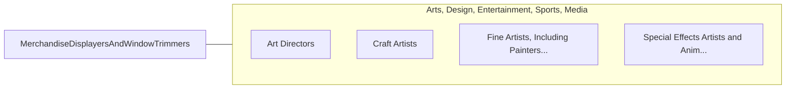

# Merchandise Displayers and Window Trimmers

> Plan and erect commercial displays, such as those in windows and interiors of retail stores and at trade exhibitions.

## Overview

Merchandise Displayers and Window Trimmers is classified under Arts, Design, Entertainment, Sports, Media (SOC 27). Plan and erect commercial displays, such as those in windows and interiors of retail stores and at trade exhibitions.

## Classification Hierarchy

## Key Statistics

| Metric | Value |
|--------|-------|
| SOC Code | 27-1026.00 |
| Category | [Arts, Design, Entertainment, Sports, Media](/occupations/ArtsMedia) |
| Task Count | 168 |
| Source | O*NET |

## Core Tasks

### plan.CommercialDisplays

Merchandise Displayers and Window Trimmers plan commercial displays as part of their core responsibilities.

**Actions:**
- `plan.CommercialDisplays.to.EnticeToCustomers`
- `plan.CommercialDisplays.to.AppealToCustomers`

### arrange.Properties

Merchandise Displayers and Window Trimmers arrange properties as part of their core responsibilities.

**Actions:**
- `arrange.Properties.in.PreparedSketches`
- `arrange.Furniture.in.PreparedSketches`
- `arrange.Merchandise.in.PreparedSketches`
- `arrange.Backdrops.in.PreparedSketches`

### change.WindowDisplays

Merchandise Displayers and Window Trimmers change window displays as part of their core responsibilities.

**Actions:**
- `change.WindowDisplays.to.reflect.ChangesInInventory`
- `change.WindowDisplays.to.Promotion`
- `change.Interi.to.reflect.ChangesInInventory`
- `change.Interi.to.Promotion`

## Skills & Competencies

### Technical Skills
- **Creative Design** - Advanced
- **Digital Media** - Advanced
- **Content Creation** - Advanced

### Soft Skills
- **Communication** - Essential
- **Problem Solving** - Essential
- **Critical Thinking** - Important
- **Teamwork** - Important
- **Adaptability** - Important

## Related Occupations

## Industries

This occupation is found across multiple industries. See [Industries](/industries) for sector-specific employment data.

## Career Progression

---

*Source: O*NET 27-1026.00 - ONETOccupation*
