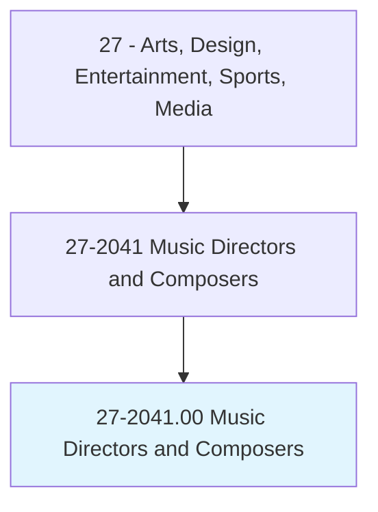
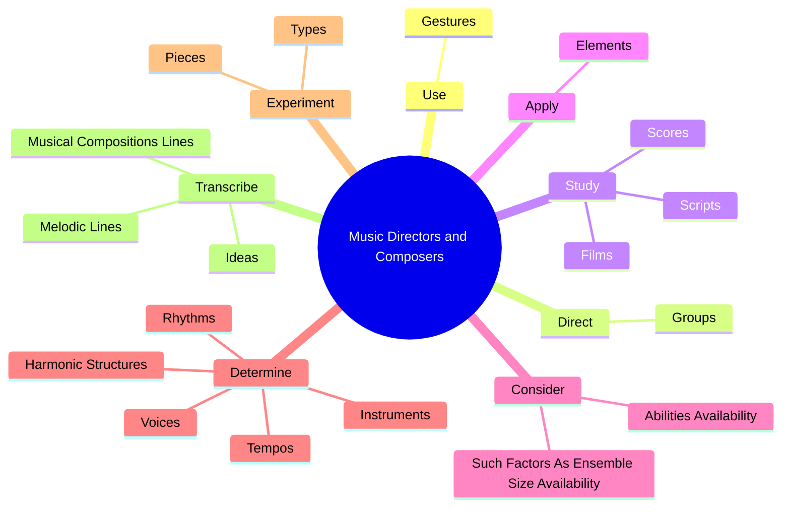
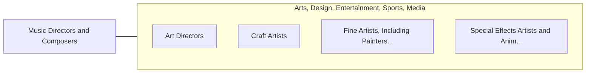

# Music Directors and Composers

> Conduct, direct, plan, and lead instrumental or vocal performances by musical artists or groups, such as orchestras, bands, choirs, and glee clubs; or create original works of music.

## Overview

Music Directors and Composers is classified under Arts, Design, Entertainment, Sports, Media (SOC 27). Conduct, direct, plan, and lead instrumental or vocal performances by musical artists or groups, such as orchestras, bands, choirs, and glee clubs; or create original works of music.

## Classification Hierarchy

## Key Statistics

| Metric | Value |
|--------|-------|
| SOC Code | 27-2041.00 |
| Category | [Arts, Design, Entertainment, Sports, Media](/occupations/ArtsMedia) |
| Task Count | 144 |
| Source | O*NET |

## Core Tasks

### use.Gestures

Music Directors and Composers use gestures as part of their core responsibilities.

**Actions:**
- `use.Gestures.to.shape.MusicBeingPlayed`
- `use.Gestures.to.CommunicatingDesiredTempo`
- `use.Gestures.to.Phrasing`
- `use.Gestures.to.Tone`

### direct.Groups

Music Directors and Composers direct groups as part of their core responsibilities.

**Actions:**
- `direct.Groups.at.Rehearsals`
- `direct.Groups.at.LivePerformances.to.achieve.DesiredEffects`
- `direct.Groups.at.RecordedPerformances.to.achieve.DesiredEffects`
- `direct.Groups.at.Tonal`

### study.Scores

Music Directors and Composers study scores as part of their core responsibilities.

**Actions:**
- `study.Scores.to.learn.MusicInDetail`
- `study.Scores.to.ToDevelopInterpretations`
- `study.Films.to.determine.HowMusicalScoresCanBeUsedToCreateDesiredEffects`
- `study.Films.to.Moods`

## Skills & Competencies

### Technical Skills
- **Creative Design** - Advanced
- **Digital Media** - Advanced
- **Content Creation** - Advanced

### Soft Skills
- **Communication** - Essential
- **Problem Solving** - Essential
- **Critical Thinking** - Important
- **Teamwork** - Important
- **Adaptability** - Important

## Related Occupations

## Industries

This occupation is found across multiple industries. See [Industries](/industries) for sector-specific employment data.

## Career Progression

---

*Source: O*NET 27-2041.00 - ONETOccupation*
