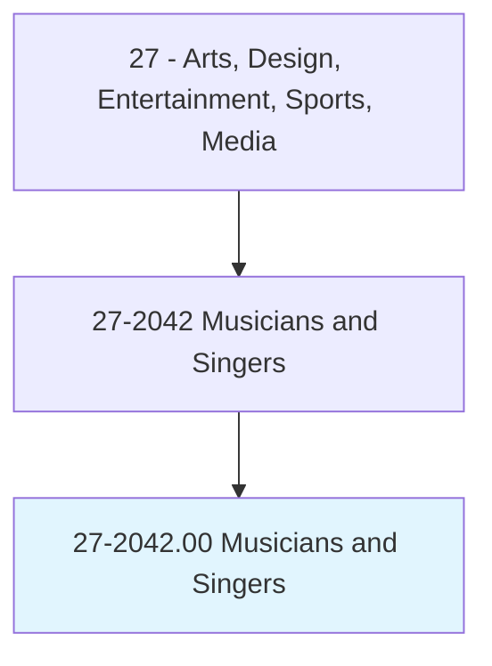
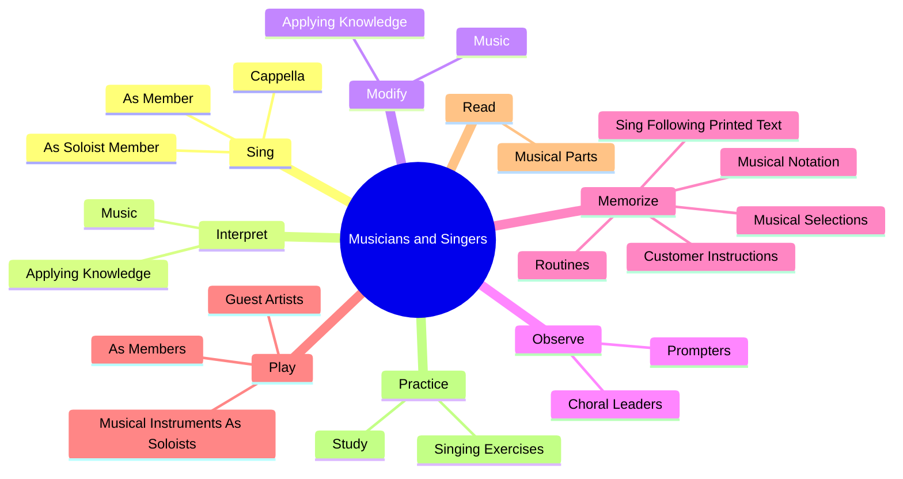
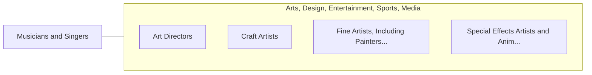

# Musicians and Singers

> Play one or more musical instruments or sing. May perform on stage, for broadcasting, or for sound or video recording.

## Overview

Musicians and Singers is an occupation within the Arts, Design, Entertainment, Sports, Media category. Play one or more musical instruments or sing. 

## Classification Hierarchy

## Key Statistics

| Metric | Value |
|--------|-------|
| SOC Code | 27-2042.00 |
| Category | [Arts, Design, Entertainment, Sports, Media](/occupations/ArtsMedia) |
| Task Count | 90 |
| Source | O*NET |

## Core Tasks

### sing.Cappella

Musicians and Singers sing cappella as part of their core responsibilities.

**Actions:**
- `sing.Cappella.with.MusicalAccompaniment`
- `sing.AsSoloistMember.of.VocalGroup`
- `sing.AsMember.of.VocalGroup`

### interpret.Music

Musicians and Singers interpret music as part of their core responsibilities.

**Actions:**
- `interpret.Music.of.Harmony`
- `interpret.Music.of.Melody`
- `interpret.Music.of.Rhythm`
- `interpret.Music.of.VoiceProduction.to.individualize.Presentations`

### modify.Music

Musicians and Singers modify music as part of their core responsibilities.

**Actions:**
- `modify.Music.of.Harmony`
- `modify.Music.of.Melody`
- `modify.Music.of.Rhythm`
- `modify.Music.of.VoiceProduction.to.individualize.Presentations`

## Skills & Competencies

### Technical Skills
- **Creative Design** - Advanced
- **Digital Media** - Advanced
- **Content Creation** - Advanced

### Soft Skills
- **Communication** - Essential
- **Problem Solving** - Essential
- **Critical Thinking** - Important
- **Teamwork** - Important
- **Adaptability** - Important

## Related Occupations

## Industries

This occupation is found across multiple industries. See [Industries](/industries) for sector-specific employment data.

## Career Progression

---

*Source: O*NET 27-2042.00 - ONETOccupation*
