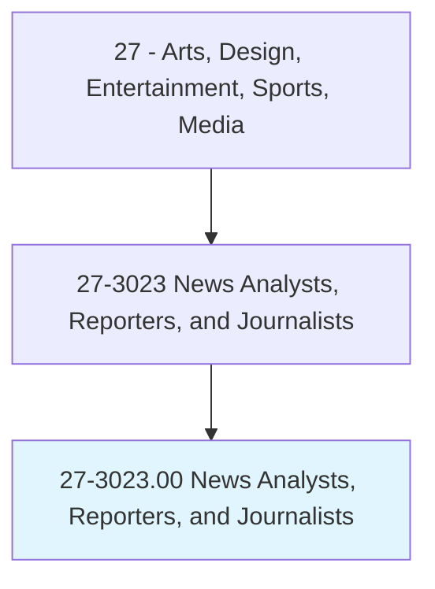
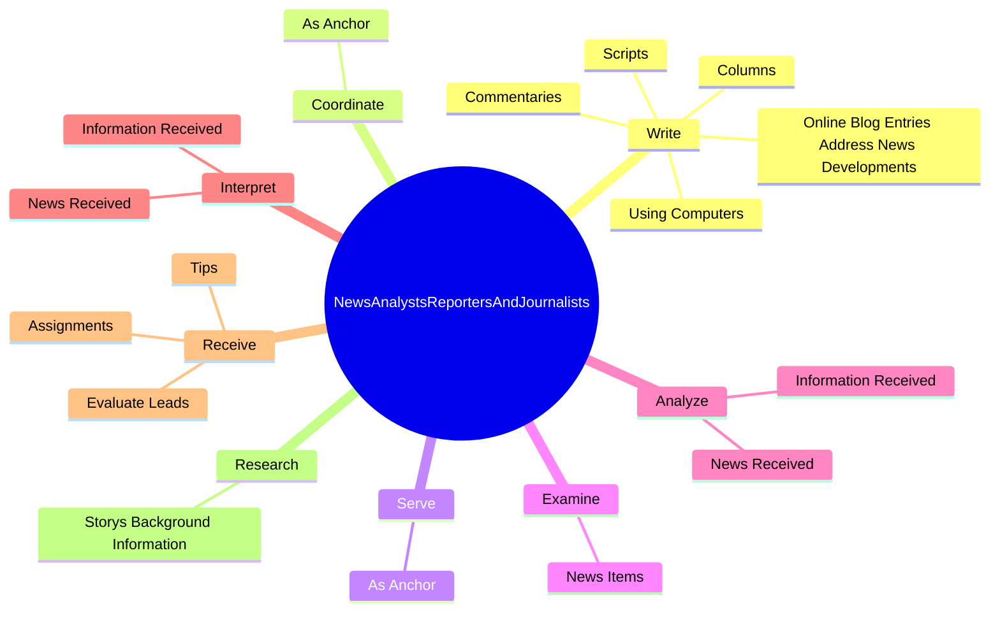

# News Analysts, Reporters, and Journalists

> Narrate or write news stories, reviews, or commentary for print, broadcast, or other communications media such as newspapers, magazines, radio, or television. May collect and analyze information through interview, investigation, or observation.

## Overview

News Analysts, Reporters, and Journalists is an occupation within the Arts, Design, Entertainment, Sports, Media category. Narrate or write news stories, reviews, or commentary for print, broadcast, or other communications media such as newspapers, magazines, radio, or television. 

## Classification Hierarchy

## Key Statistics

| Metric | Value |
|--------|-------|
| SOC Code | 27-3023.00 |
| Category | [Arts, Design, Entertainment, Sports, Media](/occupations/ArtsMedia) |
| Task Count | 132 |
| Source | O*NET |

## Core Tasks

### write.Commentaries

News Analysts, Reporters, and Journalists write commentaries as part of their core responsibilities.

**Actions:**
- `write.Commentaries`
- `write.Columns`
- `write.Scripts`
- `write.UsingComputers`

### coordinate.AsAnchor

News Analysts, Reporters, and Journalists coordinate as anchor as part of their core responsibilities.

**Actions:**
- `coordinate.AsAnchor.on.NewsBroadcastPrograms`

### serve.AsAnchor

News Analysts, Reporters, and Journalists serve as anchor as part of their core responsibilities.

**Actions:**
- `serve.AsAnchor.on.NewsBroadcastPrograms`

## Skills & Competencies

### Technical Skills
- **Creative Design** - Advanced
- **Digital Media** - Advanced
- **Content Creation** - Advanced

### Soft Skills
- **Communication** - Essential
- **Problem Solving** - Essential
- **Critical Thinking** - Important
- **Teamwork** - Important
- **Adaptability** - Important

## Related Occupations

## Industries

This occupation is found across multiple industries. See [Industries](/industries) for sector-specific employment data.

## Career Progression

---

*Source: O*NET 27-3023.00 - ONETOccupation*
