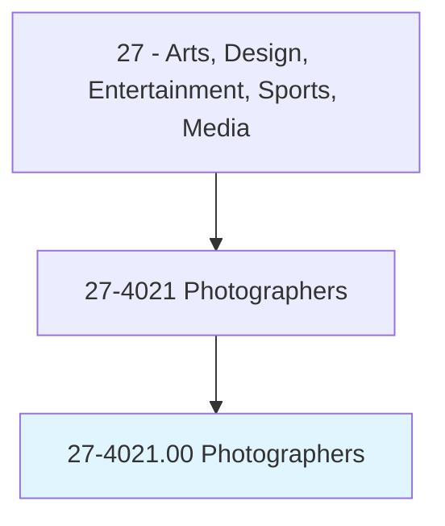
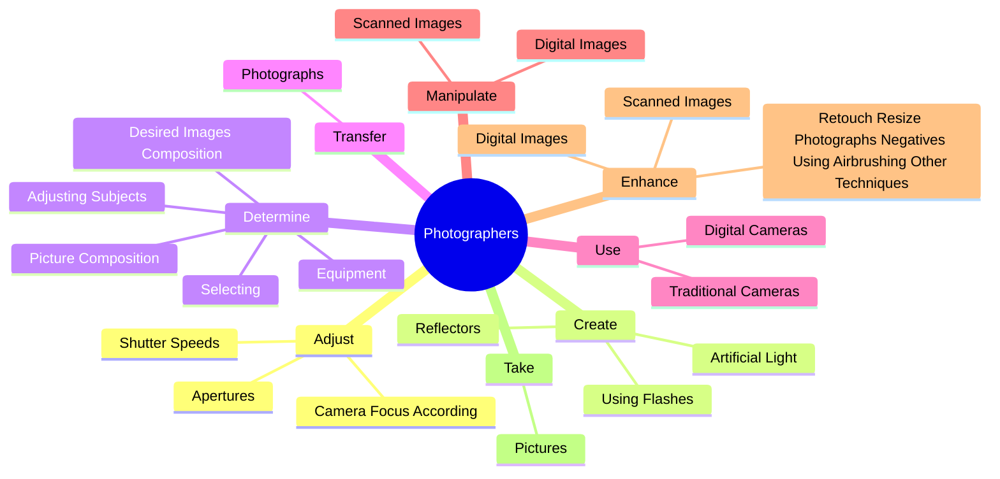

# Photographers

> Photograph people, landscapes, merchandise, or other subjects. May use lighting equipment to enhance a subject's appearance. May use editing software to produce finished images and prints. Includes commercial and industrial photographers, scientific photographers, and photojournalists.

## Overview

Photographers is an occupation within the Arts, Design, Entertainment, Sports, Media category. Photograph people, landscapes, merchandise, or other subjects. May use lighting equipment to enhance a subject's appearance.

## Classification Hierarchy

## Key Statistics

| Metric | Value |
|--------|-------|
| SOC Code | 27-4021.00 |
| Category | [Arts, Design, Entertainment, Sports, Media](/occupations/ArtsMedia) |
| Task Count | 144 |
| Source | O*NET |

## Core Tasks

### adjust.Apertures

Photographers adjust apertures as part of their core responsibilities.

**Actions:**
- `adjust.Apertures.to.CombinationOfFactors`
- `adjust.Apertures.to.Lighting`
- `adjust.Apertures.to.FieldDepth`
- `adjust.Apertures.to.subject.Motion`

### create.ArtificialLight

Photographers create artificial light as part of their core responsibilities.

**Actions:**
- `create.ArtificialLight`
- `create.UsingFlashes`
- `create.Reflectors`

### determine.DesiredImagesComposition

Photographers determine desired images composition as part of their core responsibilities.

**Actions:**
- `determine.DesiredImagesComposition.to.achieve.DesiredEffects`
- `determine.PictureComposition.to.achieve.DesiredEffects`
- `determine.Selecting.to.achieve.DesiredEffects`
- `determine.AdjustingSubjects.to.achieve.DesiredEffects`

## Skills & Competencies

### Technical Skills
- **Creative Design** - Advanced
- **Digital Media** - Advanced
- **Content Creation** - Advanced

### Soft Skills
- **Communication** - Essential
- **Problem Solving** - Essential
- **Critical Thinking** - Important
- **Teamwork** - Important
- **Adaptability** - Important

## Related Occupations

## Industries

This occupation is found across multiple industries. See [Industries](/industries) for sector-specific employment data.

## Career Progression

---

*Source: O*NET 27-4021.00 - ONETOccupation*
