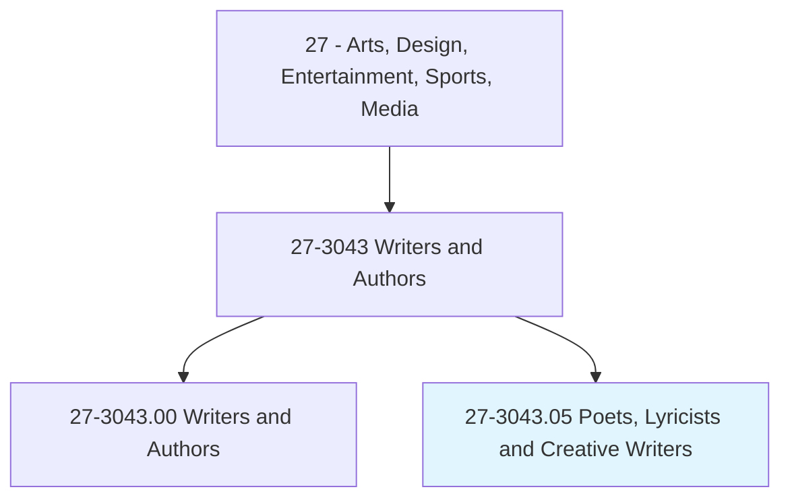
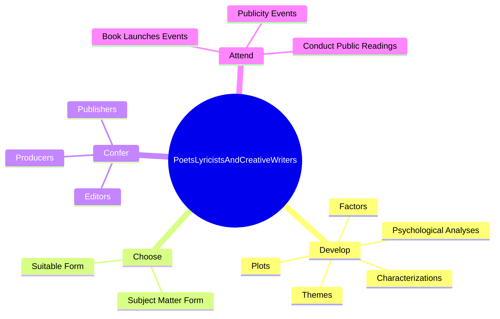
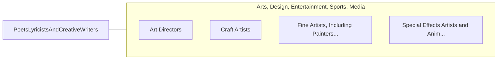

# Poets, Lyricists and Creative Writers

> Create original written works, such as scripts, essays, prose, poetry or song lyrics, for publication or performance.

## Overview

Poets, Lyricists and Creative Writers is classified under Arts, Design, Entertainment, Sports, Media (SOC 27). Create original written works, such as scripts, essays, prose, poetry or song lyrics, for publication or performance.

## Classification Hierarchy

## Key Statistics

| Metric | Value |
|--------|-------|
| SOC Code | 27-3043.05 |
| Category | [Arts, Design, Entertainment, Sports, Media](/occupations/ArtsMedia/index) |
| Task Count | 42 |
| Source | O*NET |

## Core Tasks

### develop.Factors

Poets, Lyricists and Creative Writers develop factors as part of their core responsibilities.

**Actions:**
- `develop.Factors.to.create.Material`
- `develop.Themes.to.create.Material`
- `develop.Plots.to.create.Material`
- `develop.Characterizations.to.create.Material`

### choose.SubjectMatterForm

Poets, Lyricists and Creative Writers choose subject matter form as part of their core responsibilities.

**Actions:**
- `choose.SubjectMatterForm.to.express.PersonalFeelingsIdeas`
- `choose.SubjectMatterForm.to.ExperiencesIdeas`
- `choose.SubjectMatterForm.to.ToNarrateStories`
- `choose.SubjectMatterForm.to.Events`

### confer.Editors

Poets, Lyricists and Creative Writers confer editors as part of their core responsibilities.

**Actions:**
- `confer.Editors.to.discuss.ChangesToWrittenMaterial`
- `confer.Editors.to.RevisionsToWrittenMaterial`
- `confer.Publishers.to.discuss.ChangesToWrittenMaterial`
- `confer.Publishers.to.RevisionsToWrittenMaterial`

## Skills & Competencies

### Technical Skills
- **Creative Design** - Advanced
- **Digital Media** - Advanced
- **Content Creation** - Advanced

### Soft Skills
- **Communication** - Essential
- **Problem Solving** - Essential
- **Critical Thinking** - Important
- **Teamwork** - Important
- **Adaptability** - Important

## Related Occupations

## Industries

This occupation is found across multiple industries. See [Industries](/industries) for sector-specific employment data.

## Career Progression

---

*Source: O*NET 27-3043.05 - ONETOccupation*
