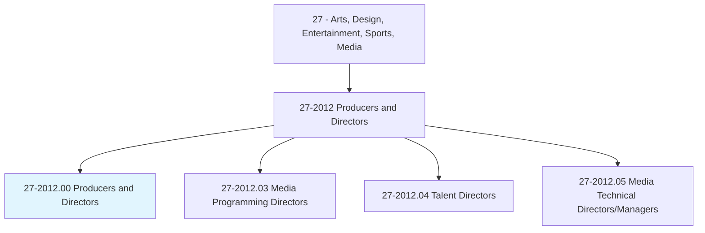
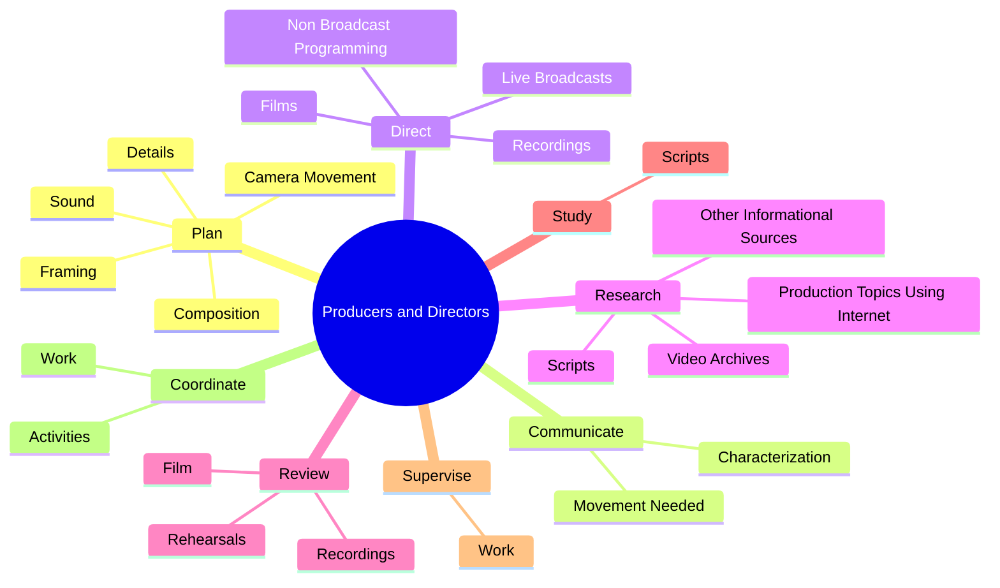

# Producers and Directors

> Produce or direct stage, television, radio, video, or film productions for entertainment, information, or instruction. Responsible for creative decisions, such as interpretation of script, choice of actors or guests, set design, sound, special effects, and choreography.

## Overview

Producers and Directors is an occupation within the Arts, Design, Entertainment, Sports, Media category. Produce or direct stage, television, radio, video, or film productions for entertainment, information, or instruction. 

## Classification Hierarchy

## Key Statistics

| Metric | Value |
|--------|-------|
| SOC Code | 27-2012.00 |
| Category | [Arts, Design, Entertainment, Sports, Media](/occupations/ArtsMedia) |
| Task Count | 157 |
| Source | O*NET |

## Core Tasks

### plan.Details

Producers and Directors plan details as part of their core responsibilities.

**Actions:**
- `plan.Details.for.Shot`
- `plan.Details.for.Scene`
- `plan.Framing.for.Shot`
- `plan.Framing.for.Scene`

### communicate.Characterization

Producers and Directors communicate characterization as part of their core responsibilities.

**Actions:**
- `communicate.Characterization.for.Scene.in.SuchWayRehearsals`
- `communicate.Characterization.for.TakesAreMinimized`
- `communicate.MovementNeeded.for.Scene.in.SuchWayRehearsals`
- `communicate.MovementNeeded.for.TakesAreMinimized`

### direct.LiveBroadcasts

Producers and Directors direct live broadcasts as part of their core responsibilities.

**Actions:**
- `direct.LiveBroadcasts.for.PublicEntertainment`
- `direct.LiveBroadcasts.for.Education`
- `direct.Films.for.PublicEntertainment`
- `direct.Films.for.Education`

## Skills & Competencies

### Technical Skills
- **Creative Design** - Advanced
- **Digital Media** - Advanced
- **Content Creation** - Advanced

### Soft Skills
- **Communication** - Essential
- **Problem Solving** - Essential
- **Critical Thinking** - Important
- **Teamwork** - Important
- **Adaptability** - Important

## Related Occupations

## Industries

This occupation is found across multiple industries. See [Industries](/industries) for sector-specific employment data.

## Career Progression

---

*Source: O*NET 27-2012.00 - ONETOccupation*
