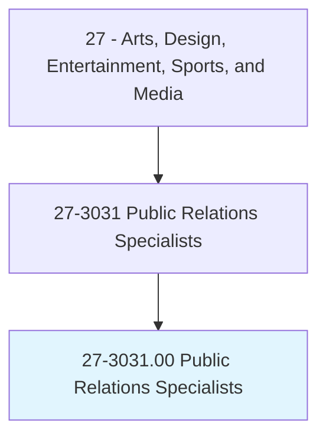
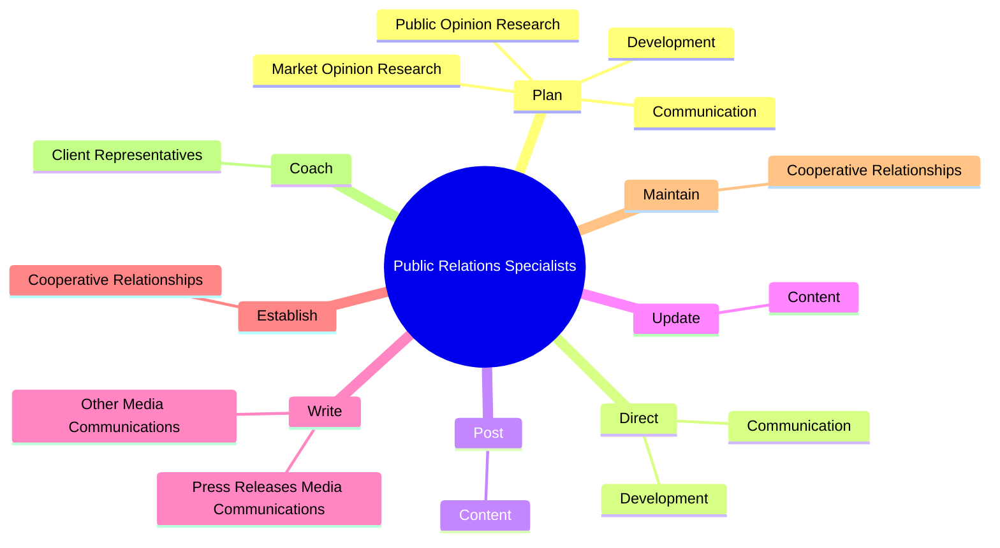
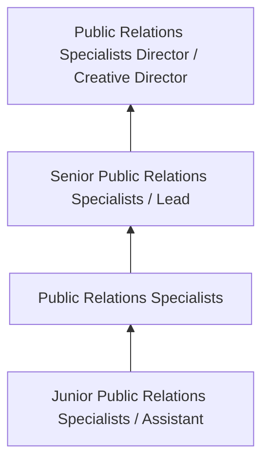

# Public Relations Specialists

> Promote or create an intended public image for individuals, groups, or organizations. May write or select material for release to various communications media. May specialize in using social media.

## Overview

Public Relations Specialists professionals promote or create an intended public image for individuals, groups, or organizations. This occupation falls within the Arts, Design, Entertainment, Sports, and Media category and requires a combination of specialized knowledge, technical skills, and practical experience.

These professionals work across diverse settings and organizational contexts, applying their expertise to meet the demands of their field. They must stay current with industry standards, emerging practices, and regulatory requirements that affect their work. The role demands both independent judgment and collaborative skills, as practitioners regularly interact with colleagues, stakeholders, and the public.

As the field continues to evolve, Public Relations Specialists professionals increasingly leverage technology and data-driven approaches to enhance their effectiveness. Career opportunities span the public and private sectors, with demand influenced by economic conditions, demographic shifts, and technological advancement.

## Classification Hierarchy



## Key Statistics

| Metric | Value |
|--------|-------|
| SOC Code | 27-3031.00 |
| Job Zone | N/A |
| Category | [Arts, Design, Entertainment, Sports, and Media](/occupations/ArtsMedia/index) |
| Core Tasks | 105+ |
| Salary Range | $35,000 - $100,000 |
| Median Salary | $55,000 |
| Growth Outlook | 3% (Slower than average) |
| Source | O*NET |

## Core Tasks



### plan.Development

Public Relations Specialists plan development as part of their core responsibilities.

**Actions:**
- `plan.Development.of.Programs.to.maintain.FavorablePublicPerceptionsOfOrganizationsAccomplishments` - Plan or direct development or communication of programs to maintain favorable...
- `plan.Development.of.StockholderPerceptions.of.OrganizationsAccomplishments` - Plan or direct development or communication of programs to maintain favorable...
- `plan.Development.of.Agenda` - Plan or direct development or communication of programs to maintain favorable...
- `plan.Development.of.EnvironmentalResponsibility` - Plan or direct development or communication of programs to maintain favorable...
- `plan.Communication.of.Programs.to.maintain.FavorablePublicPerceptionsOfOrganizationsAccomplishments` - Plan or direct development or communication of programs to maintain favorable...

### study.Objectives

Public Relations Specialists study objectives as part of their core responsibilities.

**Actions:**
- `study.Objectives.of.Organizations.to.develop.PublicRelationsStrategiesWillInfluencePublicOpinion` - Study the objectives, promotional policies, or needs of organizations to deve...
- `study.Objectives.of.PromoteIdeas` - Study the objectives, promotional policies, or needs of organizations to deve...
- `study.Objectives.of.Products` - Study the objectives, promotional policies, or needs of organizations to deve...
- `study.Objectives.of.Services` - Study the objectives, promotional policies, or needs of organizations to deve...
- `study.PromotionalPolicies.of.Organizations.to.develop.PublicRelationsStrategiesWillInfluencePublicOpinion` - Study the objectives, promotional policies, or needs of organizations to deve...

### arrange.PublicAppearances

Public Relations Specialists arrange public appearances as part of their core responsibilities.

**Actions:**
- `arrange.PublicAppearances.for.Clients.to.increase.Product` - Arrange public appearances, lectures, contests, or exhibits for clients to in...
- `arrange.PublicAppearances.for.ServiceAwarenessPromoteGoodwill` - Arrange public appearances, lectures, contests, or exhibits for clients to in...
- `arrange.PublicAppearances.for.promote.Goodwill` - Arrange public appearances, lectures, contests, or exhibits for clients to in...
- `arrange.Lectures.for.Clients.to.increase.Product` - Arrange public appearances, lectures, contests, or exhibits for clients to in...
- `arrange.Lectures.for.ServiceAwarenessPromoteGoodwill` - Arrange public appearances, lectures, contests, or exhibits for clients to in...

### direct.Development

Public Relations Specialists direct development as part of their core responsibilities.

**Actions:**
- `direct.Development.of.Programs.to.maintain.FavorablePublicPerceptionsOfOrganizationsAccomplishments` - Plan or direct development or communication of programs to maintain favorable...
- `direct.Development.of.StockholderPerceptions.of.OrganizationsAccomplishments` - Plan or direct development or communication of programs to maintain favorable...
- `direct.Development.of.Agenda` - Plan or direct development or communication of programs to maintain favorable...
- `direct.Development.of.EnvironmentalResponsibility` - Plan or direct development or communication of programs to maintain favorable...
- `direct.Communication.of.Programs.to.maintain.FavorablePublicPerceptionsOfOrganizationsAccomplishments` - Plan or direct development or communication of programs to maintain favorable...


## Skills & Competencies

### Technical Skills
- **Creative Design** - Expert
- **Digital Media Tools** - Advanced
- **Content Creation** - Advanced
- **Visual Communication** - Advanced
- **Production Techniques** - Proficient
- **Project Coordination** - Proficient

### Soft Skills
- **Creativity** - Critical
- **Communication** - Critical
- **Collaboration** - Essential
- **Adaptability** - Essential
- **Time Management** - Essential

## Education & Certifications

| Requirement | Details |
|-------------|---------|
| Typical Education | Bachelor's degree in arts, design, communications, or related field |
| Work Experience | 1-3 years portfolio-based experience |
| On-the-Job Training | Moderate - ongoing skill development in creative tools |
| Certifications | Industry-specific certifications (Adobe, etc.) |

## Career Progression



## Industry Variations

### Entertainment and Media
Creative production for film, television, music, or digital media. Public Relations Specialists professionals focus on audience engagement and storytelling.

### Advertising and Marketing
Brand communication and commercial creative work. Emphasis on client relationships and measurable campaign outcomes.

### Corporate Communications
Internal and external communications for organizations. Focus on brand consistency and strategic messaging.

### Freelance and Independent
Self-directed creative work with diverse clients. Requires strong business skills alongside creative talent.

## Technology & Tools

- **Adobe Creative Suite (Photoshop, Illustrator, Premiere)**
- **Digital audio workstations**
- **Content management systems**
- **3D modeling software**
- **Social media and analytics platforms**

## Related Occupations


## Industries

- [Media and Entertainment](/industries/Media) - High Employment
- [Advertising and Marketing](/industries/Advertising) - High Employment
- [Publishing](/industries/Publishing) - Moderate Employment
- [Technology](/industries/Technology) - Growing Employment

## Departments

This occupation typically works in:
- [Creative Services](/departments/Creative)
- [Marketing](/departments/Marketing/index)
- [Communications](/departments/Communications)

## GraphDL Semantic Structure

```
Public Relations Specialists perform:
- plan.Development.of.Programs.to.maintain.FavorablePublicPerceptionsOfOrganizationsAccomplishments
- plan.Development.of.StockholderPerceptions.of.OrganizationsAccomplishments
- plan.Development.of.Agenda
- plan.Development.of.EnvironmentalResponsibility
- plan.Communication.of.Programs.to.maintain.FavorablePublicPerceptionsOfOrganizationsAccomplishments
- plan.Communication.of.StockholderPerceptions.of.OrganizationsAccomplishments
```

---

*Source: O*NET 27-3031.00 - ONETOccupation*
