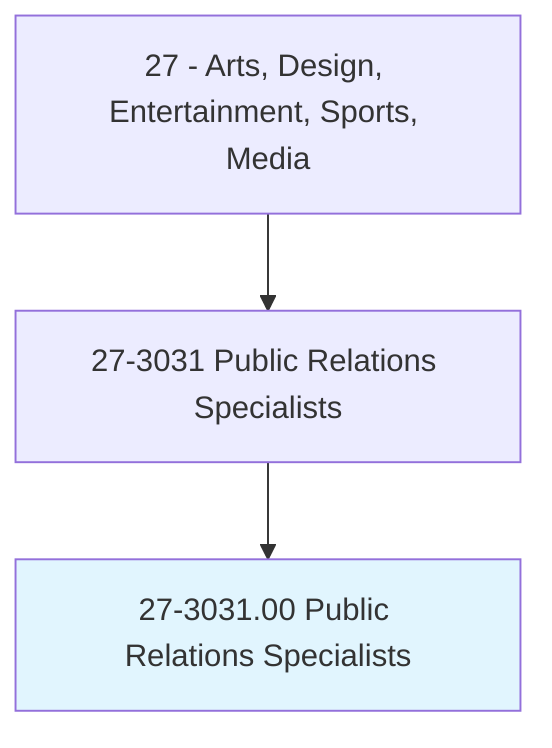
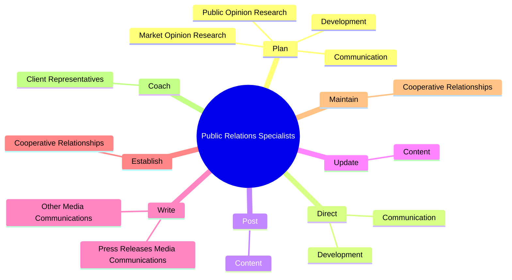

# Public Relations Specialists

> Promote or create an intended public image for individuals, groups, or organizations. May write or select material for release to various communications media. May specialize in using social media.

## Overview

Public Relations Specialists is an occupation within the Arts, Design, Entertainment, Sports, Media category. Promote or create an intended public image for individuals, groups, or organizations. May write or select material for release to various communications media.

## Classification Hierarchy

## Key Statistics

| Metric | Value |
|--------|-------|
| SOC Code | 27-3031.00 |
| Category | [Arts, Design, Entertainment, Sports, Media](/occupations/ArtsMedia) |
| Task Count | 105 |
| Source | O*NET |

## Core Tasks

### plan.Development

Public Relations Specialists plan development as part of their core responsibilities.

**Actions:**
- `plan.Development.of.Programs.to.maintain.FavorablePublicPerceptionsOfOrganizationsAccomplishments`
- `plan.Development.of.StockholderPerceptions.of.OrganizationsAccomplishments`
- `plan.Development.of.Agenda`
- `plan.Development.of.EnvironmentalResponsibility`

### direct.Development

Public Relations Specialists direct development as part of their core responsibilities.

**Actions:**
- `direct.Development.of.Programs.to.maintain.FavorablePublicPerceptionsOfOrganizationsAccomplishments`
- `direct.Development.of.StockholderPerceptions.of.OrganizationsAccomplishments`
- `direct.Development.of.Agenda`
- `direct.Development.of.EnvironmentalResponsibility`

### post.Content

Public Relations Specialists post content as part of their core responsibilities.

**Actions:**
- `post.Content.on.CompanysWebSiteMediaOutlets`
- `post.Content.on.SocialMediaOutlets`

## Skills & Competencies

### Technical Skills
- **Creative Design** - Advanced
- **Digital Media** - Advanced
- **Content Creation** - Advanced

### Soft Skills
- **Communication** - Essential
- **Problem Solving** - Essential
- **Critical Thinking** - Important
- **Teamwork** - Important
- **Adaptability** - Important

## Related Occupations

## Industries

This occupation is found across multiple industries. See [Industries](/industries) for sector-specific employment data.

## Career Progression

---

*Source: O*NET 27-3031.00 - ONETOccupation*
