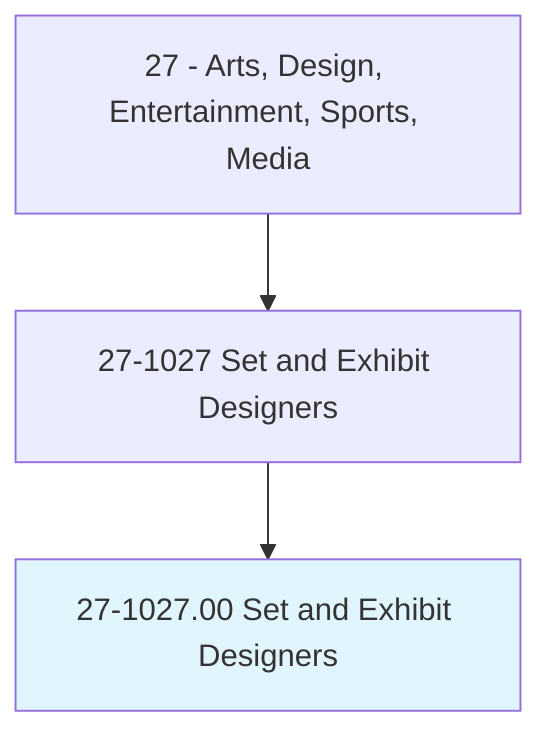
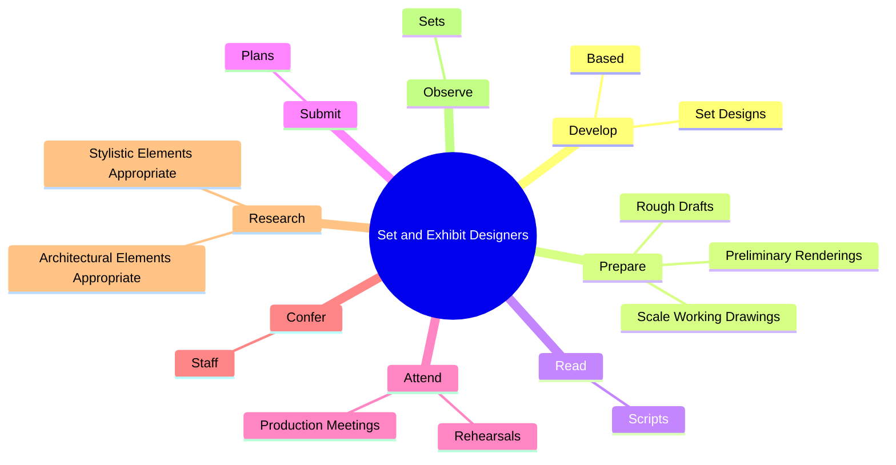
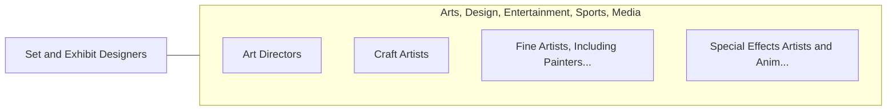

# Set and Exhibit Designers

> Design special exhibits and sets for film, video, television, and theater productions. May study scripts, confer with directors, and conduct research to determine appropriate architectural styles.

## Overview

Set and Exhibit Designers is an occupation within the Arts, Design, Entertainment, Sports, Media category. Design special exhibits and sets for film, video, television, and theater productions. 

## Classification Hierarchy

## Key Statistics

| Metric | Value |
|--------|-------|
| SOC Code | 27-1027.00 |
| Category | [Arts, Design, Entertainment, Sports, Media](/occupations/ArtsMedia/index) |
| Task Count | 157 |
| Source | O*NET |

## Core Tasks

### develop.SetDesigns

Set and Exhibit Designers develop set designs as part of their core responsibilities.

**Actions:**
- `develop.SetDesigns.on.Evaluation.of.Scripts`
- `develop.SetDesigns.on.Budgets`
- `develop.SetDesigns.on.ResearchInformation`
- `develop.SetDesigns.on.AvailableLocations`

### prepare.RoughDrafts

Set and Exhibit Designers prepare rough drafts as part of their core responsibilities.

**Actions:**
- `prepare.RoughDrafts.of.Sets`
- `prepare.RoughDrafts.of.IncludingFlo`
- `prepare.RoughDrafts.of.Plans`
- `prepare.RoughDrafts.of.Scenery`

### read.Scripts

Set and Exhibit Designers read scripts as part of their core responsibilities.

**Actions:**
- `read.Scripts.to.determine.Location`
- `read.Scripts.to.set`
- `read.Scripts.to.design.Requirements`

## Skills & Competencies

### Technical Skills
- **Creative Design** - Advanced
- **Digital Media** - Advanced
- **Content Creation** - Advanced

### Soft Skills
- **Communication** - Essential
- **Problem Solving** - Essential
- **Critical Thinking** - Important
- **Teamwork** - Important
- **Adaptability** - Important

## Related Occupations

## Industries

This occupation is found across multiple industries. See [Industries](/industries) for sector-specific employment data.

## Career Progression

---

*Source: O*NET 27-1027.00 - ONETOccupation*
