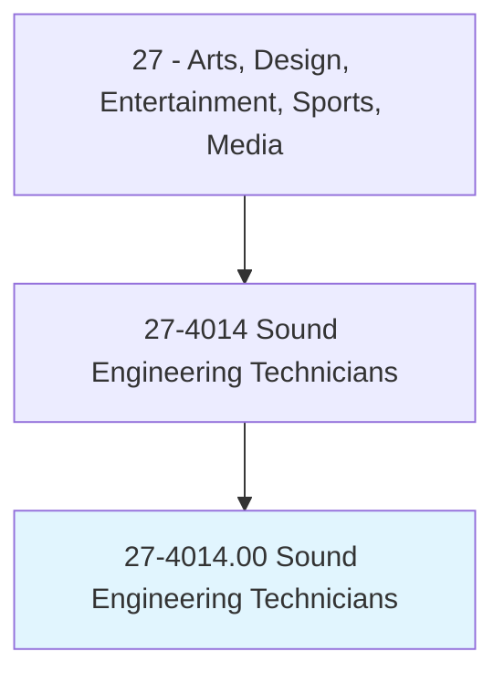
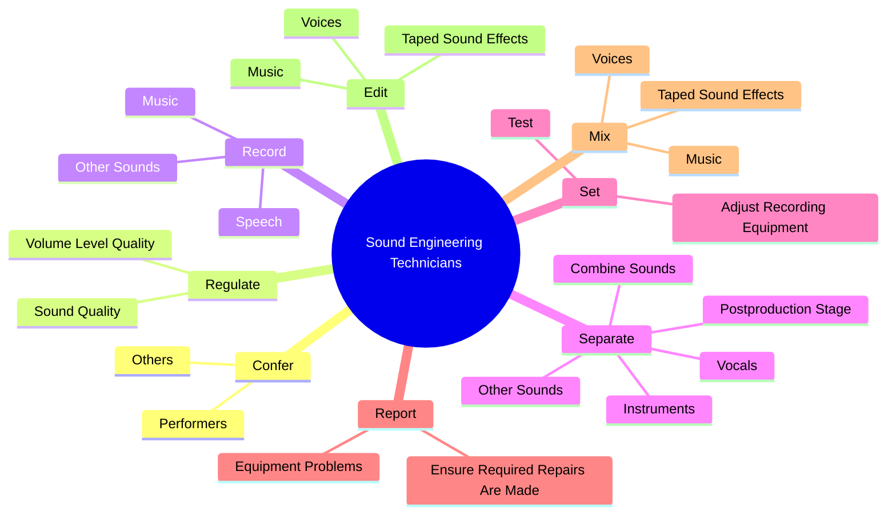
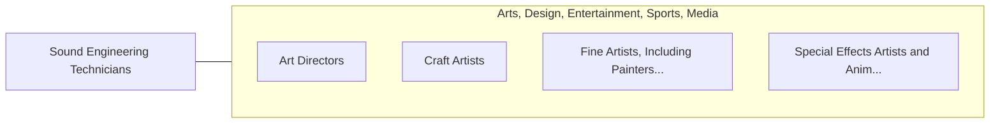

# Sound Engineering Technicians

> Assemble and operate equipment to record, synchronize, mix, edit, or reproduce sound, including music, voices, or sound effects, for theater, video, film, television, podcasts, sporting events, and other productions.

## Overview

Sound Engineering Technicians is classified under Arts, Design, Entertainment, Sports, Media (SOC 27). Assemble and operate equipment to record, synchronize, mix, edit, or reproduce sound, including music, voices, or sound effects, for theater, video, film, television, podcasts, sporting events, and other productions.

## Classification Hierarchy

## Key Statistics

| Metric | Value |
|--------|-------|
| SOC Code | 27-4014.00 |
| Category | [Arts, Design, Entertainment, Sports, Media](/occupations/ArtsMedia) |
| Task Count | 59 |
| Source | O*NET |

## Core Tasks

### confer.Performers

Sound Engineering Technicians confer performers as part of their core responsibilities.

**Actions:**
- `confer.Performers.to.determine.DesiredSoundForProduction`
- `confer.Performers.to.achieve.DesiredSoundForProduction`
- `confer.Performers.to.MusicalRecording`
- `confer.Performers.to.Film`

### regulate.VolumeLevelQuality

Sound Engineering Technicians regulate volume level quality as part of their core responsibilities.

**Actions:**
- `regulate.VolumeLevelQuality.during.RecordingSessionsUsingControlConsoles`
- `regulate.SoundQuality.during.RecordingSessionsUsingControlConsoles`

### record.Speech

Sound Engineering Technicians record speech as part of their core responsibilities.

**Actions:**
- `record.Speech.on.RecordingMedia`
- `record.Speech.on.UsingRecordingEquipment`
- `record.Music.on.RecordingMedia`
- `record.Music.on.UsingRecordingEquipment`

## Skills & Competencies

### Technical Skills
- **Creative Design** - Advanced
- **Digital Media** - Advanced
- **Content Creation** - Advanced

### Soft Skills
- **Communication** - Essential
- **Problem Solving** - Essential
- **Critical Thinking** - Important
- **Teamwork** - Important
- **Adaptability** - Important

## Related Occupations

## Industries

This occupation is found across multiple industries. See [Industries](/industries) for sector-specific employment data.

## Career Progression

---

*Source: O*NET 27-4014.00 - ONETOccupation*
