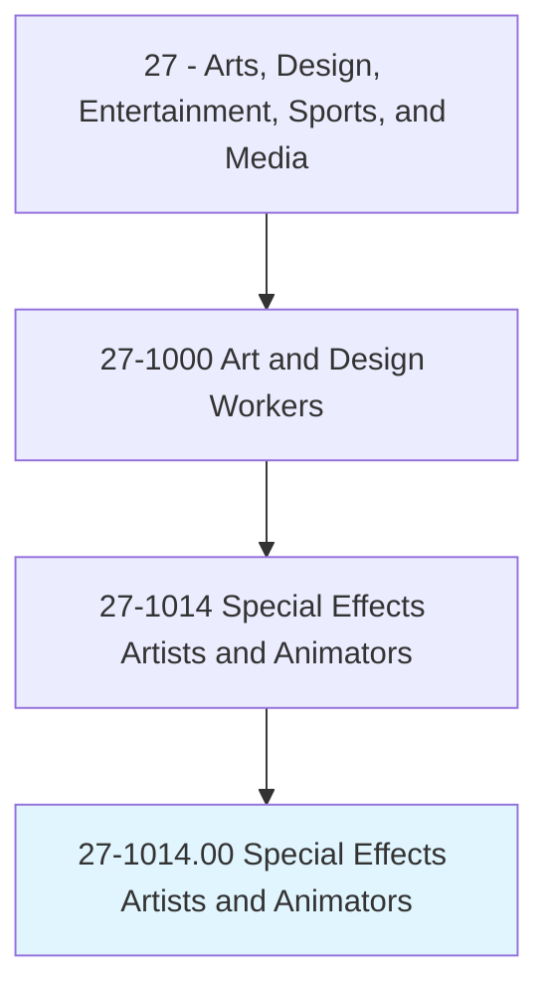
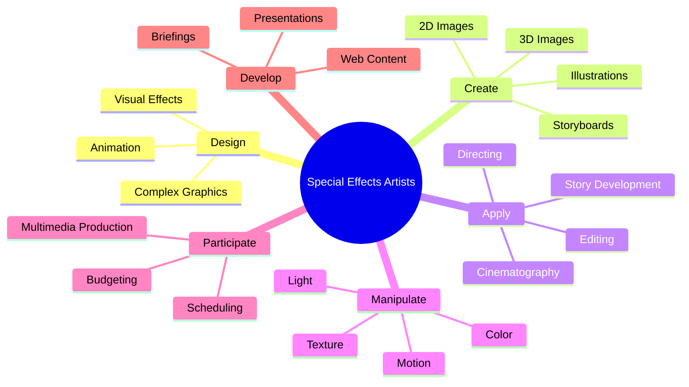
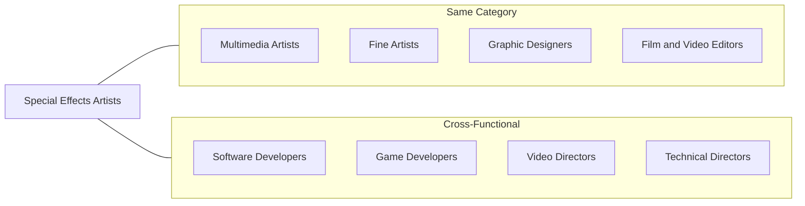
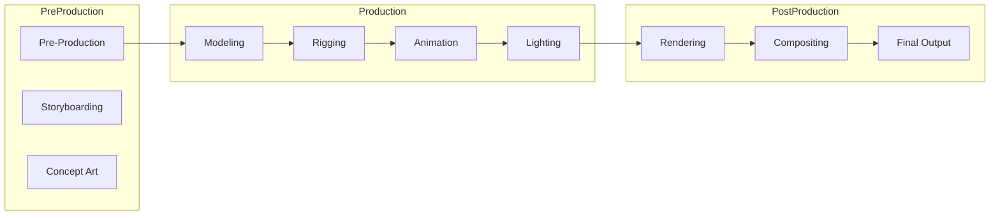
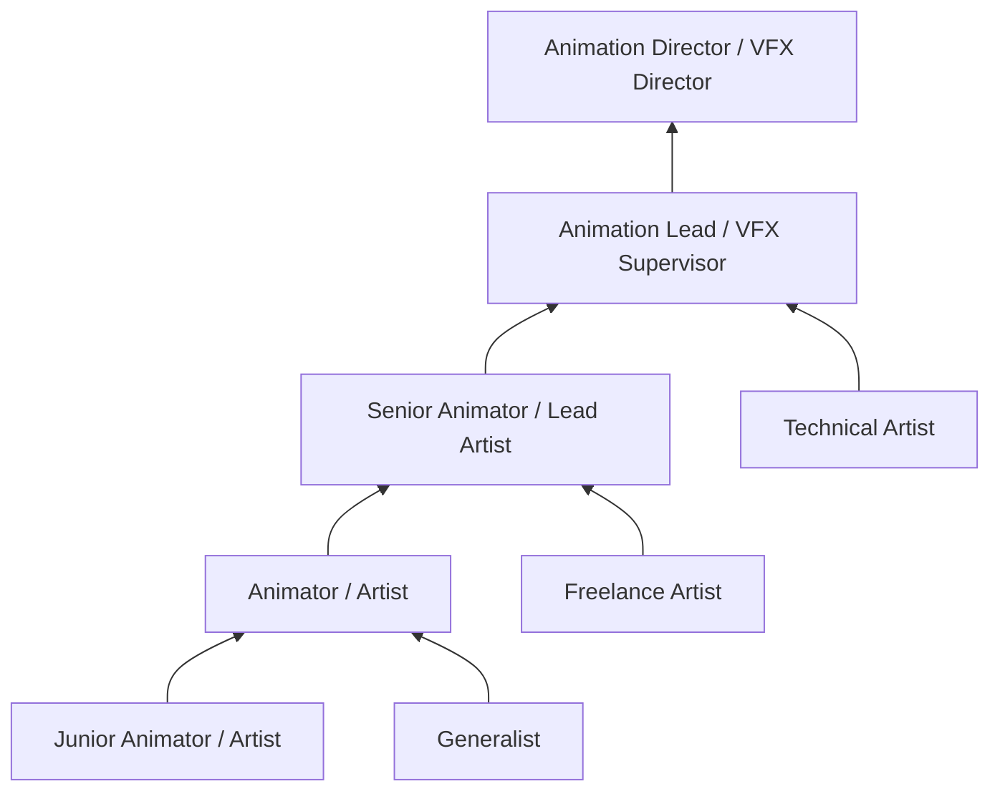

# Special Effects Artists and Animators

> Create special effects or animations using film, video, computers, or other electronic tools and media for use in products, such as computer games, movies, music videos, and commercials.

## Overview

Special Effects Artists and Animators bring visual imagination to life through digital and traditional techniques. They create the animated characters, visual effects, and motion graphics that appear in films, television, video games, and other media. This role combines artistic creativity with technical proficiency in specialized software and production pipelines. As entertainment and media increasingly rely on visual effects and animation, these professionals play a critical role in storytelling across multiple platforms.

## Classification Hierarchy

## Key Statistics

| Metric | Value |
|--------|-------|
| SOC Code | 27-1014.00 |
| Job Zone | 4 (Considerable Preparation) |
| Category | [Arts, Design, Entertainment, Sports, and Media](/occupations/ArtsMedia) |
| Core Tasks | 15+ |
| Source | O*NET |

## Core Tasks

### design.Graphics

Special Effects Artists design complex visual elements using creativity and technology.

**Actions:**
- `design.ComplexGraphics` - Create sophisticated visual designs
- `design.Animation` - Develop animated sequences and movements
- `design.UsingIndependentJudgment` - Make creative decisions autonomously
- `design.Creativity` - Apply artistic vision to technical work
- `design.ComputerEquipment` - Utilize digital tools for design creation

### create.Visuals

Special Effects Artists produce visual content across different formats and purposes.

**Actions:**
- `create.BasicDesigns.for.ProductLabels` - Design product packaging graphics
- `create.BasicDesigns.for.Television` - Create TV graphics and animations
- `create.Drawings.for.DirectMail` - Produce illustrations for marketing
- `create.Illustrations.for.Cartons` - Design product illustrations
- `create.TwoDimensionalImagesDepictingObjects.in.MotionProcess` - Create 2D motion graphics
- `create.ThreeDimensionalImagesDepictingObjects.in.UsingComputerAnimation` - Produce 3D animations

### make.Lifelike

Special Effects Artists create realistic visual effects through manipulation of visual properties.

**Actions:**
- `make.ObjectsAppearLifelike.by.ManipulatingLight` - Use lighting for realism
- `make.ObjectsAppearLifelike.by.Color` - Apply color for natural appearance
- `make.ObjectsAppearLifelike.by.Texture` - Create realistic surface textures
- `make.ObjectsAppearLifelike.by.Shadow` - Add shadows for depth and realism
- `make.ObjectsAppearLifelike.by.Transparency` - Manage transparency effects
- `make.CharactersAppearLifelike.by.ManipulatingStaticImages.to.give.IllusionOfMotion` - Animate static elements

### apply.Storytelling

Special Effects Artists apply narrative and cinematic techniques to animation.

**Actions:**
- `apply.StoryDevelopment.to.AnimationToCreateStoryboardsShowFlowOfAnimation` - Develop visual narratives
- `apply.Directing.to.map.OutKeyScenes` - Plan scene composition
- `apply.Cinematography.to.AnimationToCreateStoryboardsShowFlowOfAnimation` - Apply camera techniques
- `apply.Editing.to.Characters` - Refine character animation timing

### participate.Production

Special Effects Artists contribute to broader production activities.

**Actions:**
- `participate.Production.of.MultimediaCampaigns` - Collaborate on multimedia projects
- `participate.Production.of.HandlingBudgeting` - Manage project budgets
- `participate.Production.of.Scheduling` - Coordinate production timelines
- `participate.Production.of.BackgroundDesign` - Create background environments
- `participate.Production.of.ProgressTracking` - Monitor project advancement

### develop.Content

Special Effects Artists create diverse content for various applications.

**Actions:**
- `develop.Briefings.for.Use.in.Products` - Create visual briefing materials
- `develop.MultimediaPresentations.for.TechnicalManuals` - Produce instructional content
- `develop.Brochures.for.Newsletters` - Design marketing materials
- `script.AnimatedNarrativeSequences.under.TightDeadlines` - Write animation scripts under pressure
- `plan.AnimatedNarrativeSequences.under.TightDeadlines` - Organize production sequences

## Skills & Competencies

### Technical Skills
- **3D Animation Software (Maya, Blender, Cinema 4D)** - Expert
- **2D Animation Software (After Effects, Animate)** - Advanced
- **Compositing (Nuke, Fusion)** - Advanced
- **Texturing and Shading** - Advanced
- **Rigging and Character Setup** - Advanced
- **Motion Capture** - Intermediate to Advanced
- **Rendering Pipelines** - Advanced

### Soft Skills
- **Creativity** - Critical
- **Attention to Detail** - Critical
- **Collaboration** - Essential
- **Problem Solving** - Essential
- **Time Management** - Essential
- **Communication** - Important

## Specializations

### Character Animator
Brings characters to life through movement and expression, creating believable performances that convey emotion and personality.

### Visual Effects (VFX) Artist
Creates photorealistic effects including explosions, weather, destruction, and other elements that blend seamlessly with live-action footage.

### Motion Graphics Designer
Produces animated graphics, titles, and visual elements for broadcast, advertising, and digital media.

### 3D Modeler
Creates three-dimensional digital models of characters, objects, and environments for animation and games.

### Technical Director
Bridges artistic and technical requirements, developing tools and solving pipeline challenges for production teams.

### Lighting Artist
Designs and implements lighting for animated scenes to create mood, atmosphere, and visual interest.

### Compositor
Combines multiple visual elements from different sources into seamless final images or sequences.

### Rigging Artist
Creates the digital skeletons and controls that allow characters and objects to be animated.

## Related Occupations

## Industries

- [Motion Picture and Video Industries](/industries/MotionPictures) - High Employment
- [Computer Game Design](/industries/GameDesign) - High Employment
- [Advertising and Marketing](/industries/Advertising) - Moderate Employment
- [Software Publishers](/industries/SoftwarePublishers) - Growing Employment
- [Broadcasting (except Internet)](/industries/Broadcasting) - Moderate Employment
- [Architectural and Engineering Services](/industries/Architecture) - Visualization work

## Industry Variations

### Film VFX
Works on feature films creating photorealistic effects that blend with live-action footage. Typically involves large teams, long production cycles, and high-end software pipelines.

### Television Animation
Creates animated content for TV series with faster turnaround times and established visual styles. May work on episodic animation or motion graphics for broadcasts.

### Video Game Animation
Develops real-time animations and effects for interactive experiences. Requires understanding of game engines and technical constraints of real-time rendering.

### Advertising/Commercial
Produces short-form animated content and effects for commercials and marketing campaigns. Fast-paced with tight deadlines and client revisions.

### Architectural Visualization
Creates animated walkthroughs and visualizations of architectural designs. Combines technical accuracy with artistic presentation.

## Production Pipeline

## Career Progression

## Education & Training

| Requirement | Details |
|-------------|---------|
| Typical Education | Bachelor's degree in Animation, Computer Graphics, Fine Arts, or related field |
| Work Experience | 2-5 years building portfolio through personal projects, internships, or junior roles |
| On-the-Job Training | Continuous learning of new software, techniques, and pipeline tools |
| Common Certifications | Software-specific certifications (Autodesk, Adobe), demo reel as primary credential |

## Portfolio Requirements

### Demo Reel Essentials
- Strong opening that grabs attention
- Best work first, quality over quantity
- Variety showing range of skills
- Breakdown of personal contributions
- Clear labeling of software used

### Portfolio Website
- Easy navigation
- High-quality video playback
- Contact information
- Resume/CV
- Links to professional profiles

## Tools & Software

### 3D Animation
- Autodesk Maya
- Blender
- Cinema 4D
- Houdini
- 3ds Max

### 2D Animation & Motion Graphics
- Adobe After Effects
- Adobe Animate
- Toon Boom Harmony
- Moho

### Compositing
- Nuke
- Blackmagic Fusion
- After Effects

### Game Engines
- Unity
- Unreal Engine
- Godot

### Rendering
- Arnold
- V-Ray
- Redshift
- RenderMan

## Departments

This occupation typically works in:
- [Visual Effects Department](/departments/VFX)
- [Animation Department](/departments/Animation)
- [Post-Production](/departments/PostProduction)
- [Creative Department](/departments/Creative)
- [Game Development Studio](/departments/GameDev)

---

*Source: O*NET 27-1014.00 - ONETOccupation*
