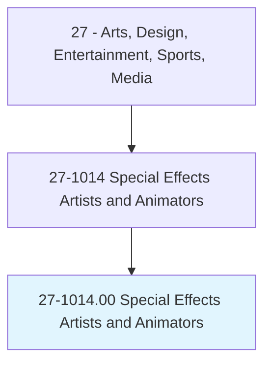
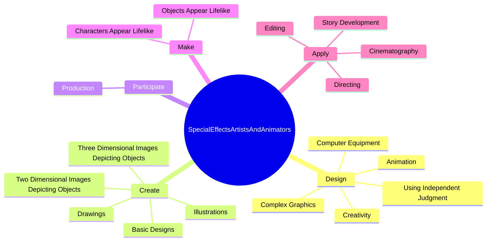
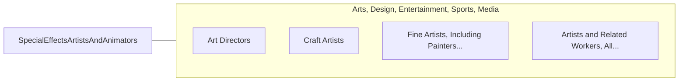

# Special Effects Artists and Animators

> Create special effects or animations using film, video, computers, or other electronic tools and media for use in products, such as computer games, movies, music videos, and commercials.

## Overview

Special Effects Artists and Animators is classified under Arts, Design, Entertainment, Sports, Media (SOC 27). Create special effects or animations using film, video, computers, or other electronic tools and media for use in products, such as computer games, movies, music videos, and commercials.

## Classification Hierarchy

## Key Statistics

| Metric | Value |
|--------|-------|
| SOC Code | 27-1014.00 |
| Category | [Arts, Design, Entertainment, Sports, Media](/occupations/ArtsMedia/index) |
| Task Count | 122 |
| Source | O*NET |

## Core Tasks

### design.ComplexGraphics

Special Effects Artists and Animators design complex graphics as part of their core responsibilities.

**Actions:**
- `design.ComplexGraphics`
- `design.Animation`
- `design.UsingIndependentJudgment`
- `design.Creativity`

### create.BasicDesigns

Special Effects Artists and Animators create basic designs as part of their core responsibilities.

**Actions:**
- `create.BasicDesigns.for.ProductLabels`
- `create.BasicDesigns.for.Cartons`
- `create.BasicDesigns.for.DirectMail`
- `create.BasicDesigns.for.Television`

### participate.Production

Special Effects Artists and Animators participate production as part of their core responsibilities.

**Actions:**
- `participate.Production.of.MultimediaCampaigns`
- `participate.Production.of.HandlingBudgeting`
- `participate.Production.of.Scheduling`
- `participate.Production.of.Assisting.with.SuchResponsibilitiesAsProductionCoordination`

## Skills & Competencies

### Technical Skills
- **Creative Design** - Advanced
- **Digital Media** - Advanced
- **Content Creation** - Advanced

### Soft Skills
- **Communication** - Essential
- **Problem Solving** - Essential
- **Critical Thinking** - Important
- **Teamwork** - Important
- **Adaptability** - Important

## Related Occupations

## Industries

This occupation is found across multiple industries. See [Industries](/industries) for sector-specific employment data.

## Career Progression

---

*Source: O*NET 27-1014.00 - ONETOccupation*
