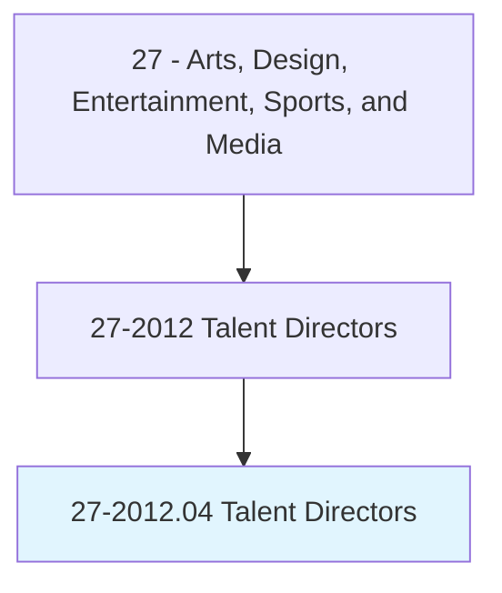
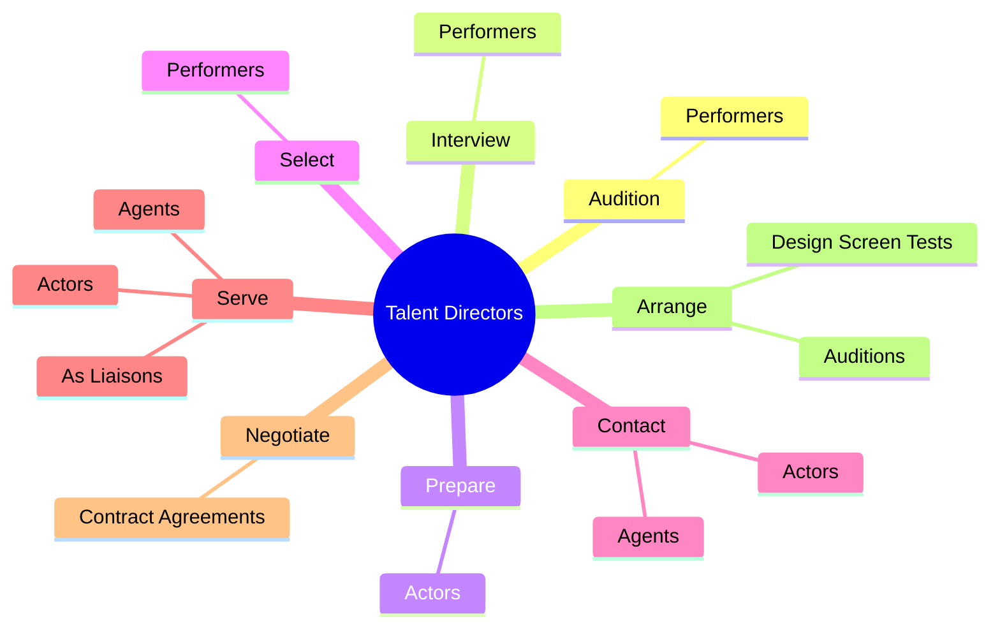
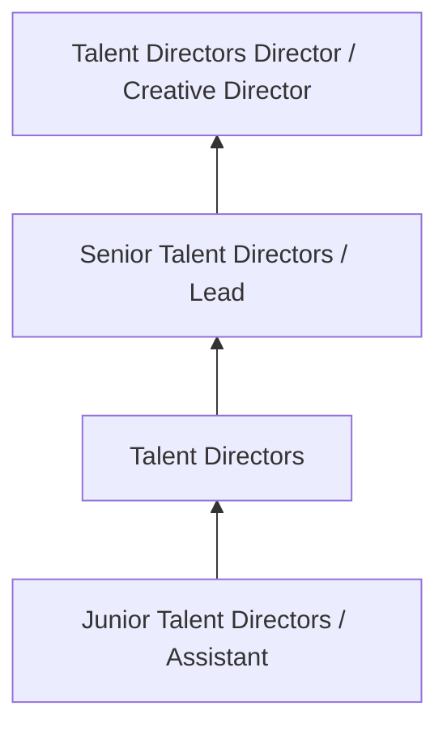
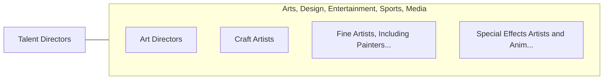

# Talent Directors

> Audition and interview performers to select most appropriate talent for parts in stage, television, radio, or motion picture productions.

## Overview

Talent Directors professionals audition and interview performers to select most appropriate talent for parts in stage, television, radio, or motion picture productions.. This occupation falls within the Arts, Design, Entertainment, Sports, and Media category and requires a combination of specialized knowledge, technical skills, and practical experience.

These professionals work across diverse settings and organizational contexts, applying their expertise to meet the demands of their field. They must stay current with industry standards, emerging practices, and regulatory requirements that affect their work. The role demands both independent judgment and collaborative skills, as practitioners regularly interact with colleagues, stakeholders, and the public.

As the field continues to evolve, Talent Directors professionals increasingly leverage technology and data-driven approaches to enhance their effectiveness. Career opportunities span the public and private sectors, with demand influenced by economic conditions, demographic shifts, and technological advancement.

## Classification Hierarchy



## Key Statistics

| Metric | Value |
|--------|-------|
| SOC Code | 27-2012.04 |
| Job Zone | N/A |
| Category | [Arts, Design, Entertainment, Sports, and Media](/occupations/ArtsMedia/index) |
| Core Tasks | 57+ |
| Salary Range | $35,000 - $100,000 |
| Median Salary | $55,000 |
| Growth Outlook | 3% (Slower than average) |
| Source | O*NET |

## Core Tasks



### locate.Performers

Talent Directors locate performers as part of their core responsibilities.

**Actions:**
- `locate.Performers.for.CrowdScenes` - Locate performers or extras for crowd and background scenes, and stand-ins or...
- `locate.Performers.for.BackgroundScenes` - Locate performers or extras for crowd and background scenes, and stand-ins or...
- `locate.Performers.for.StandIns` - Locate performers or extras for crowd and background scenes, and stand-ins or...
- `locate.Performers.for.PhotoDoubles.for.Actors` - Locate performers or extras for crowd and background scenes, and stand-ins or...
- `locate.Performers.for.ByDirectContact` - Locate performers or extras for crowd and background scenes, and stand-ins or...

### review.PerformerInformation

Talent Directors review performer information as part of their core responsibilities.

**Actions:**
- `review.PerformerInformation.to.decide.WhomToAuditionForParts` - Review performer information, such as photos, resumes, voice tapes, videos, a...
- `review.Photos.to.decide.WhomToAuditionForParts` - Review performer information, such as photos, resumes, voice tapes, videos, a...
- `review.Resumes.to.decide.WhomToAuditionForParts` - Review performer information, such as photos, resumes, voice tapes, videos, a...
- `review.VoiceTapes.to.decide.WhomToAuditionForParts` - Review performer information, such as photos, resumes, voice tapes, videos, a...
- `review.Videos.to.decide.WhomToAuditionForParts` - Review performer information, such as photos, resumes, voice tapes, videos, a...

### contact.Agents

Talent Directors contact agents as part of their core responsibilities.

**Actions:**
- `contact.Agents.to.provide.NotificationOfAuditionOpportunitiesToSetUpAuditionTimes` - Contact agents and actors to provide notification of audition and performance...
- `contact.Agents.to.PerformanceOpportunitiesToSetUpAuditionTimes` - Contact agents and actors to provide notification of audition and performance...
- `contact.Actors.to.provide.NotificationOfAuditionOpportunitiesToSetUpAuditionTimes` - Contact agents and actors to provide notification of audition and performance...
- `contact.Actors.to.PerformanceOpportunitiesToSetUpAuditionTimes` - Contact agents and actors to provide notification of audition and performance...

### negotiate.ContractAgreements

Talent Directors negotiate contract agreements as part of their core responsibilities.

**Actions:**
- `negotiate.ContractAgreements.with.Performers` - Negotiate contract agreements with performers, with agents, or between perfor...
- `negotiate.ContractAgreements.with.WithAgents` - Negotiate contract agreements with performers, with agents, or between perfor...
- `negotiate.ContractAgreements.with.BetweenPerformersProductionCompanies` - Negotiate contract agreements with performers, with agents, or between perfor...
- `negotiate.ContractAgreements.with.AgentsProductionCompanies` - Negotiate contract agreements with performers, with agents, or between perfor...


## Skills & Competencies

### Technical Skills
- **Creative Design** - Expert
- **Digital Media Tools** - Advanced
- **Content Creation** - Advanced
- **Visual Communication** - Advanced
- **Production Techniques** - Proficient
- **Project Coordination** - Proficient

### Soft Skills
- **Creativity** - Critical
- **Communication** - Critical
- **Collaboration** - Essential
- **Adaptability** - Essential
- **Time Management** - Essential

## Education & Certifications

| Requirement | Details |
|-------------|---------|
| Typical Education | Bachelor's degree in arts, design, communications, or related field |
| Work Experience | 1-3 years portfolio-based experience |
| On-the-Job Training | Moderate - ongoing skill development in creative tools |
| Certifications | Industry-specific certifications (Adobe, etc.) |

## Career Progression



## Industry Variations

### Entertainment and Media
Creative production for film, television, music, or digital media. Talent Directors professionals focus on audience engagement and storytelling.

### Advertising and Marketing
Brand communication and commercial creative work. Emphasis on client relationships and measurable campaign outcomes.

### Corporate Communications
Internal and external communications for organizations. Focus on brand consistency and strategic messaging.

### Freelance and Independent
Self-directed creative work with diverse clients. Requires strong business skills alongside creative talent.

## Technology & Tools

- **Adobe Creative Suite (Photoshop, Illustrator, Premiere)**
- **Digital audio workstations**
- **Content management systems**
- **3D modeling software**
- **Social media and analytics platforms**

## Related Occupations



## Industries

- [Media and Entertainment](/industries/Media) - High Employment
- [Advertising and Marketing](/industries/Advertising) - High Employment
- [Publishing](/industries/Publishing) - Moderate Employment
- [Technology](/industries/Technology) - Growing Employment

## Departments

This occupation typically works in:
- [Creative Services](/departments/Creative)
- [Marketing](/departments/Marketing/index)
- [Communications](/departments/Communications)

## GraphDL Semantic Structure

```
Talent Directors perform:
- audition.Performers.to.match.AttributesToSpecificRolesIncreasePoolOfAvailableActingTalent
- audition.Performers.to.ToIncreasePoolOfAvailableActingTalent
- interview.Performers.to.match.AttributesToSpecificRolesIncreasePoolOfAvailableActingTalent
- interview.Performers.to.ToIncreasePoolOfAvailableActingTalent
- prepare.Actors.for.Auditions.by.ProvidingScriptsAboutRolesCastingRequirements
- prepare.Actors.for.InformationAboutRolesCastingRequirements
```

---

*Source: O*NET 27-2012.04 - ONETOccupation*
