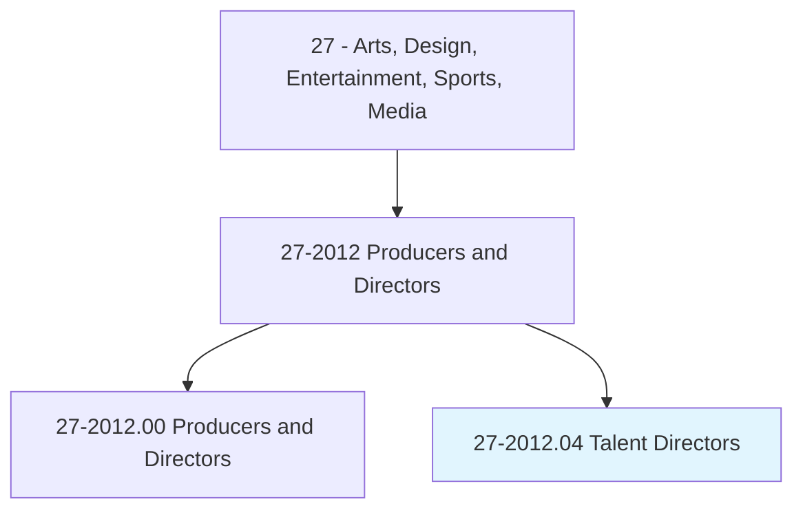
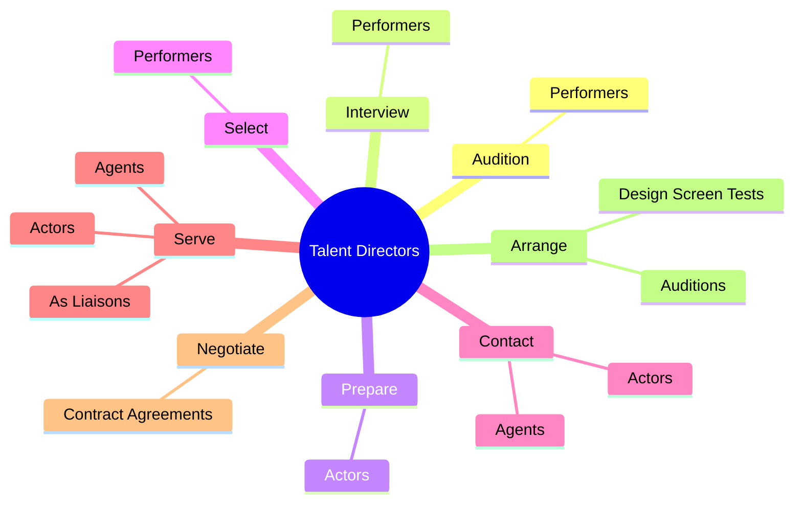

# Talent Directors

> Audition and interview performers to select most appropriate talent for parts in stage, television, radio, or motion picture productions.

## Overview

Talent Directors is classified under Arts, Design, Entertainment, Sports, Media (SOC 27). Audition and interview performers to select most appropriate talent for parts in stage, television, radio, or motion picture productions.

## Classification Hierarchy

## Key Statistics

| Metric | Value |
|--------|-------|
| SOC Code | 27-2012.04 |
| Category | [Arts, Design, Entertainment, Sports, Media](/occupations/ArtsMedia/index) |
| Task Count | 57 |
| Source | O*NET |

## Core Tasks

### audition.Performers

Talent Directors audition performers as part of their core responsibilities.

**Actions:**
- `audition.Performers.to.match.AttributesToSpecificRolesIncreasePoolOfAvailableActingTalent`
- `audition.Performers.to.ToIncreasePoolOfAvailableActingTalent`

### interview.Performers

Talent Directors interview performers as part of their core responsibilities.

**Actions:**
- `interview.Performers.to.match.AttributesToSpecificRolesIncreasePoolOfAvailableActingTalent`
- `interview.Performers.to.ToIncreasePoolOfAvailableActingTalent`

### prepare.Actors

Talent Directors prepare actors as part of their core responsibilities.

**Actions:**
- `prepare.Actors.for.Auditions.by.ProvidingScriptsAboutRolesCastingRequirements`
- `prepare.Actors.for.InformationAboutRolesCastingRequirements`

## Skills & Competencies

### Technical Skills
- **Creative Design** - Advanced
- **Digital Media** - Advanced
- **Content Creation** - Advanced

### Soft Skills
- **Communication** - Essential
- **Problem Solving** - Essential
- **Critical Thinking** - Important
- **Teamwork** - Important
- **Adaptability** - Important

## Related Occupations

## Industries

This occupation is found across multiple industries. See [Industries](/industries) for sector-specific employment data.

## Career Progression

---

*Source: O*NET 27-2012.04 - ONETOccupation*
