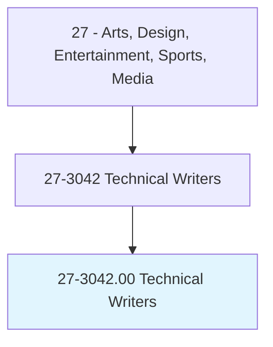
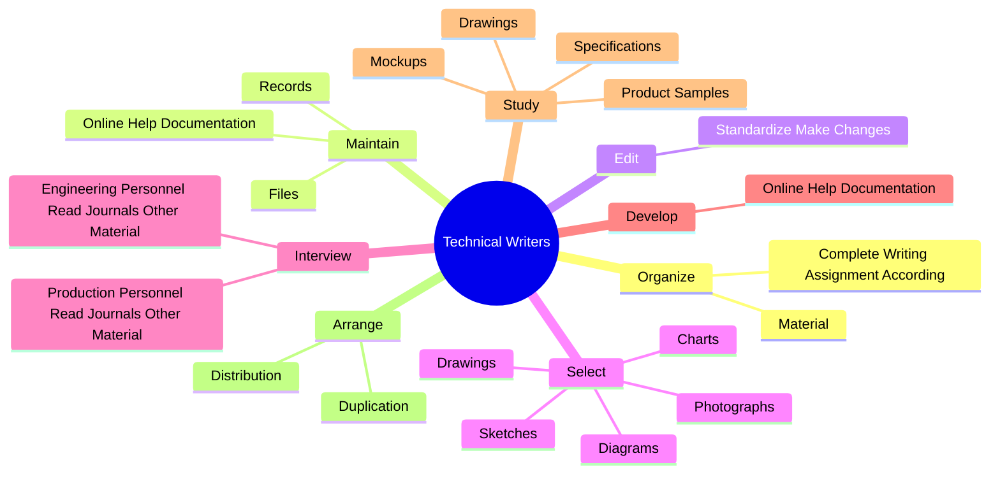
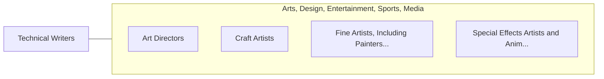

# Technical Writers

> Write technical materials, such as equipment manuals, appendices, or operating and maintenance instructions. May assist in layout work.

## Overview

Technical Writers is an occupation within the Arts, Design, Entertainment, Sports, Media category. Write technical materials, such as equipment manuals, appendices, or operating and maintenance instructions. 

## Classification Hierarchy

## Key Statistics

| Metric | Value |
|--------|-------|
| SOC Code | 27-3042.00 |
| Category | [Arts, Design, Entertainment, Sports, Media](/occupations/ArtsMedia) |
| Task Count | 91 |
| Source | O*NET |

## Core Tasks

### organize.Material

Technical Writers organize material as part of their core responsibilities.

**Actions:**
- `organize.Material.to.set.StandardsRegardingOrder`
- `organize.Material.to.Clarity`
- `organize.Material.to.Conciseness`
- `organize.Material.to.Style`

### maintain.Records

Technical Writers maintain records as part of their core responsibilities.

**Actions:**
- `maintain.Records.of.Work`
- `maintain.Records.of.Revisions`
- `maintain.Files.of.Work`
- `maintain.Files.of.Revisions`

### edit.StandardizeMakeChanges

Technical Writers edit standardize make changes as part of their core responsibilities.

**Actions:**
- `edit.StandardizeMakeChanges.to.MaterialPreparedByOtherWritersEstablishmentPersonnel`

## Skills & Competencies

### Technical Skills
- **Creative Design** - Advanced
- **Digital Media** - Advanced
- **Content Creation** - Advanced

### Soft Skills
- **Communication** - Essential
- **Problem Solving** - Essential
- **Critical Thinking** - Important
- **Teamwork** - Important
- **Adaptability** - Important

## Related Occupations

## Industries

This occupation is found across multiple industries. See [Industries](/industries) for sector-specific employment data.

## Career Progression

---

*Source: O*NET 27-3042.00 - ONETOccupation*
