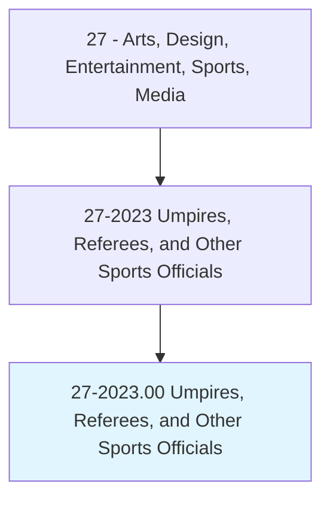
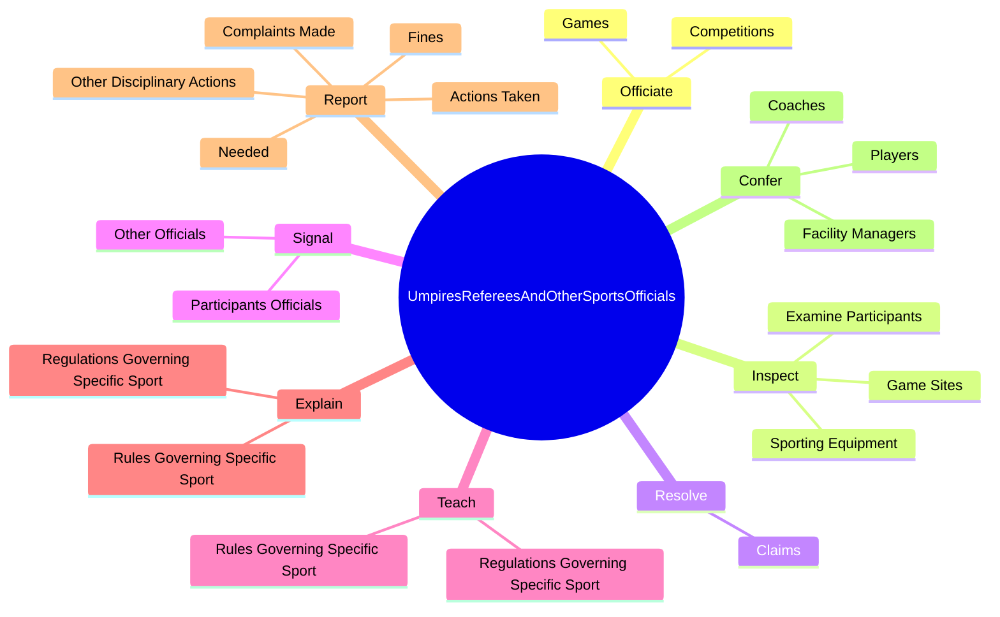
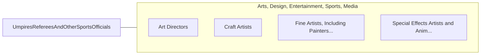

# Umpires, Referees, and Other Sports Officials

> Officiate at competitive athletic or sporting events. Detect infractions of rules and decide penalties according to established regulations. Includes all sporting officials, referees, and competition judges.

## Overview

Umpires, Referees, and Other Sports Officials is an occupation within the Arts, Design, Entertainment, Sports, Media category. Officiate at competitive athletic or sporting events. Detect infractions of rules and decide penalties according to established regulations.

## Classification Hierarchy

## Key Statistics

| Metric | Value |
|--------|-------|
| SOC Code | 27-2023.00 |
| Category | [Arts, Design, Entertainment, Sports, Media](/occupations/ArtsMedia/index) |
| Task Count | 58 |
| Source | O*NET |

## Core Tasks

### officiate.Games

Umpires, Referees, and Other Sports Officials officiate games as part of their core responsibilities.

**Actions:**
- `officiate.Games.to.maintain.StandardsOfPlayEnsureGameRulesAreObserved`
- `officiate.Games.to.ToEnsureGameRulesAreObserved`
- `officiate.Competitions.to.maintain.StandardsOfPlayEnsureGameRulesAreObserved`
- `officiate.Competitions.to.ToEnsureGameRulesAreObserved`

### inspect.GameSites

Umpires, Referees, and Other Sports Officials inspect game sites as part of their core responsibilities.

**Actions:**
- `inspect.GameSites.for.Compliance.with.RegulationsRequirements`
- `inspect.GameSites.for.SafetyRequirements`
- `inspect.SportingEquipment.to.ensure.ComplianceWithEventRegulations`
- `inspect.SportingEquipment.to.SafetyRegulations`

### resolve.Claims

Umpires, Referees, and Other Sports Officials resolve claims as part of their core responsibilities.

**Actions:**
- `resolve.Claims.of.RuleInfractions.by.ParticipantsAssessNecessaryPenaltiesAccordingToRegulations`
- `resolve.Claims.of.Complaints.by.ParticipantsAssessNecessaryPenaltiesAccordingToRegulations`

## Skills & Competencies

### Technical Skills
- **Creative Design** - Advanced
- **Digital Media** - Advanced
- **Content Creation** - Advanced

### Soft Skills
- **Communication** - Essential
- **Problem Solving** - Essential
- **Critical Thinking** - Important
- **Teamwork** - Important
- **Adaptability** - Important

## Related Occupations

## Industries

This occupation is found across multiple industries. See [Industries](/industries) for sector-specific employment data.

## Career Progression

---

*Source: O*NET 27-2023.00 - ONETOccupation*
