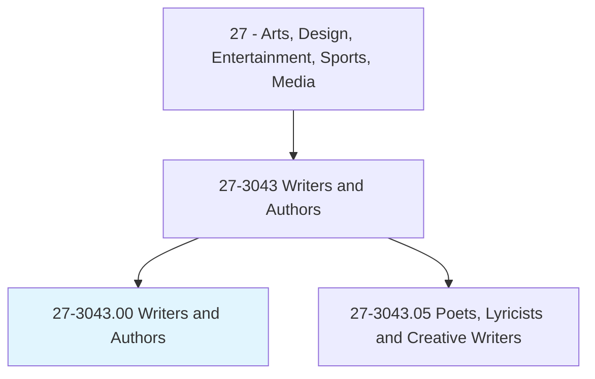
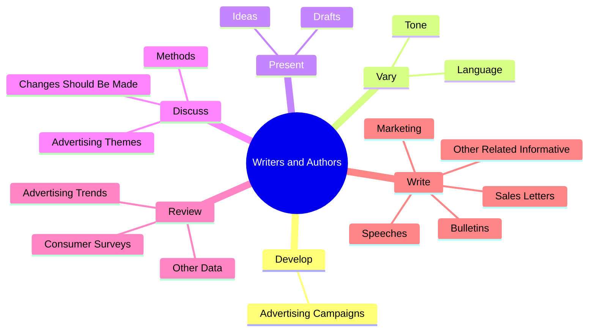

# Writers and Authors

> Originate and prepare written material, such as scripts, stories, advertisements, and other material.

## Overview

Writers and Authors is classified under Arts, Design, Entertainment, Sports, Media (SOC 27). Originate and prepare written material, such as scripts, stories, advertisements, and other material.

## Classification Hierarchy

## Key Statistics

| Metric | Value |
|--------|-------|
| SOC Code | 27-3043.00 |
| Category | [Arts, Design, Entertainment, Sports, Media](/occupations/ArtsMedia) |
| Task Count | 77 |
| Source | O*NET |

## Core Tasks

### develop.AdvertisingCampaigns

Writers and Authors develop advertising campaigns as part of their core responsibilities.

**Actions:**
- `develop.AdvertisingCampaigns.for.WideRange.of.Clients`
- `develop.AdvertisingCampaigns.for.Working.with.AdvertisingAgencysCreativeDirect`
- `develop.AdvertisingCampaigns.for.ArtDirector.to.determine.BestWayToPresentAdvertisingInformation`

### vary.Language

Writers and Authors vary language as part of their core responsibilities.

**Actions:**
- `vary.Language.of.MessagesBased.on.Product`
- `vary.Language.of.Medium`
- `vary.Tone.of.MessagesBased.on.Product`
- `vary.Tone.of.Medium`

### present.Drafts

Writers and Authors present drafts as part of their core responsibilities.

**Actions:**
- `present.Drafts.to.Clients`
- `present.Ideas.to.Clients`

## Skills & Competencies

### Technical Skills
- **Creative Design** - Advanced
- **Digital Media** - Advanced
- **Content Creation** - Advanced

### Soft Skills
- **Communication** - Essential
- **Problem Solving** - Essential
- **Critical Thinking** - Important
- **Teamwork** - Important
- **Adaptability** - Important

## Related Occupations

## Industries

This occupation is found across multiple industries. See [Industries](/industries) for sector-specific employment data.

## Career Progression

---

*Source: O*NET 27-3043.00 - ONETOccupation*
