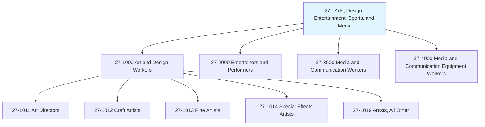
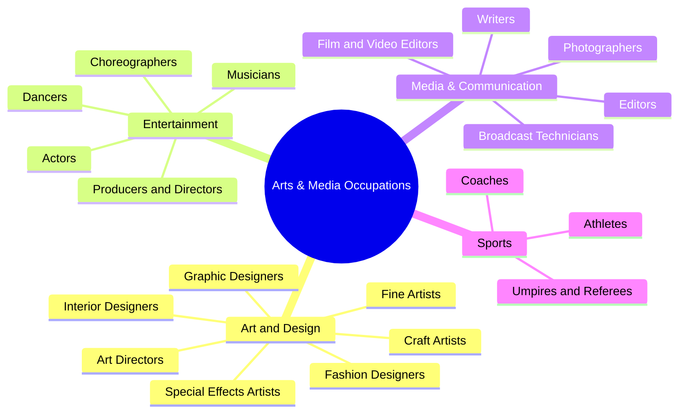
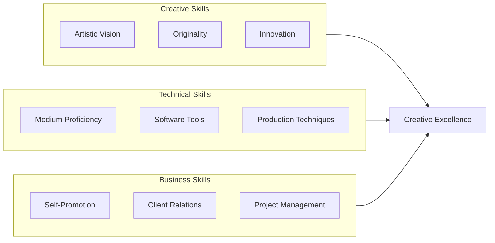
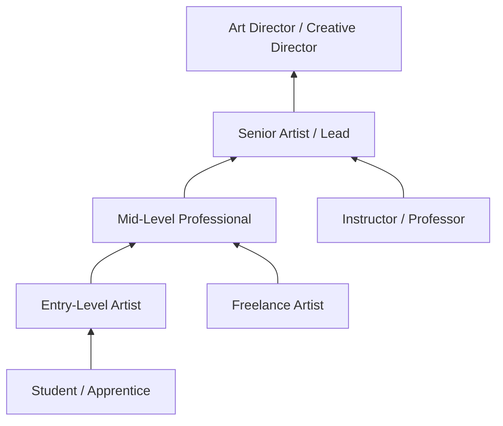

# Arts, Design, Entertainment, Sports, and Media Occupations

> Category 27 - Occupations in this category create, design, and perform artistic and creative works across visual arts, design, entertainment, sports, and media industries.

## Overview

Arts, Design, Entertainment, Sports, and Media Occupations encompass a diverse range of creative professionals who shape visual culture, entertainment experiences, and media content. This category includes artists who create original works, designers who shape products and experiences, performers and athletes, and media professionals who inform and entertain. These roles combine technical skills with creativity and artistic vision, often requiring both formal training and ongoing development of personal artistic expression.

## Classification Hierarchy

## Key Statistics

| Metric | Value |
|--------|-------|
| SOC Category Code | 27 |
| Major Groups | 4 |
| Detailed Occupations | 50+ |
| Source | O*NET / BLS |

## Occupations in this Category

### Art and Design Workers (27-1000)

| Occupation | Code | Description |
|------------|------|-------------|
| [Art Directors](./ArtDirectors.mdx) | 27-1011.00 | Formulate design concepts and presentation approaches for visual productions |
| [Craft Artists](./CraftArtists.mdx) | 27-1012.00 | Create handmade objects using techniques like welding, weaving, pottery |
| [Fine Artists](./FineArtists.mdx) | 27-1013.00 | Create original artwork using various media and techniques |
| [Special Effects Artists and Animators](./SpecialEffectsArtists.mdx) | 27-1014.00 | Create special effects and animations for digital media |
| [Artists and Related Workers, All Other](./Artists.mdx) | 27-1019.00 | All artists and related workers not listed separately |

## Category Overview Diagram

## Skills Common to Arts and Media Occupations

### Core Competencies

## Career Pathways

## Industries Employing Arts and Media Occupations

- Motion Picture and Video Industries - Highest concentration
- [Advertising and Public Relations](/industries/Advertising) - High employment
- [Publishing Industries](/industries/Publishing) - High employment
- [Performing Arts and Spectator Sports](/industries/PerformingArts) - Core industry
- [Broadcasting](/industries/Broadcasting) - Significant presence
- [Software Publishers](/industries/Information/PublishingIndustries/SoftwarePublishers) - Growing sector

## Education & Training Trends

| Level | Percentage of Workers |
|-------|----------------------|
| Bachelor's Degree (Fine Arts, Design) | 35-45% |
| Some College / Associate's | 25-35% |
| Self-Taught / Portfolio-Based | 15-25% |
| Master's Degree (MFA) | 10-15% |

## Related Categories

- [Computer and Mathematical](/occupations/Technology/index) - Category 15 (Digital media roles)
- [Educational Instruction](/occupations/Education/index) - Category 25 (Art teachers)
- [Sales and Related](/occupations/Sales/index) - Category 41 (Art dealers, representatives)
- [Management](/occupations/Management/index) - Category 11 (Creative directors)

---

*Source: O*NET / Bureau of Labor Statistics - SOC Category 27*
