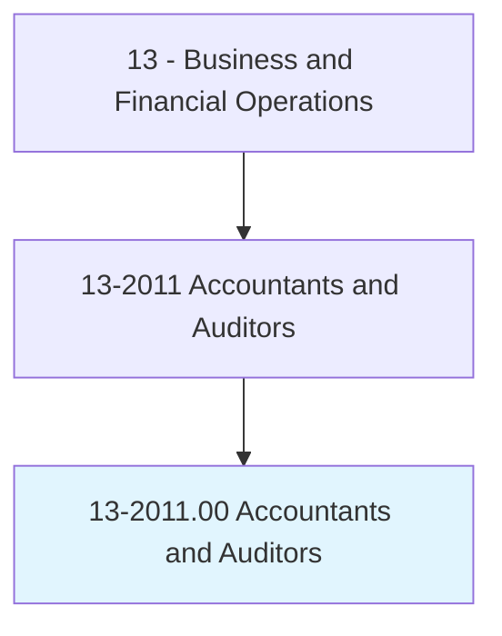
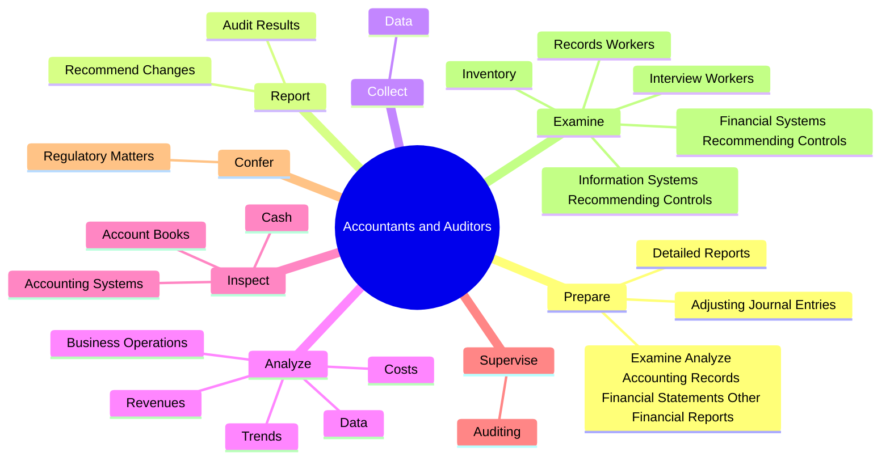
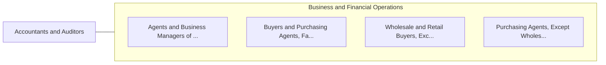

# Accountants and Auditors

> Examine, analyze, and interpret accounting records to prepare financial statements, give advice, or audit and evaluate statements prepared by others. Install or advise on systems of recording costs or other financial and budgetary data.

## Overview

Accountants and Auditors is an occupation within the Business and Financial Operations category. Examine, analyze, and interpret accounting records to prepare financial statements, give advice, or audit and evaluate statements prepared by others. 

## Classification Hierarchy

## Key Statistics

| Metric | Value |
|--------|-------|
| SOC Code | 13-2011.00 |
| Category | [Business and Financial Operations](/occupations/Business) |
| Task Count | 165 |
| Source | O*NET |

## Core Tasks

### prepare.DetailedReports

Accountants and Auditors prepare detailed reports as part of their core responsibilities.

**Actions:**
- `prepare.DetailedReports.on.AuditFindings`
- `prepare.ExamineAnalyzeAccountingRecordsFinancialStatementsOtherFinancialReports.to.assess.AccuracyCompletenessConformanceToReportingProceduralStandards`
- `prepare.AdjustingJournalEntries`

### report.AuditResults

Accountants and Auditors report audit results as part of their core responsibilities.

**Actions:**
- `report.AuditResults.in.OperationsActivities`
- `report.AuditResults.in.FinancialActivities`
- `report.RecommendChanges.in.OperationsActivities`
- `report.RecommendChanges.in.FinancialActivities`

### collect.Data

Accountants and Auditors collect data as part of their core responsibilities.

**Actions:**
- `collect.Data.to.detect.DeficientControls`
- `collect.Data.to.duplicated.Effort`
- `collect.Data.to.Extravagance`
- `collect.Data.to.Fraud`

## Skills & Competencies

### Technical Skills
- **Financial Analysis** - Advanced
- **Data Analysis** - Advanced
- **Regulatory Compliance** - Advanced

### Soft Skills
- **Communication** - Essential
- **Problem Solving** - Essential
- **Critical Thinking** - Important
- **Teamwork** - Important
- **Adaptability** - Important

## Related Occupations

## Industries

This occupation is found across multiple industries. See [Industries](/industries) for sector-specific employment data.

## Career Progression

---

*Source: O*NET 13-2011.00 - ONETOccupation*
