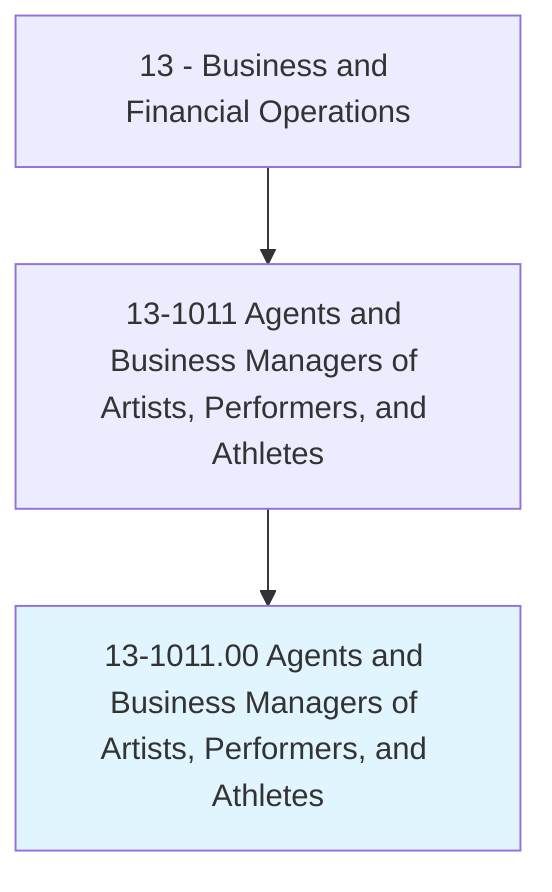
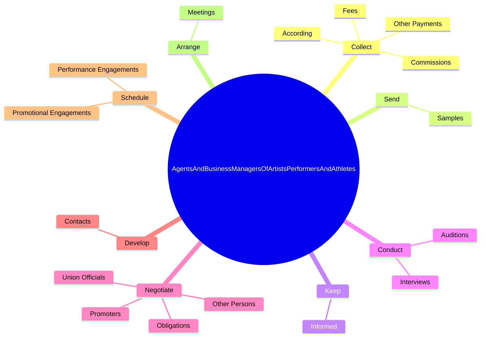

# Agents and Business Managers of Artists, Performers, and Athletes

> Represent and promote artists, performers, and athletes in dealings with current or prospective employers. May handle contract negotiation and other business matters for clients.

## Overview

Agents and Business Managers of Artists, Performers, and Athletes is an occupation within the Business and Financial Operations category. Represent and promote artists, performers, and athletes in dealings with current or prospective employers. 

## Classification Hierarchy

## Key Statistics

| Metric | Value |
|--------|-------|
| SOC Code | 13-1011.00 |
| Category | [Business and Financial Operations](/occupations/Business/index) |
| Task Count | 50 |
| Source | O*NET |

## Core Tasks

### collect.Fees

Agents and Business Managers of Artists, Performers, and Athletes collect fees as part of their core responsibilities.

**Actions:**
- `collect.Fees.to.contract.Terms`
- `collect.Commissions.to.contract.Terms`
- `collect.OtherPayments.to.contract.Terms`
- `collect.According.to.contract.Terms`

### send.Samples

Agents and Business Managers of Artists, Performers, and Athletes send samples as part of their core responsibilities.

**Actions:**
- `send.Samples.of.ClientsWorkPromotionalMaterialToPotentialEmployersToObtainAuditions`
- `send.Samples.of.OtherPromotionalMaterialToPotentialEmployersToObtainAuditions`
- `send.Samples.of.Sponsorships`
- `send.Samples.of.EndorsementDeals`

### keep.Informed

Agents and Business Managers of Artists, Performers, and Athletes keep informed as part of their core responsibilities.

**Actions:**
- `keep.Informed.of.IndustryTrends`
- `keep.Informed.of.Deals`

## Skills & Competencies

### Technical Skills
- **Financial Analysis** - Advanced
- **Data Analysis** - Advanced
- **Regulatory Compliance** - Advanced

### Soft Skills
- **Communication** - Essential
- **Problem Solving** - Essential
- **Critical Thinking** - Important
- **Teamwork** - Important
- **Adaptability** - Important

## Related Occupations

## Industries

This occupation is found across multiple industries. See [Industries](/industries) for sector-specific employment data.

## Career Progression

---

*Source: O*NET 13-1011.00 - ONETOccupation*
